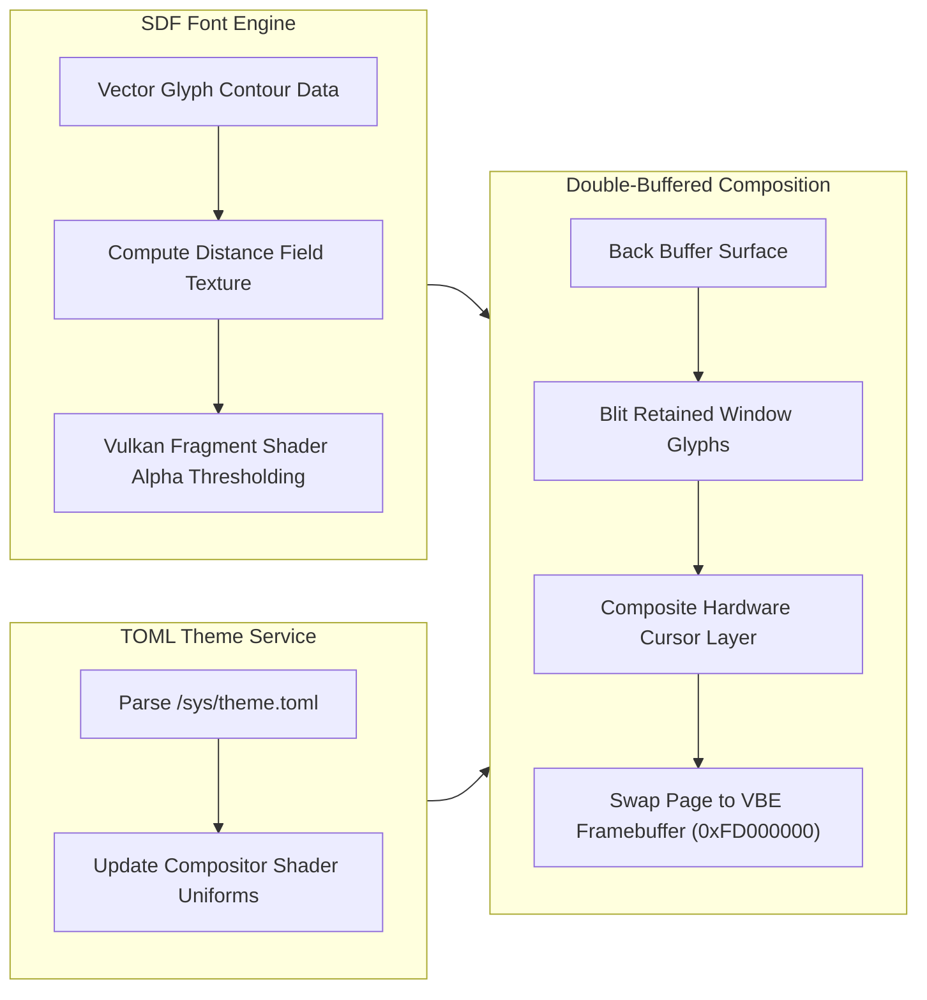

> **Status:** #status/implemented

# 🖱️ Hardware Cursor, SDF Fonts & Visual Buffer Compositor

> **Layer:** Ring 2 Presentation Subsystem  
> **Source Files:** `rings/ring_2/ring_2/console/console.asm`, `vbe_compositor.c`

---

## 1. Overview & Architecture

This note outlines the presentation layer's rendering engine, including low-level hardware cursor acceleration, double-buffered frame composition, Signed Distance Field (SDF) font rasterization, and TOML live-theming.

---

## 2. Low-Level Graphics Specs
- **Hardware Cursor**: Direct VBE sprite overlay rendering without CPU redrawing.
- **SDF Glyph Fonts**: Scale-invariant typography rendered sharp at any resolution via GPU distance field fragment shaders.
- **TOML Live Theming**: Theme changes in `/sys/theme.toml` apply instantly via VFS file watches.
