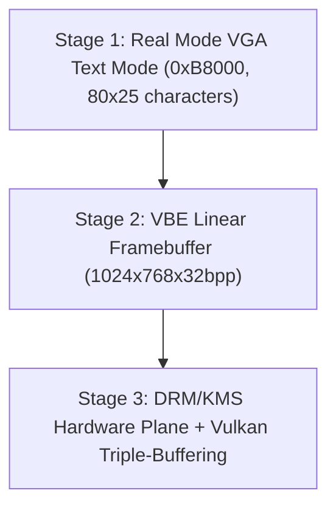

> **Status:** #status/future-implementation

# 🖱️ Hardware Cursor & Visual Buffers

> **Evolution:** From 16-bit BIOS text mode (`0xB8000`) to VBE Linear Framebuffer to GPU hardware cursor overlay planes.

---

## 1. Visual Buffer Stages Across Boot & Runtime

---

## 2. Hardware Cursor Plane
To eliminate mouse cursor input lag:
1. The mouse cursor is rendered onto a dedicated hardware overlay plane (DRM plane).
2. Mouse move events update cursor plane coordinates directly via `SYS_CURSOR_MOVE` (`0x202`) without triggering a full screen redraw.

---

## 3. Related Links
- [[02 - Reference/Console & Display API|Console API]]
- [[03 - Ring 2 - Userland & Spatial UI/03 - Spatial Window Compositor|Compositor]]
