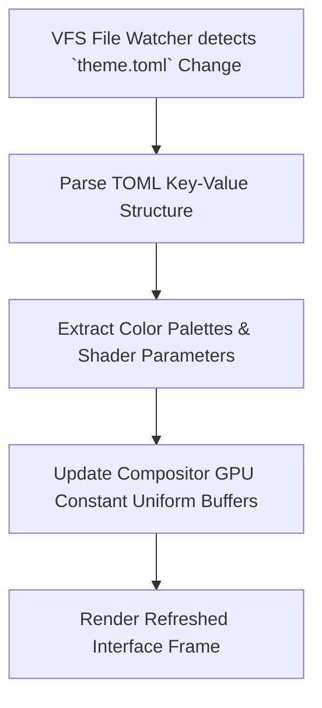

> **Status:** #status/future-implementation

# 🎨 Live Theming & TOML Engine

> **Config Path:** `~/.config/heaplit/theme.toml`  
> **Mechanism:** Inotify watch $\rightarrow$ GPU Uniform Buffer Object (UBO) hot reload.

---

## 1. Structure of `theme.toml`

```toml
[colors]
background        = "#0B0F19"
surface           = "#111827"
surface_translucent = "#111827D0"
accent_primary    = "#6366F1"
accent_glow       = "#818CF8"
text_primary      = "#F9FAFB"
text_muted        = "#9CA3AF"
error_red         = "#EF4444"

[compositor.effects]
blur_radius       = 24
glass_opacity     = 0.78
window_corner_rad = 12
shadow_elevation  = 16

[compositor.physics]
mass              = 1.0
friction          = 6.5
elasticity        = 0.35

[dock]
position          = "bottom"  # "top", "bottom", "left", "right"
size              = 56
autohide          = false
frosted_glass     = true
```

---

## 2. Related Links
- [[03 - Ring 2 - Userland & Spatial UI/03 - Spatial Window Compositor|Spatial Compositor]]
- [[03 - Ring 2 - Userland & Spatial UI/04 - GPU Rendering & SDF Fonts|SDF Fonts]]

## 🔄 Live Theme Reloading Flowchart


