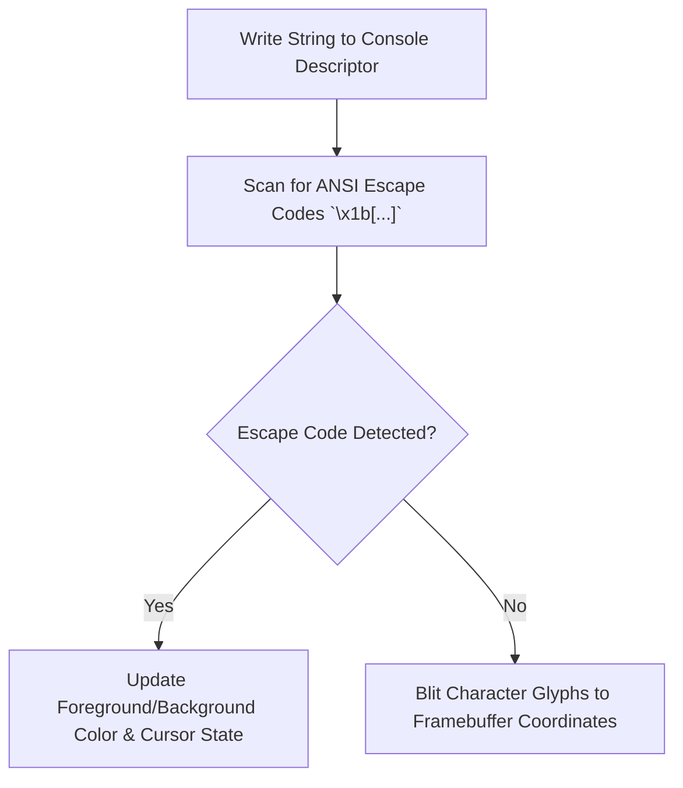

> **Status:** #status/implemented

# 📺 Console & Display Subsystem

> **Ring Placement:** `rings/ring_2/ring_2/console/`  
> **Source File:** `console.asm`  
> **Privilege Level:** Ring 2 ($M \le 2$)

---

## 1. Real-Mode Video Services API

The Console subsystem manages VGA video modes, screen clearing, and text formatting via BIOS `INT 0x10`.

```nasm
; set_video_mode: Configures 80x25 16-color VGA text mode
set_video_mode:
    mov ah, 0x00
    mov al, 0x03
    int 0x10
    ret

; clear_screen: Clears active screen and resets cursor to (0,0)
clear_screen:
    mov ah, 0x06
    mov al, 0x00
    mov bh, 0x07                ; Light gray on black background
    mov cx, 0x0000              ; Upper left (row 0, col 0)
    mov dx, 0x184f              ; Lower right (row 24, col 79)
    int 0x10

    mov ah, 0x02
    mov bh, 0x00
    mov dx, 0x0000
    int 0x10
    ret

; print_string_16: Emits null-terminated string at SI via BIOS teletype
print_string_16:
    push ax
    push bx
    push si
    mov ah, 0x0e
    mov bh, 0
.loop:
    lodsb
    test al, al
    jz .done
    int 0x10
    jmp .loop
.done:
    pop si
    pop bx
    pop ax
    ret
```

## 🔄 Console Output & ANSI Processing Pipeline


