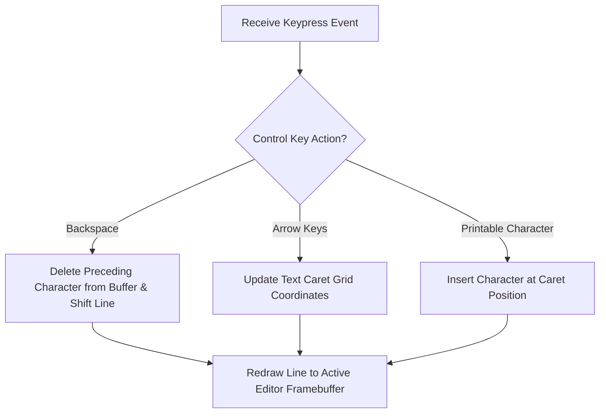

> **Status:** #status/implemented

# ⌨️ Keyboard & Interactive Line Editor

> **Ring Placement:** `rings/ring_2/ring_2/input/`  
> **Source File:** `keyboard.asm`  
> **Privilege Level:** Ring 2 ($M \le 2$)

---

## 1. BIOS Keyboard Service Wrapper

- **`read_char() -> AL`**: Blocks execution until a key is pressed (`INT 0x16, AH=0x00`).
- **`read_char_noblock() -> AL`**: Polls keyboard buffer (`INT 0x16, AH=0x01`). Sets Zero Flag `ZF = 1` if no keystroke is pending.

---

## 2. Line Buffer Editor Routine (`read_line`)

`read_line(DI = buffer_ptr, CX = max_length)` provides a robust command-line editor:

```nasm
read_line:
    push ax
    push cx
    push di
    push bx
    mov bx, di                 ; BX holds start of buffer
.read_loop:
    call read_char
    cmp al, 0x0d               ; Check for Enter key
    je .done
    cmp al, 0x08               ; Check for Backspace key
    je .handle_backspace

    ; Store character if below max length
    cmp cx, 1
    jbe .read_loop
    mov [di], al
    inc di
    dec cx

    ; Echo character to screen
    mov ah, 0x0e
    int 0x10
    jmp .read_loop

.handle_backspace:
    cmp di, bx                 ; Cannot erase past buffer start
    jbe .read_loop
    dec di
    inc cx

    ; Erase on screen: emit Backspace (0x08), Space (0x20), Backspace (0x08)
    mov ah, 0x0e
    mov al, 0x08
    int 0x10
    mov al, 0x20
    int 0x10
    mov al, 0x08
    int 0x10
    jmp .read_loop

.done:
    mov byte [di], 0           ; Append null terminator
    call print_newline
    pop bx
    pop di
    pop cx
    pop ax
    ret
```

## 🔄 Interactive Text Editor Input Cycle


