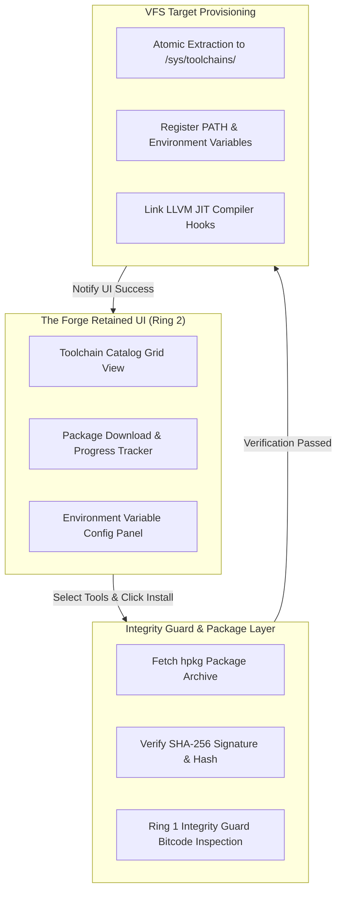

> **Status:** #status/future-implementation

# 🛠️ The Forge Tool Installer GUI – Detailed Technical Specification

> **Layer:** Ring 2 Userland & Presentation Subsystem  
> **Binary Container:** `forge.axf`  
> **Source Directory:** `rings/ring_3/ring_3/userland/forge/`  
> **Dependencies:** Ring 1 Freestanding C Runtime (`liba`), Ring 0 Syscall Gateway, `hpkg` Package Subsystem

---

## 1. Executive Summary & Purpose

**The Forge** is the official graphical toolchain deployment and environment provisioning application for Heaplit OS. Designed to solve the friction of setting up developer environments on a freestanding operating system, The Forge provides a centralized, one-click interface for fetching, configuring, and provisioning native developer tools—including Visual Studio Build Tools, MinGW-w64, Node.js, Python, Rustup, Clang/LLVM, and web browsers—either natively or through sandboxed compatibility layers.

---

## 2. Supported Toolchain Ecosystem

The Forge manages pre-packaged `.hpkg` archives for major developer tools:

| Developer Toolchain | Target Binary Package | VFS Installation Path | Primary Function |
| :--- | :--- | :--- | :--- |
| **LLVM / Clang Native** | `clang-toolchain.hpkg` | `/sys/toolchains/llvm/` | Core C/C++ compilation via embedded JIT kernel service. |
| **Visual Studio Build Tools** | `vs-buildtools.hpkg` | `/sys/toolchains/msvc/` | MSVC ABI compatibility headers, MSBuild, and NMAKE tools. |
| **MinGW-w64 Suite** | `mingw64.hpkg` | `/sys/toolchains/mingw/` | GCC x86-64 toolchain for cross-platform C/C++ projects. |
| **Node.js & npm** | `nodejs-runtime.hpkg` | `/sys/toolchains/node/` | V8 JavaScript engine runtime and package ecosystem. |
| **Rustup & Cargo** | `rust-toolchain.hpkg` | `/sys/toolchains/rust/` | Rust compiler (`rustc`) and package manager (`cargo`). |
| **Web Browser Environment** | `web-browser.hpkg` | `/sys/apps/browser/` | Retained-mode WebKit/Blink browser binary for web rendering. |

---

## 3. Package Verification & Deployment Protocol

1. **Repository Query**: The Forge queries trusted package manifests over HTTPS or local mirrors.
2. **SHA-256 Cryptographic Check**: The archive is hashed and verified against the official signed manifest.
3. **Integrity Guard Inspection**: Binary payloads and `.axf` entry points are scanned by the Ring 1 Integrity Guard for unsafe memory instructions.
4. **Atomic Extraction**: The package is unpacked into isolated VFS directories under `/sys/toolchains/<tool_name>/`.
5. **Path Registry**: Updates global VFS environment configuration stored in `/sys/config/env.toml`.
