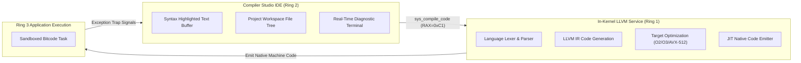
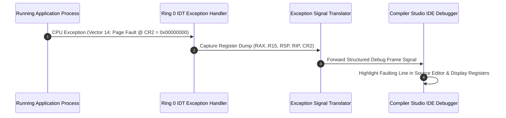

> **Status:** #status/future-implementation

# 💻 Built-In Multi-Language Compiler Studio – Detailed Technical Specification

> **Layer:** Ring 2 Userland Application  
> **Binary Container:** `studio.axf`  
> **Kernel Service:** Ring 1 Embedded LLVM JIT Engine & Symbol Resolver  
> **Supported Languages:** C, C++, Assembly (x86-64 NASM syntax), C# (.NET 8), Rust

---

## 1. Executive Summary & Architecture

The **Multi-Language Compiler Studio** is Heaplit OS's built-in native Integrated Development Environment (IDE). Designed to operate without third-party dependencies, the Compiler Studio interfaces directly with the kernel's embedded LLVM JIT service via Ring 0 system calls to compile, link, execute, and debug applications in real-time.

---

## 2. Core Subsystems

### 2.1 Embedded LLVM JIT Interface
- **Hot-Patching Engine**: Modifications made in the Compiler Studio editor can be JIT-compiled and patched directly into running process memory without losing process state.
- **Multi-Language Lexing**: Integrates parsers for C23, C++26, x86-64 Assembly, Rust 2024, and C# 12.

### 2.2 CPU Exception Interceptor & Interactive Debugger
When an executing application triggers a CPU exception (such as a Page Fault at `CR2` or Divide-by-Zero), the Ring 0 IDT handler captures the registers and forwards a structured debug frame to the Compiler Studio:

