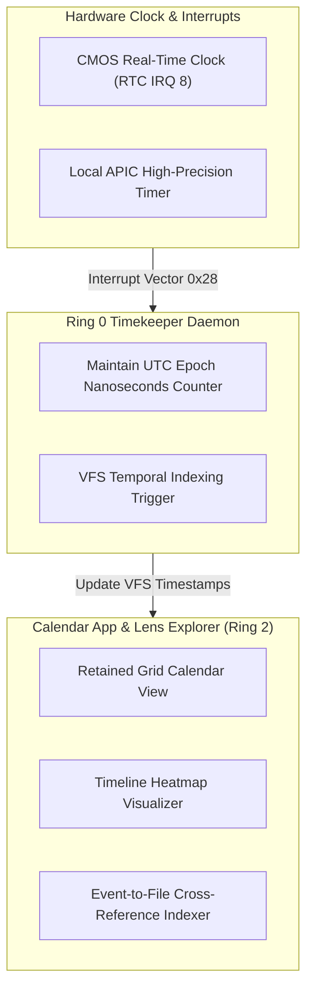

> **Status:** #status/future-implementation

# 📅 Custom Calendar & Native Time Service – Technical Specification

> **Layer:** Ring 2 Presentation & System Time Subsystem  
> **Binary Target:** `calendar.axf`  
> **Kernel Service:** Ring 0 RTC / Local APIC Timer Interrupts & VFS Temporal Indexer

---

## 1. Overview & Architecture

The **Heaplit Native Time Service & Calendar** is a low-overhead system daemon and presentation app that links Real-Time Clock (RTC IRQ 8) interrupts with the VFS temporal metadata index layer. It manages user schedules while automatically correlating calendar events with file creation and modification timestamps across the operating system.

---

## 2. Event-to-File Cross-Referencing Engine
- **Automatic Temporal Linkage**: When a user creates or modifies files during an active calendar event (e.g., "Architecture Review"), the VFS automatically attaches an `xattr` temporal metadata tag linking the file to the event ID.
- **Timeline Heatmap**: Displays a visual heatmap of file activity integrated directly into The Lens 3D Spatial File Explorer.
