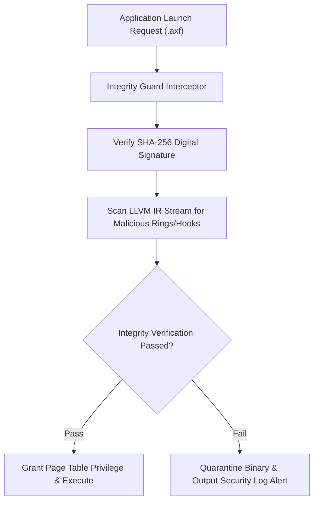

> **Status:** #status/future-implementation

# 🛡️ Kernel-Level Antivirus & Integrity Guard – Technical Specification

> **Layer:** Ring 1 / Ring 0 Security Boundary Service  
> **Source Files:** `rings/ring_1/ring_1/drivers/integrity_guard.c`  
> **Protection Domains:** `.axf` LLVM Bitcode Validation, Page Table W^X, Syscall Whitelisting

---

## 1. Executive Summary & Architecture

The **Integrity Guard** is Heaplit OS's built-in kernel security daemon operating at the boundary between Ring 1 driver space and Ring 0 microkernel memory. It inspects all application binaries (`.axf`), dynamic bitcode payloads, and syscall invocation patterns before granting execution privileges.

---

## 2. Security Enforcement Pillars
1. **Bitcode Static Analysis**: Scans LLVM IR blocks prior to JIT compilation to detect unauthorized raw assembly injection, ring-escalation instructions, or invalid memory offsets.
2. **Page-Table `W^X` Enforcement**: Memory pages are strictly marked Write XOR Execute (`W^X`). Pages allocated for JIT compilation cannot be modified once execution rights are granted.
3. **Syscall Permission Whitelisting**: Process manifests declare required syscall IDs. Attempts to issue unlisted syscalls trigger an instant process termination and security alert.
