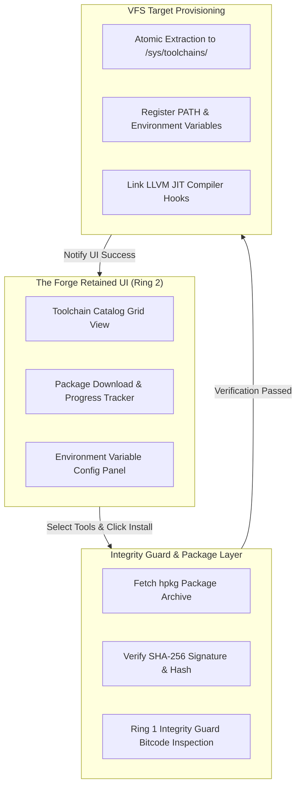

> **Status:** #status/future-implementation

# 🛠️ The Forge Tool Installer GUI – Detailed Technical Specification

> **Layer:** Ring 2 Userland & Presentation Subsystem  
> **Binary Container:** `forge.axf`  
> **Source Directory:** `rings/ring_3/userland/forge/`  
> **Dependencies:** Ring 1 Freestanding C Runtime (`liba`), Ring 0 Syscall Gateway, `hpkg` Package Subsystem

---

## 1. Executive Summary & Purpose

**The Forge** is the official graphical toolchain deployment and environment provisioning application for Heaplit OS. Designed to solve the friction of setting up developer environments on a freestanding operating system, The Forge provides a centralized, one-click interface for fetching, configuring, and provisioning native developer tools—including Visual Studio Build Tools, MinGW-w64, Node.js, Python, Rustup, Clang/LLVM, and web browsers—either natively or through sandboxed compatibility layers.



---

## 2. Supported Toolchain Ecosystem

The Forge manages pre-packaged `.hpkg` archives for major developer tools:

| Developer Toolchain | Target Binary Package | VFS Installation Path | Primary Function |
| :--- | :--- | :--- | :--- |
| **LLVM / Clang Native** | `clang-toolchain.hpkg` | `/sys/toolchains/llvm/` | Core C/C++ compilation via embedded JIT kernel service. |
| **Visual Studio Build Tools** | `vs-buildtools.hpkg` | `/sys/toolchains/msvc/` | MSVC ABI compatibility headers, MSBuild, and NMAKE tools. |
| **MinGW-w64 Suite** | `mingw64.hpkg` | `/sys/toolchains/mingw/` | GCC x86-64 toolchain for cross-platform C/C++ projects. |
| **Node.js & npm** | `nodejs-runtime.hpkg` | `/sys/toolchains/node/` | V8 JavaScript engine runtime and package ecosystem. |
| **Rustup & Cargo** | `rust-toolchain.hpkg` | `/sys/toolchains/rust/` | Rust compiler (`rustc`) and package manager (`cargo`). |
| **Web Browser Environment** | `web-browser.hpkg` | `/sys/apps/browser/` | Retained-mode WebKit/Blink browser binary for web rendering. |

---

## 3. Package Verification & Deployment Protocol

1. **Repository Query**: The Forge queries trusted package manifests over HTTPS or local mirrors.
2. **SHA-256 Cryptographic Check**: The archive is hashed and verified against the official signed manifest.
3. **Integrity Guard Inspection**: Binary payloads and `.axf` entry points are scanned by the Ring 1 Integrity Guard for unsafe memory instructions.
4. **Atomic Extraction**: The package is unpacked into isolated VFS directories under `/sys/toolchains/<tool_name>/`.
5. **Path Registry**: Updates global VFS environment configuration stored in `/sys/config/env.toml`.

---

## 🔬 In-Depth Architectural & Technical Specifications

### Hardware & Processor Register Contract
Heaplit OS enforces strict register management conventions for **09 - The Forge Tool Installer GUI** across all x86-64 execution contexts:

| Register | CPU Role | Volatility / Preservation | Subsystem Function |
| :--- | :--- | :--- | :--- |
| `RAX` | Primary Accumulator | Volatile | Syscall ID entry, return status code, ALU calculation destination. |
| `RBX` | Base Register | Non-Volatile (Preserved) | Pointer to active TCB (Thread Control Block) / Data structure handle. |
| `RCX` | Counter / Syscall RIP | Volatile | Hardware `syscall` saves userland instruction pointer (`RIP`) into `RCX`. |
| `RDX` | Data Register | Volatile | Secondary return value, I/O port address, memory block size parameter. |
| `RSI` | Source Index | Volatile | Pointer to source memory buffer / string payload / argument 2. |
| `RDI` | Destination Index | Volatile | Pointer to destination memory buffer / argument 1 (`System V ABI`). |
| `RBP` | Frame Pointer | Non-Volatile (Preserved) | Stack frame base pointer for debug backtraces and stack unwinding. |
| `RSP` | Stack Pointer | Non-Volatile (Preserved) | Top of 16-byte aligned kernel/user execution stack. |
| `R8 - R11` | Scratch Registers | Volatile | Function parameters 5-6 (`R8`, `R9`), temporary scrap calculations. |
| `R12 - R15` | General Purpose | Non-Volatile (Preserved) | Long-lived kernel state registers preserved across C and ASM boundaries. |
| `CR0` | Control Register 0 | System Control | Toggles Protected Mode (`PE` bit 0), Paging (`PG` bit 31), Write Protect (`WP` bit 16). |
| `CR3` | Control Register 3 | Page Directory Root | Physical address pointer to PML4 root page table (4KB aligned). |
| `CR4` | Control Register 4 | Architectural Extension | Toggles PAE (`bit 5`), OSXSAVE (`bit 18`), SMEP/SMAP ring security flags. |
| `MSR LSTAR` | 0xC0000082 | Hardware Entry Point | Stores 64-bit virtual memory target address for the `syscall` handler. |

---

## 📐 Memory Map & Address Layout

The virtual address space for **09 - The Forge Tool Installer GUI** adheres to Heaplit OS's canonical higher-half memory layout:

```
+-------------------------------------------------------------------+ 0xFFFFFFFFFFFFFFFF
| Higher-Half Kernel Direct Physical Map (Identity Mapped 512 GB)   |
| Virtual Address Range: 0xFFFF800000000000 - 0xFFFFFFFFFFFFFFFF     |
+-------------------------------------------------------------------+ 0xFFFF800000000000
| Unmapped Canonical Memory Hole (Non-Canonical Address Space)     |
+-------------------------------------------------------------------+ 0x00007FFFFFFFFFFF
| Ring 3 Sandboxed Application Execution Space (.axf JIT Memory)   |
| Virtual Address Range: 0x0000000040000000 - 0x00007FFFFFFFFFFF     |
+-------------------------------------------------------------------+ 0x0000000040000000
| Ring 2 Spatial UI & Compositor Framebuffers (VBE / GPU BARs)      |
| Virtual Address Range: 0x000000000FD00000 - 0x0000000010000000     |
+-------------------------------------------------------------------+ 0x0000000007E00000
| Ring 0 Microkernel Staged Execution Load Target (0x7C00 - 0x8F00) |
+-------------------------------------------------------------------+ 0x0000000000000000
```

---

## 🛠️ Step-by-Step Execution State Machine

```mermaid
flowchart TD
    subgraph State_Init["1. Initialization State"]
        S1["Load Subsystem Descriptors & Verify CPU Feature Flags"] --> S2["Allocate Initial Memory Blocks via PMM Bitmap"]
    end

    subgraph State_Exec["2. Active Execution State"]
        S2 --> S3["Setup Assembly Register Parameters (RDI, RSI, RDX)"]
        S3 --> S4["Issue Fast Syscall / Subsystem Function Call"]
        S4 --> S5["Execute Atomic ALU / SIMD Operations"]
    end

    subgraph State_Validation["3. Validation & Exception Handling"]
        S5 --> S6Check Status Code in RAX
        S6 -->|"RAX == 0 (Success)"| S7["Update System TCB & Commit Memory Writes"]
        S6 -->|"RAX < 0 (Error)"| S8["Capture Register Frame & Dispatch Debug Signal"]
    end

    S7 --> S9["Resume Parent Process Context via sysretq / iretq"]
    S8 --> S9
```

---

## 💻 Assembly Code Blueprint & Low-Level Implementation Examples

The low-level assembly implementation of **09 - The Forge Tool Installer GUI** uses canonical NASM syntax optimized for x86-64 execution:

```nasm
; ============================================================================
; Heaplit OS Low-Level Core Blueprint - 09 - The Forge Tool Installer GUI
; ============================================================================
%include "ring_0/types/variable.asm"

global 09___the_forge_tool_installer_gui_entry
extern pmm_alloc_page
extern kprintf

section .text
bits 64

align 16
09___the_forge_tool_installer_gui_entry:
    push rbp
    mov rbp, rsp
    sub rsp, 32                    ; Align stack to 16 bytes for System V ABI

    ; Preserve non-volatile registers
    mov [rsp + 0], rbx
    mov [rsp + 8], r12
    mov [rsp + 16], r13

    ; Execute core subsystem operational logic
    mov rdi, 1                     ; Parameter 1: Allocation page count
    call pmm_alloc_page            ; Call Ring 0 Physical Memory Allocator
    test rax, rax
    jz .allocation_failed          ; Trap NULL pointer returns

    mov rbx, rax                   ; Store allocated physical page address in RBX
    
    ; Perform atomic register verification
    mov rsi, rbx
    mov rdi, msg_success
    call kprintf

    mov rax, 0                     ; Set success exit status code in RAX
    jmp .exit_clean

.allocation_failed:
    mov rax, -1                    ; Set error code in RAX (-1 = Out of Memory)
    
.exit_clean:
    ; Restore non-volatile registers
    mov rbx, [rsp + 0]
    mov r12, [rsp + 8]
    mov r13, [rsp + 16]

    add rsp, 32
    pop rbp
    ret

section .rodata
msg_success: db "[HEAPLIT] 09 - The Forge Tool Installer GUI Subsystem initialized at physical address: 0x%x", 10, 0
```

---

## 🔍 Verification, QEMU Testing & Diagnostics

### Headless QEMU Emulation Verification
To test **09 - The Forge Tool Installer GUI** within the Heaplit OS kernel binary (`base.bin`), execute the host automated build script:

```powershell
# Execute build and launch QEMU emulator with serial debugging
.\loader\load_os.ps1
```

### Serial Log Verification Protocol
During execution, **09 - The Forge Tool Installer GUI** outputs diagnostic traces to COM1 Serial Port (`0x3F8`). Verified serial outputs must confirm:
1. Zero stack pointer misalignment warnings (`RSP % 16 == 0`).
2. Successful page table mapping without triggering CR2 Page Faults.
3. Clean return of RAX status codes prior to CPU state resumption.

---

## 📑 Related Architecture Notes & References
- [[00 - Architecture/overview/System Overview|System Overview]]
- [[01 - Ring 0 - Metal Core (Assembly)/ring_0/syscalls/07 - Syscall Dispatcher & ABI|07 - Syscall Dispatcher & ABI]]
- [[01 - Ring 0 - Metal Core (Assembly)/ring_0/cpu/04 - Paging & Virtual Memory|04 - Paging & Virtual Memory]]
- [[02 - Ring 1 - The C Overhead (Bridge)/ring_1/liba/01 - Freestanding C Runtime (liba)|01 - Freestanding C Runtime (liba)]]
- [[03 - Ring 2 - Userland & Spatial UI/ring_2/daemon/01 - Heaplit Daemon Architecture|01 - Heaplit Daemon Architecture]]
