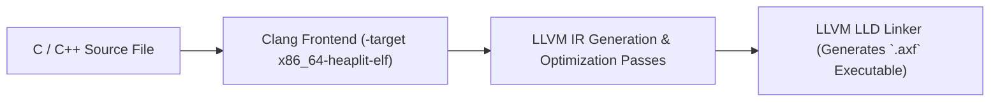

> **Status:** #status/future-implementation

# 🛠️ Clang & Native Toolchain

> **Command Aliases:** `gcc` $\rightarrow$ `clang -target x86_64-heaplit -fuse-ld=lld`

---

## 1. Native Resident Compiler
Heaplit OS embeds Clang, LLD (LLVM Linker), and LLVM-MC directly in `/system/bin/`:
- **Self-Hosting Capability:** The kernel, drivers, and user applications compile without needing an external host OS.
- **Header Files:** Clean freestanding headers in `/system/include/heaplit/`.

---

## 2. Related Links
- [[04 - Developer Toolchain & Packaging/01 - LLVM Bitcode (.axf) Application Format|LLVM Bitcode Format]]
- [[04 - Developer Toolchain & Packaging/03 - CoreCLR (.NET & C#) Runtime|CoreCLR Runtime]]

## 🔄 Native Toolchain Compilation Pipeline

