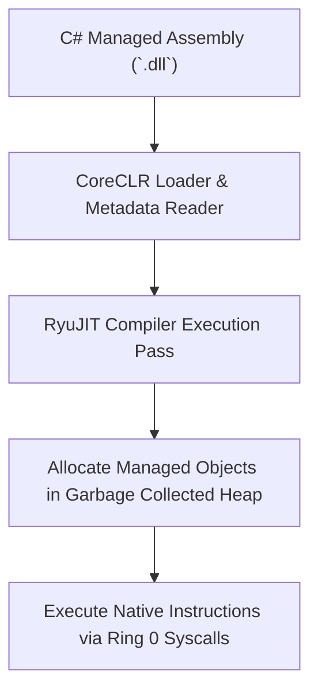

> **Status:** #status/future-implementation

# ⚡ CoreCLR (.NET & C#) Runtime

> **Target:** Native C# execution in Heaplit OS using the RyuJIT compiler and AVX-512 backend.

---

## 1. Zero-Overhead C# Kernel Interoperability
- **Command:** `dotnet myapp.dll` or direct execution of `.axf` binaries.
- **RyuJIT Scheduler Tie-in:** RyuJIT emits native x86_64 Long Mode machine code utilizing the exact same AVX-512 register preservation paths managed by the Ring 0 XSAVE dispatcher.
- **P/Invoke:** Direct microkernel syscall dispatch without Win32 or Linux glibc emulation layers.

---

## 2. Related Links
- [[04 - Developer Toolchain & Packaging/01 - LLVM Bitcode (.axf) Application Format|LLVM Bitcode Format]]
- [[01 - Ring 0 - Metal Core (Assembly)/08 - AVX-512 & XSAVE Engine|XSAVE Engine]]

## 🔄 CoreCLR Runtime Execution Architecture

