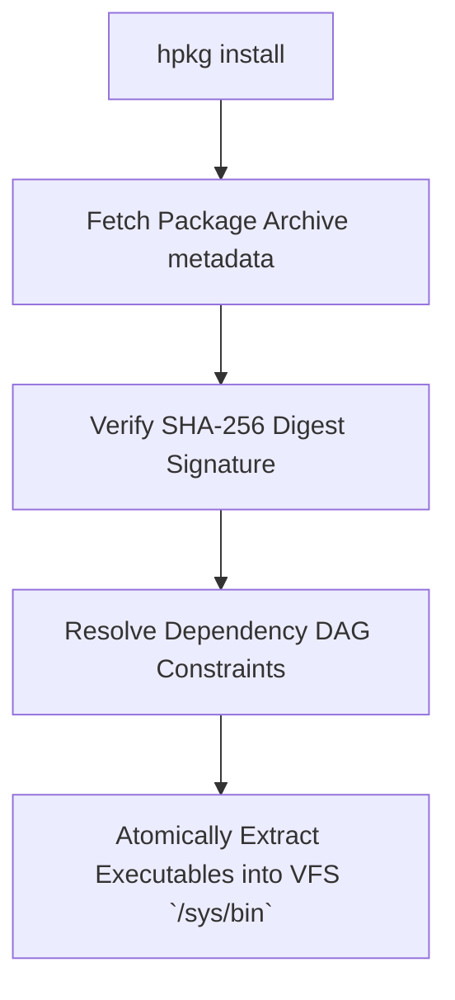

> **Status:** #status/future-implementation

# 📦 The hpkg Sovereign Package Manager

> **Package Format:** `.hpkg`  
> **Rollback Integration:** Atomic ZFS / Microkernel Snapshots

---

## 1. Atomic Package Management

`hpkg` provides zero-rot, transactional package installation:

1. **Pre-Install Snapshot:** Creates an instant kernel state & VFS snapshot prior to modification.
2. **Atomic Installation:** Unpacks application bitcode (`.axf`), installs dependencies into isolated sandboxes, and links VFS `xattr` relational tags.
3. **Instant Rollback:** If installation or verification fails, `hpkg rollback` restores the exact state of the OS in under 1 second.

## 🔄 Package Manager Installation Pipeline

