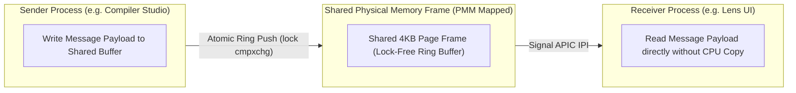

> **Status:** #status/future-implementation

# ⚡ High-Speed IPC & Shared Memory Message Bus – Technical Specification

> **Layer:** Ring 0 / Ring 1 Communication Infrastructure  
> **ASM Routines:** `ipc_ring_gate.asm`, `shared_mem.c`  
> **Performance Target:** Sub-microsecond (<500 ns) zero-copy message transfers

---

## 1. Overview & Architecture

Heaplit OS features a zero-copy **Inter-Process Communication (IPC)** message bus designed for ultra-low latency data transfer between userland daemons, the Compiler Studio, and the Lens UI shell.

---

## 2. Technical Characteristics
- **Zero-Copy Architecture**: Uses PMM shared physical pages mapped directly into both processes' virtual address spaces.
- **ASM Ring Gates**: Employs lock-free atomic ring buffers (`lock cmpxchg`) for sub-microsecond signaling.
- **Event Notification**: Inter-Processor Interrupts (IPI) wake sleeping receiver threads instantly without polling overhead.
