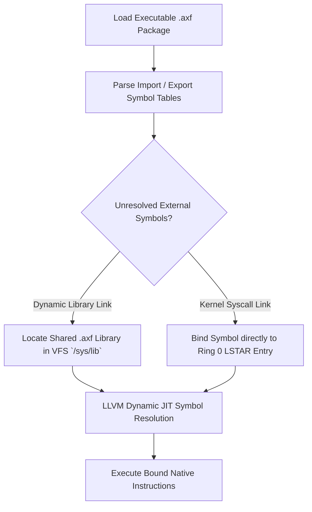

> **Status:** #status/future-implementation

# 🔗 Dynamic Bitcode Linking & Runtime Resolution – Technical Specification

> **Layer:** Developer Toolchain & Runtime Execution  
> **Subsystem:** Ring 1 LLVM Dynamic Linker (`axf_linker.c`)

---

## 1. Overview & Architecture

The **Dynamic Bitcode Linker** handles symbol resolution, relocation binding, and JIT compilation for mixed C, Assembly, and managed C# `.axf` binaries at runtime.

---

## 2. Key Capabilities
- **Cross-Language Linking**: Binds native C functions, Assembly procedures, and C# CoreCLR managed delegates seamlessly.
- **Lazy Symbol Resolution**: Defers resolution of dynamic library symbols until first function call via JIT trampolines.
- **Atomic Hot-Patching**: Allows updating shared system libraries in memory while host applications remain running.
