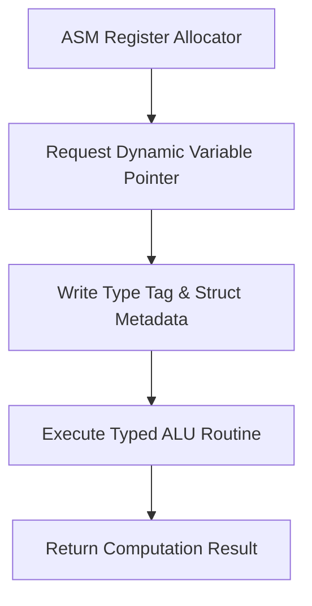

> **Status:** #status/implemented

# 🧱 Variable System Specification Blueprint

> **Source File:** `rings/ring_0/ring_0/types/variable.asm`  
> **Structure Size:** 6 Bytes

---

## Technical Specification

```nasm
struc variable
    .type:       resb 1    ; +0: Type (1=Int, 2=String, 3=Float, 4=Ptr)
    .flags:      resb 1    ; +1: Bit 0=Const, Bit 1=Alloc, Bit 2=Signed
    .payload:    resd 1    ; +2: 32-bit integer / string ptr / float
endstruc
```

### Complete Procedure Checklist
- `create_variable`: Sets up structure fields cleanly without clobbering registers.
- `add_variables`: Type-checks operands, adds integer payloads, sets overflow flags.
- `sub_variables`: Type-checks operands, subtracts integer payloads.
- `print_variable`: Dynamically dispatches output based on `type`.

## 🔄 Assembly Variable Management Pipeline


