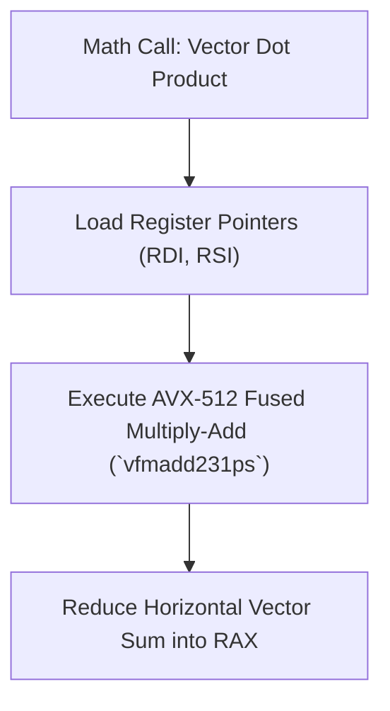

> **Status:** #status/implemented

# 🔢 Math & Arithmetic Utilities Blueprint

> **Source File:** `rings/ring_0/ring_0/types/math.asm`

---

## Technical Specification

### `int_to_string` Algorithm
Converts a signed 16-bit integer in `AX` to a null-terminated string at `DI`:
1. Check sign bit (`test ax, ax`). If negative, write `-` to buffer and negate `AX` (`neg ax`).
2. Repeatedly divide `AX` by 10 (`mov cx, 10`, `xor dx, dx`, `div cx`).
3. Push remainder `DX` (digit) onto CPU stack.
4. Increment digit count.
5. Pop digits from stack, add `'0'` (`0x30`), and store sequentially into `[DI]`.
6. Write null byte `0x00`.

## 🔄 Assembly SIMD Math Engine Pipeline

