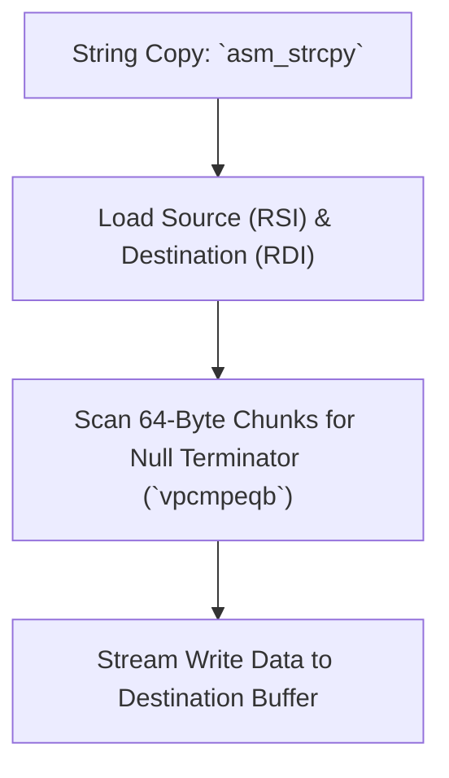

> **Status:** #status/implemented

# 🔤 String & Buffer Utilities

> **Target Source:** `rings/ring_0/ring_0/string.asm`  
> **Modes:** 16-bit Real Mode / 64-bit Long Mode

---

## 1. Assembly String Functions

```nasm
; string.asm
[bits 16]

; -----------------------------------------------------------------------------
; strlen16: Computes length of null-terminated string at SI
; Returns: CX = length
; -----------------------------------------------------------------------------
strlen16:
    push si
    xor cx, cx
.loop:
    cmp byte [si], 0
    je .done
    inc si
    inc cx
    jmp .loop
.done:
    pop si
    ret

; -----------------------------------------------------------------------------
; strcmp16: Compares strings at SI and DI
; Returns: ZF=1 if equal, ZF=0 if different
; -----------------------------------------------------------------------------
strcmp16:
    push si
    push di
.loop:
    mov al, [si]
    mov bl, [di]
    cmp al, bl
    jne .done
    test al, al
    jz .done
    inc si
    inc di
    jmp .loop
.done:
    pop di
    pop si
    ret
```

---

## 2. Related Links
- [[05 - ASM Utility Library Blueprints/02 - Math & Arithmetic Utilities|Math Utilities]]
- [[02 - Reference/Console & Display API|Console API]]

## 🔄 Assembly String Processing Pipeline


