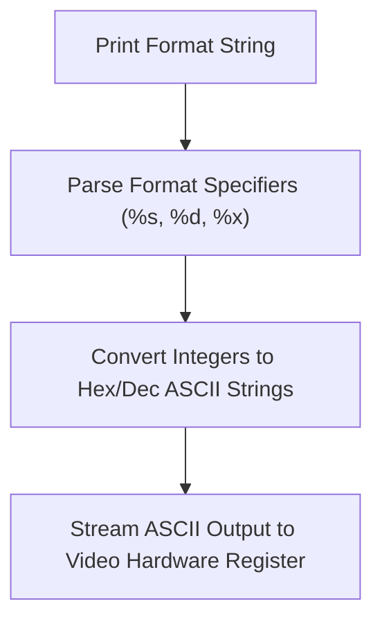

> **Status:** #status/implemented

# 🖥️ Console & Video Utilities

> **Target Source:** `rings/ring_0/ring_2/console.asm`  
> **Features:** Screen clearing, cursor positioning, color text output, newline handling.

---

## 1. Key Routines

```nasm
; console_utils.asm
[bits 16]

; -----------------------------------------------------------------------------
; print_newline: Emits carriage return (0x0D) and line feed (0x0A)
; -----------------------------------------------------------------------------
print_newline:
    push ax
    mov ah, 0x0E
    mov al, 0x0D
    int 0x10
    mov al, 0x0A
    int 0x10
    pop ax
    ret

; -----------------------------------------------------------------------------
; print_hex_byte: Prints AL as 2 hexadecimal characters (e.g. 0x7E -> "7E")
; -----------------------------------------------------------------------------
print_hex_byte:
    push ax
    push bx
    mov bl, al
    shr al, 4                   ; High nibble
    call .print_nibble
    mov al, bl                  ; Low nibble
    and al, 0x0F
    call .print_nibble
    pop bx
    pop ax
    ret

.print_nibble:
    add al, '0'
    cmp al, '9'
    jle .ok
    add al, 7                   ; 'A' - '9' - 1
.ok:
    mov ah, 0x0E
    int 0x10
    ret
```

---

## 2. Related Links
- [[02 - Reference/Console & Display API|Console API Reference]]
- [[05 - ASM Utility Library Blueprints/05 - Keyboard & Input Service|Keyboard Service]]

## 🔄 Assembly Console Rendering Flowchart


