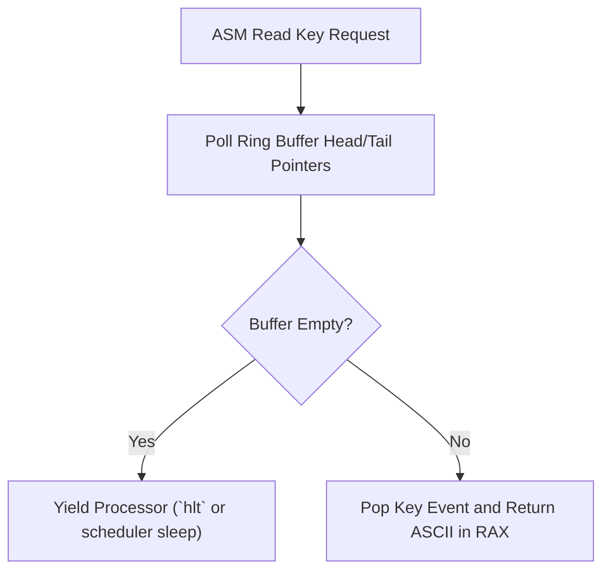

> **Status:** #status/implemented

# ⌨️ Keyboard & Input Service Blueprint

> **Source File:** `rings/ring_2/ring_2/input/keyboard.asm`

---

## Technical Specification

### `read_line` Backspace Logic
```nasm
; Read string into buffer DI, max length CX
read_line:
    push ax
    push cx
    push di
    push bx
    mov bx, di
.loop:
    call read_char
    cmp al, 0x0d
    je .done
    cmp al, 0x08
    je .backspace

    cmp cx, 1
    jbe .loop
    mov [di], al
    inc di
    dec cx
    mov ah, 0x0e
    int 0x10
    jmp .loop

.backspace:
    cmp di, bx
    jbe .loop
    dec di
    inc cx
    mov ah, 0x0e
    mov al, 0x08
    int 0x10
    mov al, 0x20
    int 0x10
    mov al, 0x08
    int 0x10
    jmp .loop

.done:
    mov byte [di], 0
    call print_newline
    pop bx
    pop di
    pop cx
    pop ax
    ret
```

## 🔄 Assembly Input Queue Flowchart


