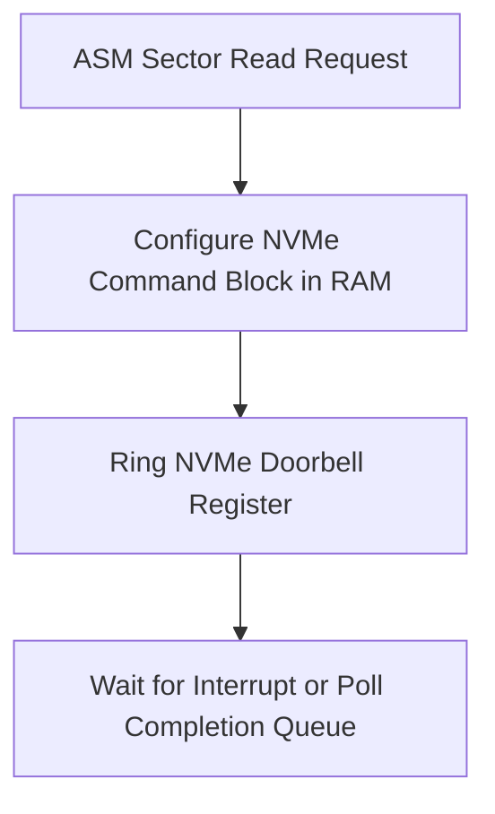

> **Status:** #status/future-implementation

# 💽 Disk & Storage Utilities

> **Target Source:** `rings/ring_0/ring_1/disk.asm`  
> **Features:** LBA Addressing, Extended BIOS Read (`INT 0x13, AH=0x42`).

---

## 1. BIOS Extended LBA Disk Packet (64-bit LBA)

```nasm
; disk_packet.asm
align 4
disk_address_packet:
    .size           db 0x10     ; Packet size (16 bytes)
    .reserved       db 0        ; Always 0
    .sector_count   dw 1        ; Number of sectors to read
    .buffer_offset  dw 0x7E00   ; Destination Offset
    .buffer_segment dw 0x0000   ; Destination Segment
    .lba_low        dd 1        ; LBA bits 0..31
    .lba_high       dd 0        ; LBA bits 32..63

; -----------------------------------------------------------------------------
; read_sectors_lba: Reads sectors using BIOS Extended Read (INT 0x13, AH=0x42)
; Inputs: SI = Pointer to disk_address_packet, DL = Drive ID
; Returns: Carry Flag clear on success, Carry Flag set on error
; -----------------------------------------------------------------------------
read_sectors_lba:
    mov ah, 0x42
    int 0x13
    ret
```

---

## 2. Related Links
- [[01 - Ring 0 - Metal Core (Assembly)/01 - Boot Sequence & Staged Loading|Boot Sequence]]
- [[02 - Ring 1 - The C Overhead (Bridge)/04 - FAT32 & EXT4 Drivers|FAT32 Driver]]

## 🔄 Assembly Storage Controller Pipeline


