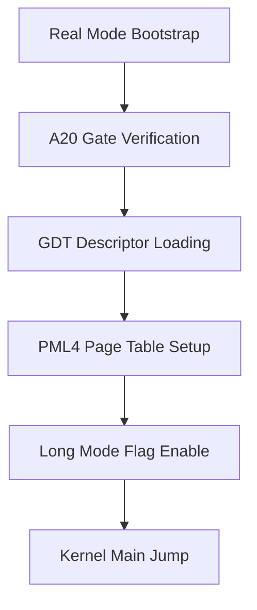

> **Status:** #status/implemented

# 📋 HeaplitPlan: Bootloader & Long Mode Switch

> **Target Phase:** Phase 0  
> **Status:** Completed & Validated

---

## Action Checklist

- [x] Sector 1 MBR loader at `0x7C00` (`mbr.asm`).
- [x] Disk read service via BIOS `INT 0x13, AH=0x02` for Sectors 2-8.
- [x] Multi-tier A20 line enabler (`a20.asm`).
- [x] Global Descriptor Table setup (`gdt.asm`).
- [x] 32-bit Protected Mode transition (`protected_mode.asm`).
- [x] 4-level PML4 paging tables setup at `0x1000` with 2MB huge pages (`paging.asm`).
- [x] 64-bit Long Mode switch (`long_mode.asm`).
- [x] Ring 3 unprivileged `iretq` drop (`entry.asm`).

## 🔄 Boot & Long Mode Master Sequence Flowchart

