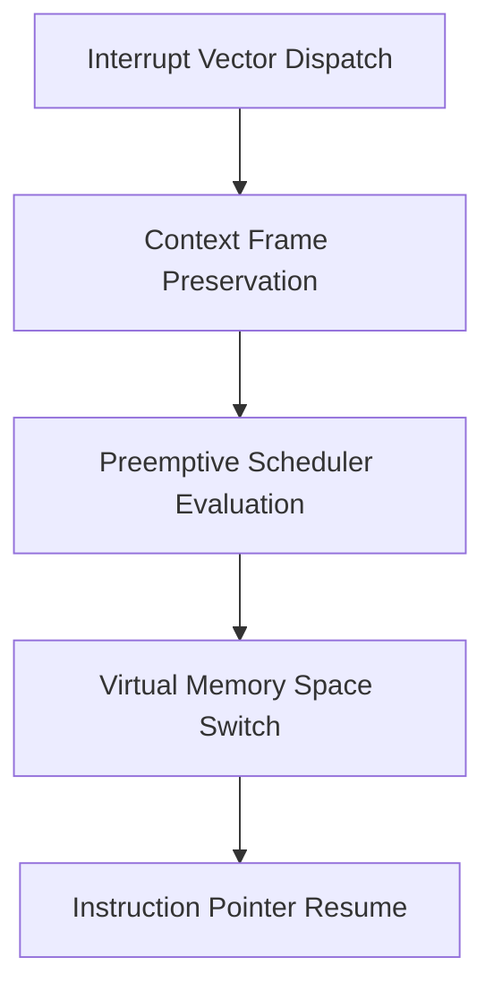

> **Status:** #status/future-implementation

# 📋 HeaplitPlan: Microkernel & ASM Scheduler

Tags: #HeaplitPlan #Phase0 #ASM #Ring0 #MVP

> **Target Phase:** Phase 0 (Months 1–3)  
> **Goal:** High-speed, tickless context switching and cooperative/preemptive event dispatching.

---

## 1. Actionable Milestones

- [ ] **Thread Control Block (TCB):** Define 64-byte aligned `struc thread_control_block` with `rsp`, `cr3`, `affinity`, `priority`.
- [ ] **Context Switch Macro:** Implement ~20-instruction `switch_threads` macro in pure assembly.
- [ ] **Kernel Ready Queue:** Implement doubly-linked list priority queues (0 = Idle to 255 = Realtime AI).
- [ ] **Idle Thread:** Implement `hlt`-based low-power sleep loop for zero CPU consumption.
- [ ] **Fast Syscall Setup:** Configure `MSR_LSTAR`, `MSR_STAR`, `MSR_SFMASK` for instant userland syscall dispatch.

---

## 2. Related Links
- [[01 - Ring 0 - Metal Core (Assembly)/06 - Tickless ASM Scheduler|Tickless Scheduler Spec]]
- [[01 - Ring 0 - Metal Core (Assembly)/07 - Syscall Dispatcher & ABI|Syscall Dispatcher]]

## 🔄 Microkernel Execution & Dispatch Pipeline

