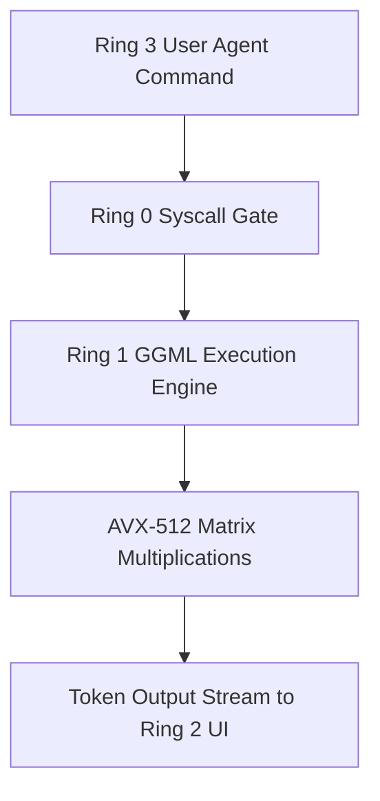

> **Status:** #status/future-implementation

# 📋 HeaplitPlan: AI Subsystem & Ring 1 Bridge

Tags: #HeaplitPlan #Phase1 #Ring0 #Ring1 #MVP

> **Target Phase:** Phase 1 (Months 4–6)  
> **Goal:** Run local quantized LLM inside Ring 1 and wire `SYS_AI_INFER` syscall to Heaplit daemon.

---

## 1. Actionable Milestones

- [ ] **AVX-512 XSAVE Area:** Reserve 4KB buffer at `0xFFFFFFFF80000000 + 0x5000` and enable `OSXSAVE` + `XCR0`.
- [ ] **Huge-Page Allocator:** Support 2MB and 1GB virtual memory mappings in Ring 0 for model weight caching.
- [ ] **GGML Port (`liba`):** Port core matrix multiplication (`ggml_vec_dot_f32`) with AVX-512 intrinsics.
- [ ] **BPE Tokenizer:** Implement zero-allocation BPE tokenizer in freestanding C.
- [ ] **Syscall Bridge (`0x600` - `0x602`):** Implement `SYS_AI_LOAD_MODEL`, `SYS_AI_INFER`, and `SYS_AI_SCHEDULE_TASK`.

---

## 2. Related Links
- [[02 - Ring 1 - The C Overhead (Bridge)/02 - GGML & Llama.cpp Kernel Port|GGML Port]]
- [[01 - Ring 0 - Metal Core (Assembly)/08 - AVX-512 & XSAVE Engine|XSAVE Engine]]

## 🔄 AI Subsystem Master Integration Flowchart

