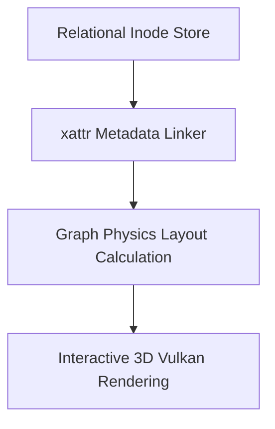

> **Status:** #status/future-implementation

# 📋 HeaplitPlan: Lens Graph Filesystem

Tags: #HeaplitPlan #Phase2 #Ring1 #Ring2 #MVP

> **Target Phase:** Phase 2 (Months 7–9)  
> **Goal:** Extended attribute (`xattr`) semantic tagging and force-directed graph UI rendered in Vulkan.

---

## 1. Actionable Milestones

- [ ] **FAT32 / EXT4 VFS:** Implement partition table reader, cluster reader, file open/read/write/close.
- [ ] **Extended Attributes (`xattr`):** Implement `get_xattr` and `set_xattr` syscalls in Ring 0.
- [ ] **Adjacency Indexer:** Background worker building B+Tree indices of tag connections and file references.
- [ ] **Vulkan Compute Shader Graph:** Render force-directed node-edge network on GPU with physics solver.
- [ ] **Hybrid POSIX-Lens Interface:** Dual-pane file manager (Graph view on left, table on right).

---

## 2. Related Links
- [[03 - Ring 2 - Userland & Spatial UI/02 - The Lens Graph File Explorer|Lens Explorer]]
- [[02 - Ring 1 - The C Overhead (Bridge)/03 - Virtual File System (VFS)|VFS Driver]]

## 🔄 Lens Graph Master Flowchart

