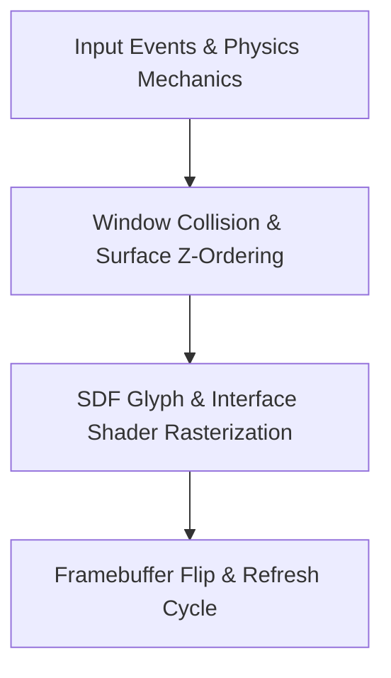

> **Status:** #status/future-implementation

# 📋 HeaplitPlan: Spatial Compositor & UI Shell

Tags: #HeaplitPlan #Phase3 #Ring2 #MVP

> **Target Phase:** Phase 3 (Months 10–15)  
> **Goal:** Smooth GPU window compositor with inertia physics, frosted glass blur, dock, and live TOML theming.

---

## 1. Actionable Milestones

- [ ] **Vulkan 1.3 DRM Compositor:** Set up direct framebuffer rendering, triple-buffering, swapchains.
- [ ] **Window Physics Engine:** Implement momentum, friction, and boundary elasticity for window dragging.
- [ ] **Dual-Kawase Blur Shaders:** GPU-accelerated frosted glass blur for windows and taskbar.
- [ ] **SDF Font Engine:** Implement multi-channel signed distance field font rasterization on GPU.
- [ ] **Live TOML Theming:** Watch `~/.config/heaplit/theme.toml` and hot-reload shader uniforms without restart.
- [ ] **Homepage Dashboard:** Render clock, system stats, quick-launch dock, and notification drawer.

---

## 2. Related Links
- [[03 - Ring 2 - Userland & Spatial UI/03 - Spatial Window Compositor|Spatial Compositor Spec]]
- [[03 - Ring 2 - Userland & Spatial UI/06 - Live Theming & TOML Engine|Live Theming]]

## 🔄 Spatial Compositor Master Flowchart

