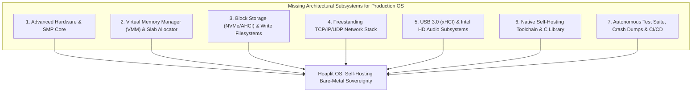
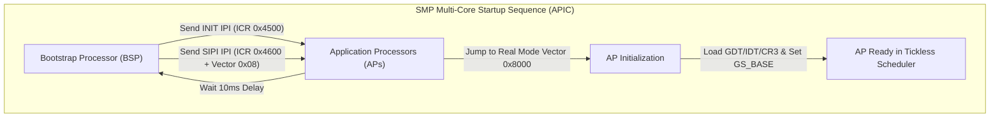
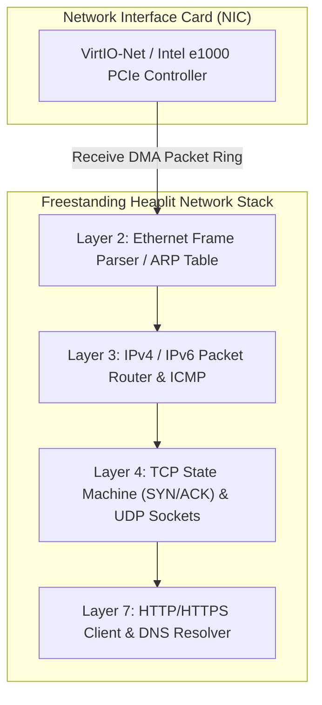
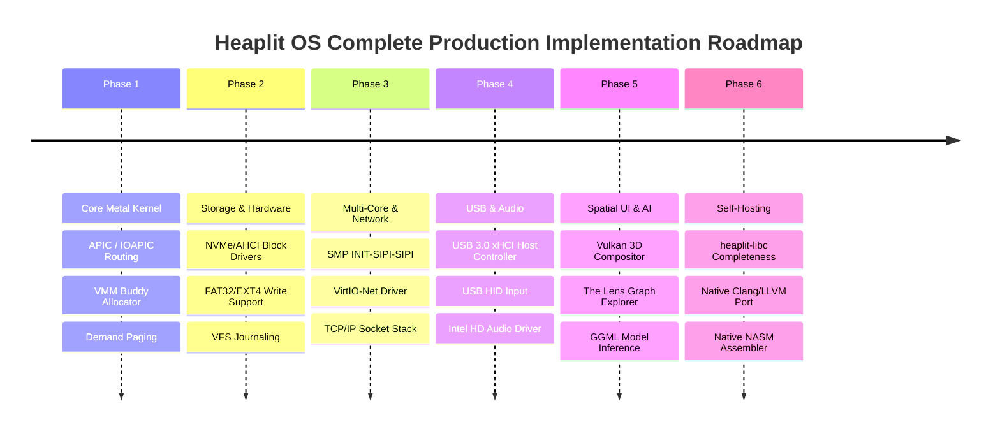

> **Status:** #status/future-implementation

# 🚀 The Complete Production OS Implementation Blueprint & Architectural Gap Analysis

> **Target OS:** Heaplit OS  
> **Purpose:** Master roadmap identifying all remaining architectural components, hardware drivers, memory allocators, network stacks, and self-hosting toolchains required to evolve Heaplit OS from a staged kernel prototype into a fully bootable, self-hosting, production-grade sovereign OS.

---

## 1. Executive Summary & Missing Subsystem Gap Analysis

To transform Heaplit OS into a complete, independent operating system capable of running on bare-metal hardware and hosting its own compiler toolchain without reliance on host operating systems, 7 critical architectural domains must be implemented step-by-step:



---

## 2. Deep Subsystem Breakdowns & Implementation Specifications

### Domain 1: Advanced Hardware, SMP & Interrupt Architecture (Ring 0)
Beyond real-mode boot and basic IDT setup, a production OS requires modern multi-core interrupt and power management:

1. **APIC & IOAPIC Interrupt Routing**:
   - Parse ACPI `MADT` (Multiple APIC Description Table) to map physical legacy IRQs (0-15) to IOAPIC redirection table entries (vectors `0x20`-`0xFF`).
   - Implement Message Signaled Interrupts (MSI/MSI-X) for PCIe devices to bypass legacy IRQ lines.
2. **SMP (Symmetric Multiprocessing) Multi-Core Booting**:
   - Broadcast INIT-SIPI-SIPI (Startup Inter-Processor Interrupt) sequences over the APIC ICR (Interrupt Command Register) to wake Application Processors (APs).
   - Allocate per-CPU kernel stacks and per-CPU Thread Control Blocks (`GS_BASE` register via `wrmsr 0xC0000101`).
3. **ACPI AML Interpreter & Power Controls**:
   - Parse `RSDP`, `XSDT`, `FADT`, and `DSDT` tables.
   - Implement power management routines: Shutdown (`S5` state via ACPI PM1a/PM1b control registers), Reboot (`Port 0xCF9` or 8042 controller), and CPU Sleep (`S3` RAM suspend).
4. **Precision Time Management**:
   - Calibrate the Local APIC Timer using the HPET (High Precision Event Timer) or TSC (Time Stamp Counter) Deadline mode for nanosecond-level tickless scheduling.



---

### Domain 2: Virtual Memory Manager (VMM / `kheap`) & Page Fault Engine
While the PMM manages raw 4KB physical frames, the OS requires a complete virtual memory allocator and dynamic kernel heap:

1. **Slab & Buddy Memory Allocator (`kmalloc` / `kfree`)**:
   - Implement a Buddy Allocator for contiguous power-of-two page frame allocations.
   - Implement a Slab Allocator (`kmem_cache_create`, `kmem_cache_alloc`) for kernel structures (TCBs, VFS inodes, socket buffers).
2. **Demand Paging & Page Fault Handler**:
   - Handle Vector 14 Interrupts: Inspect `CR2` register to determine the faulting virtual address.
   - Implement Copy-on-Write (`COW`) page splitting for fast process cloning.
   - Enforce Write-Protect (`WP` bit in `CR0`) and User/Supervisor (`U/S`) privilege boundaries.

---

### Domain 3: High-Speed Storage Drivers & Filesystem Write Subsystem
1. **NVMe & AHCI SATA Block Storage Drivers**:
   - Implement NVMe Submission Queue (SQ) and Completion Queue (CQ) doorbells over PCIe BARs.
   - Implement AHCI HBA DMA transfers using Physical Region Descriptor Tables (PRDT).
2. **Full VFS Write Operations & Journaling**:
   - FAT32/EXT4 file creation, cluster allocation bitmaps, directory entry writing, and file truncation.
   - Transactional metadata write-ahead logging to prevent filesystem corruption during power loss.

---

### Domain 4: Freestanding TCP/IP/UDP Network Stack & Drivers
To enable network connectivity, package fetching, and remote SSH/TLS communication without third-party OS kernels:



1. **Hardware Drivers**: VirtIO-Net (QEMU default), Intel e1000/e1000e PCIe driver.
2. **Network Stack Implementation**:
   - Layer 2: Ethernet frame parsing, ARP request/reply cache.
   - Layer 3: IPv4 packet checksumming, ICMP echo response.
   - Layer 4: Full TCP state machine (LISTEN, SYN_SENT, SYN_RECEIVED, ESTABLISHED, FIN_WAIT), UDP datagram sockets.
   - Layer 7: HTTP/1.1 client for package downloading via `hpkg`, DNS resolution client.

---

### Domain 5: USB 3.0 (xHCI), HID Input & Audio Subsystem
1. **USB 3.0 (xHCI) Host Controller Driver**:
   - Enumerate USB device descriptors via xHCI transfer rings and doorbells.
   - HID Driver: USB Keyboard and Mouse event streams replacing legacy PS/2 emulation.
   - Mass Storage Driver: USB flash drive block reading/writing.
2. **Intel HD Audio Subsystem**:
   - DMA stream ring buffer management, PCM audio sample mixing, volume control API.

---

### Domain 6: Self-Hosting Toolchain & Standard C Library
To make Heaplit OS self-hosting (compiling its own OS kernel without Windows/Linux):

1. **`heaplit-libc` Runtime Completeness**:
   - Expand `liba` into a complete C standard library featuring POSIX `pthread` threading, `<math.h>` (`libm`), `<sys/socket.h>`, and `<stdio.h>`.
2. **Native Toolchain Compilation**:
   - Port Clang/LLVM frontend and LLD linker to execute natively as `.axf` userland packages on Heaplit OS.
   - Port NASM assembler to compile `.asm` kernel files directly on Heaplit OS.

---

### Domain 7: Automated Testing, Crash Diagnostics & CI/CD Pipeline
1. **Kernel Panic & Stack Backtrace Engine**:
   - Inspect DWARF / ELF symbol tables to print human-readable function names during kernel panics.
   - Dump CPU registers, stack memory, and serial diagnostic logs.
2. **Autonomous Unit & Integration Test Framework**:
   - Headless QEMU test harness executing automated assertions on every build:
     - Memory allocation leak checks.
     - Syscall latency benchmarks (<500 ns).
     - Scheduler multi-thread stress testing.
     - VFS read/write corruption verification.

---

## 3. Concrete Master Implementation Roadmap (Phases 1 - 6)



---

## 4. Hardware Register & ABI Cheat Sheet

| Subsystem | Key Registers / Ports | Operational Function |
| :--- | :--- | :--- |
| **APIC Timer** | `0xFEE00320` (LVTT), `0xFEE00380` (Initial Count) | Program tickless sleep durations & periodic timer interrupts. |
| **IOAPIC** | `0xFEC00000` (Index), `0xFEC00010` (Data) | Map external hardware IRQs to CPU interrupt vectors. |
| **GS Base (SMP)** | `MSR 0xC0000101` (`IA32_GS_BASE`) | Store physical pointer to CPU-local TCB and CPU ID. |
| **CR2 (Page Fault)** | `CR2` Control Register | Contains faulting 64-bit virtual memory address during Vector 14. |
| **NVMe Doorbell** | `BAR0 + 0x1000 + (2 * QID * DBSTRIDE)` | Signal NVMe controller that new command entries are ready in RAM. |
| **xHCI Doorbell** | `BAR0 + DB_OFFSET + (4 * SlotID)` | Command USB 3.0 host controller to execute transfer rings. |

---

## 5. Verification & Testing Commands

```powershell
# Run headless automated test harness with serial output logging
.\loader\load_os.ps1 -Headless -TestMode

# Run graphical QEMU instance with full hardware emulation (NVMe, e1000, xHCI)
qemu-system-x86_64 -drive file=base.bin,format=raw -m 4G -smp 4 -device nvme,drive=n1 -drive id=n1,file=disk.img,format=raw -netdev user,id=n1 -device e1000,netdev=n1 -serial stdio
```

---

## 📑 Related Master Architecture Notes
- [[00 - Architecture/00 - Comprehensive Project Handover & Architecture Specification]]
- [[00 - Architecture/System Overview]]
- [[01 - Ring 0 - Metal Core (Assembly)/06 - Tickless ASM Scheduler]]
- [[02 - Ring 1 - The C Overhead (Bridge)/03 - Virtual File System (VFS)]]
- [[04 - Developer Toolchain & Packaging/01 - LLVM Bitcode (.axf) Application Format]]
