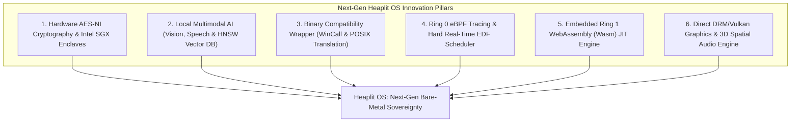
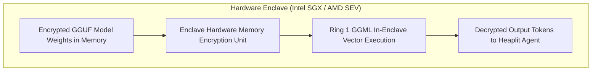
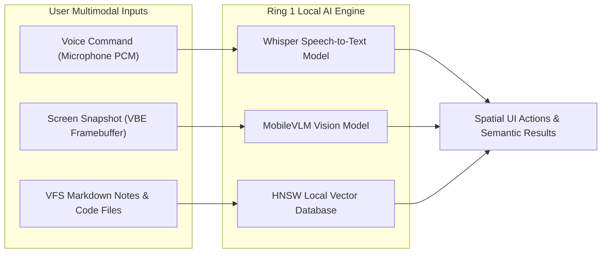
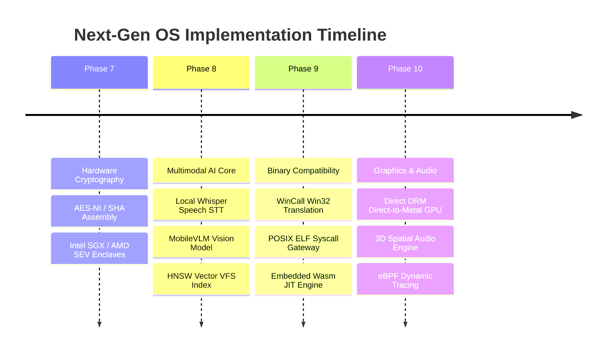

> **Status:** #status/future-implementation

# 🔮 Next-Gen Operating System Innovations & Advanced Architectural Blueprint

> **Target OS:** Heaplit OS  
> **Document Purpose:** Comprehensive technical specification detailing next-generation hardware cryptography, local multimodal AI pipelines, Wasm/POSIX binary compatibility layers, eBPF dynamic kernel tracing, hard real-time scheduling, and 3D spatial audio mechanics.

---

## 1. Executive Summary & Innovation Matrix

To elevate Heaplit OS into a dominant, future-proof operating system, 6 next-generation architectural pillars are specified for progressive integration into the Ring 0 – Ring 3 execution layers:

---

## 2. Comprehensive Technical Specifications

### 2.1 Hardware-Accelerated Cryptography & Enclave Security
- **Assembly AES-NI & SHA Extensions**: Direct Ring 0 assembly routines utilizing `aesenc`, `aesenclast`, `sha256rnds2` hardware instructions for zero-overhead disk encryption, VFS file integrity checks, and packet signing.
- **Hardware Enclave Protection (Intel SGX / AMD SEV)**: Isolated Execution Environments (IEE) isolating local GGML model weights, private vector embeddings, and cryptographic keys from compromised kernel drivers or userland processes.

---

### 2.2 Local Multimodal AI & HNSW Vector Database
- **Multimodal AI Pipeline (Vision & Speech)**: Extends the local Ring 1 GGML engine to support local vision models (MobileVLM / CLIP) for screenshot analysis and local speech-to-text (Whisper) for voice-driven spatial OS navigation.
- **In-VFS HNSW Vector Index**: Embedded Hierarchical Navigable Small World (HNSW) vector database built directly into the POSIX VFS. Enables sub-millisecond semantic similarity lookups across system notes, code files, and calendar entries without external databases.

---

### 2.3 Binary Compatibility Wrapper (`wincall` & `posixcall`)
- **`wincall` Translation Layer**: Low-level ABI wrapper mapping Windows Portable Executable (`.exe`) PE headers and Win32 system calls to Heaplit Ring 0 assembly syscalls.
- **`posixcall` Translation Layer**: Intercepts Linux ELF (`.so` / executable) syscalls (`sys_open`, `sys_mmap`, `sys_fork`) and translates them on the fly to native Heaplit VFS and PMM operations, allowing legacy binaries to execute seamlessly inside sandboxed `.axf` containers.

---

### 2.4 Ring 0 eBPF-Style Tracing & Hard Real-Time EDF Scheduler
- **Ring 0 Tracing Engine**: Lightweight assembly bytecode engine allowing userland daemons to register safe, sandboxed probe hooks onto Ring 0 syscalls and VFS events for real-time performance profiling without kernel recompilation.
- **Hard Real-Time EDF Scheduler**: Earliest Deadline First (EDF) scheduling policy operating alongside the APIC tickless scheduler. Guarantees sub-millisecond (<500 µs) latency for audio mixing, robotics control, and VR rendering queues.

---

### 2.5 Embedded Ring 1 WebAssembly (Wasm) JIT Engine
- **Sandboxed Wasm Runtime**: Embedded Wasm JIT compiler in Ring 1 allowing web applications, microservices, and user plugins to run natively on Heaplit OS at near-bare-metal speeds with complete memory safety.

---

### 2.6 Direct DRM/Vulkan Compositor & 3D Spatial Audio
- **Direct DRM / Vulkan Graphics Pipeline**: Bypasses traditional X11/Wayland display server bloat. Retained spatial UI frames render directly to hardware GPU swapchains via DRM/KMS.
- **3D Spatial Audio Engine**: Positions application sound sources in 3D space corresponding to window positions within the spatial compositor viewport.

---

## 3. Advanced Implementation Roadmap (Phases 7 - 10)

---

## 4. Subsystem Hardware Ports & Registers

| Feature | Port / Register / Instruction | Technical Function |
| :--- | :--- | :--- |
| **AES-NI Encrypt** | `aesenc xmm1, xmm2` | Execute single round of AES encryption in hardware. |
| **SHA-256 Round** | `sha256rnds2 xmm1, xmm2` | Perform 2 rounds of SHA-256 hash calculation. |
| **Intel SGX Launch** | `eenter`, `eexit` | Transition CPU execution into hardware secure enclave. |
| **Direct DRM Mode** | `/dev/dri/card0` (DRM KMS) | Atomic mode setting for direct GPU page flips. |

---

## 📑 Related Master Architecture Notes
- [[06 - Master Planning & Roadmaps/roadmap/08 - The Complete Production OS Implementation Blueprint & Gap Analysis|08 - The Complete Production OS Implementation Blueprint & Gap Analysis]]
- [[00 - Architecture/overview/00 - Comprehensive Project Handover & Architecture Specification|00 - Comprehensive Project Handover & Architecture Specification]]
- [[02 - Ring 1 - The C Overhead (Bridge)/ring_1/drivers/02 - GGML & Llama.cpp Kernel Port|02 - GGML & Llama.cpp Kernel Port]]
- [[04 - Developer Toolchain & Packaging/format/01 - LLVM Bitcode (.axf) Application Format|01 - LLVM Bitcode (.axf) Application Format]]
