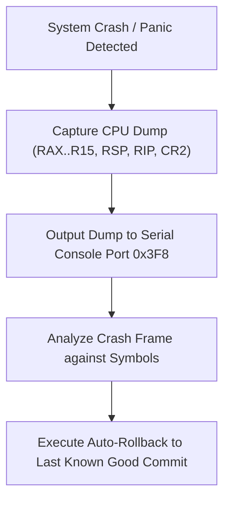

> **Status:** #status/future-implementation

# 🚑 Crash Diagnostics & Rollback Playbook

> **Diagnostic Protocol:** Bare-Metal Failure Recovery

---

## 1. Standard Diagnostic Procedure

1. **Inspect Log First:** When QEMU crashes or NASM fails, read the complete un-truncated error log output.
2. **Register Trace Analysis:**
   - `#GP` (General Protection Fault, Exception 13): Verify segment selector privileges and alignment.
   - `#PF` (Page Fault, Exception 14): Read register `CR2` to determine faulting virtual address. If address is near `0x0`, inspect null pointer dereferences.
   - `#UD` (Invalid Opcode, Exception 6): Check instruction set support (CPUID for AVX-512 / Long Mode).
3. **Rollback Execution:** If code changes break existing functionality, use `git restore` or `hpkg rollback` to revert to last known good snapshot.

## 🔄 Diagnostics & Recovery Playbook Flowchart

