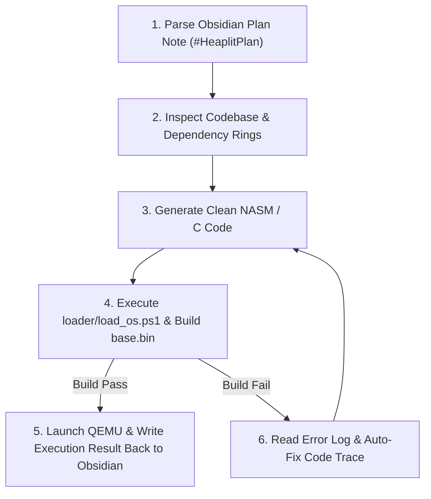

> **Status:** #status/implemented

# 🤖 Autonomous Build & Test Loop Playbook

> **Agent Protocol:** Heaplit AI OS Developer Loop

---

## 🔄 The 5-Step Agent Loop

```mermaid
graph TD
    Step1["1. Parse Obsidian Plan Note (#HeaplitPlan)"] --> Step2["2. Inspect Codebase & Dependency Rings"]
    Step2 --> Step3["3. Generate Clean NASM / C Code"]
    Step3 --> Step4["4. Execute loader/load_os.ps1 & Build base.bin"]
    Step4 -->|"Build Pass"| Step5["5. Launch QEMU & Write Execution Result Back to Obsidian"]
    Step4 -->|"Build Fail"| Step6["6. Read Error Log & Auto-Fix Code Trace"]
    Step6 --> Step3
```
