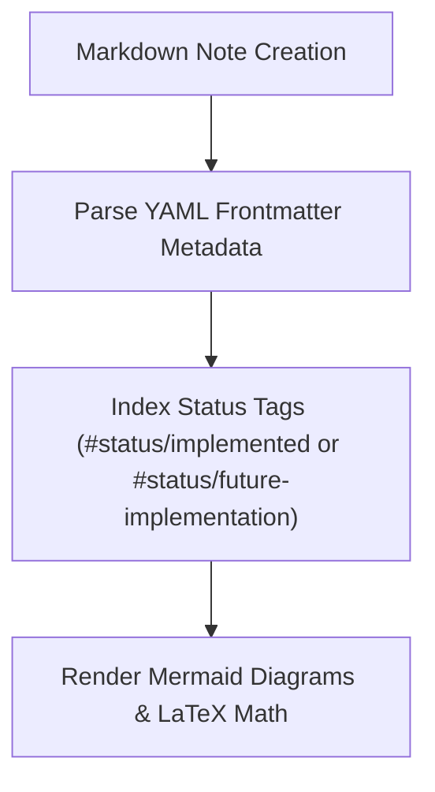

> **Status:** #status/future-implementation

# 📝 Obsidian Markdown Syntax & Directives

> **Heaplit Directive Parser Specification**

---

## 1. Directive Format

When Heaplit parses an Obsidian note tagged `#HeaplitPlan`, it searches for the following syntax:

```markdown
# HeaplitPlan: [Task Name]
Tags: #HeaplitPlan #ASM #Ring0 #MVP

- [ ] [High-level Task Description]

@Heaplit:
[Detailed natural language instructions for code generation]
Target: [File path in source tree]
Language: [NASM | C | C++]
```

---

## 2. Supported Directives & Annotations

| Tag / Directive | Meaning |
| :--- | :--- |
| `@Heaplit:` | Initiates code generation for the subsequent prompt block. |
| `Target: <path>` | Explicit destination file for generated source. |
| `Language: <lang>` | Assembler / compiler syntax target. |
| `// @Heaplit` | Inline source code insertion marker. |
| `## Build Errors` | Target section where Heaplit writes compile failure logs. |

---

## 3. Related Links
- [[07 - Heaplit AI Agent Playbooks/01 - Autonomous Build & Test Loop|Build Loop]]
- [[00 - Architecture/Obsidian Integration & 2-Way Sync|Obsidian 2-Way Sync]]

## 🔄 Markdown Processing & Tag Indexing Flowchart


