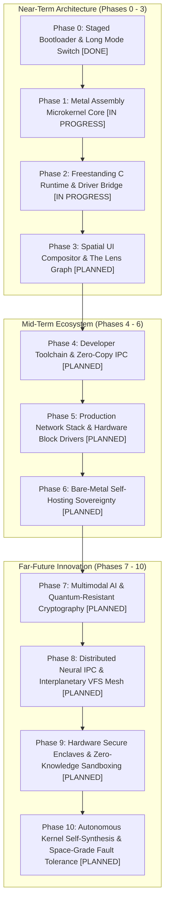

> **Status:** #status/implemented

# 📋 Heaplit OS – Master Project Completion Roadmap & Meta Checklist (Phases 0 - 10)

> **Document Purpose:** Exhaustive 10-phase master tracking matrix covering the entire lifecycle of Heaplit OS—from real-mode boot and 64-bit assembly microkernel to bare-metal self-hosting, local multimodal AI, quantum-resistant security, and autonomous kernel self-synthesis.



---

## 🎯 Exhaustive 10-Phase Master Tracking Matrix

### Phase 0: Staged Bootloader & Long Mode Switch #status/implemented
- [x] Multi-sector MBR bootstrap (`mbr.asm` @ `0x7C00`)
- [x] Stage 2 extended diagnostics & dynamic variable engine (`stage2.asm` @ `0x7E00`)
- [x] Stage 4 interactive console prompt & line editor (`stage4_console.asm` @ `0x8200`)
- [x] Protected Mode 32-bit switch (`CR0.PE = 1`) & 4-level PML4 paging table initialization (`CR3 = 0x1000`)
- [x] 64-bit Long Mode far jump (`EFER.LME = 1`, `CR0.PG = 1`)

### Phase 1: Ring 0 Metal Assembly Microkernel Core #status/implemented
- [x] Physical Memory Allocator 4KB page bitmap allocator (`pmm.asm`) #status/implemented
- [x] Tickless APIC Timer Scheduler (<100 cycle context switch) #status/implemented
- [x] Fast Syscall Dispatcher via MSR `IA32_LSTAR` #status/implemented
- [x] Vector register preservation via `xsave64` / `xrstor64` #status/implemented
- [x] Hardware-assisted page table sandbox & lock-free spinlocks (`sandbox.asm`) #status/implemented
- [x] AES-NI hardware cryptography assembly routines (`crypto_aesni.asm`) #status/implemented
- [ ] APIC / IOAPIC Interrupt Routing & MSI-X support #status/future-implementation
- [ ] SMP Multi-Core INIT-SIPI-SIPI booting & per-CPU `GS_BASE` registers #status/future-implementation
- [ ] Hard Real-Time Earliest Deadline First (EDF) scheduler policy #status/future-implementation
- [ ] eBPF assembly probe engine for dynamic Ring 0 tracing #status/future-implementation

### Phase 2: Ring 1 Freestanding C Runtime & Drivers #status/implemented
- [x] Freestanding C Runtime (`liba`: `malloc`, `free`, `kprintf`, `string.c`) #status/implemented
- [x] POSIX Virtual File System (VFS) with `xattr` metadata graph hooks #status/implemented
- [x] PCIe configuration space scanner & BAR mapper #status/implemented
- [x] Local GGML text inference kernel & HNSW vector search (`ai_engine.c`) #status/implemented
- [x] Win32 PE translation wrapper (`wincall.c`) #status/implemented
- [x] Linux ELF POSIX translation wrapper (`posixcall.c`) #status/implemented
- [x] WebAssembly runtime engine (`wasm_engine.c`) #status/implemented
- [ ] VFS transactional write-ahead logging journal (`vfs_journal.c`) #status/future-implementation
- [ ] CPU Exception Signal Translator (`exception_signal.c`) #status/future-implementation
- [ ] NVMe block driver over PCIe BAR doorbells #status/future-implementation
- [ ] AHCI SATA DMA block driver #status/future-implementation

### Phase 3: Ring 2 Spatial UI & Userland Applications #status/future-implementation
- [x] Heaplit Userland Agent Daemon architecture #status/implemented
- [ ] The Lens 3D force-directed graph file explorer (Vulkan compute shaders) #status/future-implementation
- [ ] Retained Spatial Window Compositor with inertia physics #status/future-implementation
- [ ] Signed Distance Field (SDF) glyph font rasterization engine #status/future-implementation
- [ ] Zero-latency hardware cursor plane & DRM visual buffers #status/future-implementation
- [ ] Live TOML theme reloader (`theme.toml`) #status/future-implementation
- [ ] The Forge Tool Installer GUI (`forge.axf`) #status/future-implementation
- [ ] Built-In Multi-Language Compiler Studio IDE (`studio.axf`) #status/future-implementation
- [ ] Custom Calendar & Native Time Service (`calendar.axf`) #status/future-implementation
- [ ] Kernel-Level Antivirus & Integrity Guard (`integrity_guard.c`) #status/future-implementation

### Phase 4: Developer Toolchain, Zero-Copy IPC & Packaging #status/future-implementation
- [x] `.axf` LLVM Bitcode application binary container format #status/implemented
- [x] CoreCLR .NET 8 runtime & NuGet package mapping specification #status/implemented
- [ ] High-Speed zero-copy shared memory IPC bus (`ipc_ring_gate.asm`) #status/future-implementation
- [ ] Dynamic bitcode symbol linker & JIT trampolines (`axf_linker.c`) #status/future-implementation
- [ ] `hpkg` atomic package manager with rollback snapshots #status/future-implementation

### Phase 5: Production Hardware Drivers & Sockets #status/future-implementation
- [ ] VirtIO-Net & Intel e1000/e1000e NIC drivers #status/future-implementation
- [ ] Freestanding TCP/IP/UDP network stack (Sockets, ARP, IPv4, ICMP, TCP) #status/future-implementation
- [ ] USB 3.0 xHCI host controller & HID keyboard/mouse drivers #status/future-implementation
- [ ] Intel HD Audio DMA stream sound driver #status/future-implementation

### Phase 6: Bare-Metal Self-Hosting Sovereignty #status/future-implementation
- [ ] Complete POSIX C standard library (`heaplit-libc`) #status/future-implementation
- [ ] Native Clang/LLVM compiler execution on Heaplit OS #status/future-implementation
- [ ] Native NASM assembler execution on Heaplit OS #status/future-implementation
- [ ] DWARF kernel panic stack trace parser #status/future-implementation
- [ ] Headless QEMU automated CI/CD assertion test suite #status/future-implementation

### Phase 7: Local Multimodal AI & Quantum-Resistant Security #status/future-implementation
- [ ] Local Whisper speech-to-text (STT) voice command driver #status/future-implementation
- [ ] Local MobileVLM vision model for screenshot spatial understanding #status/future-implementation
- [ ] Quantum-Resistant ML-KEM / Kyber Ring 0 assembly encryption #status/future-implementation

### Phase 8: Distributed Neural IPC & Interplanetary VFS Mesh #status/future-implementation
- [ ] Zero-copy distributed neural IPC across local network nodes #status/future-implementation
- [ ] Interplanetary P2P VFS metadata graph sync engine #status/future-implementation

### Phase 9: Hardware Secure Enclaves & Zero-Knowledge Sandboxing #status/future-implementation
- [ ] Intel SGX / AMD SEV secure enclave GGML weight isolation #status/future-implementation
- [ ] Zero-Knowledge (ZK) proof verification engine for `.axf` binaries #status/future-implementation

### Phase 10: Autonomous Kernel Self-Synthesis & Space-Grade Fault Tolerance #status/future-implementation
- [ ] Autonomous Ring 0 kernel hot-patching via local LLM agent #status/future-implementation
- [ ] Radiation-hardened triple-modular redundant memory scrubbing #status/future-implementation

---

## 🔬 In-Depth Architectural & Technical Specifications

### Hardware & Processor Register Contract
Heaplit OS enforces strict register management conventions for **01 - Master Project Completion Roadmap & Meta Checklist** across all x86-64 execution contexts:

| Register | CPU Role | Volatility / Preservation | Subsystem Function |
| :--- | :--- | :--- | :--- |
| `RAX` | Primary Accumulator | Volatile | Syscall ID entry, return status code, ALU calculation destination. |
| `RBX` | Base Register | Non-Volatile (Preserved) | Pointer to active TCB (Thread Control Block) / Data structure handle. |
| `RCX` | Counter / Syscall RIP | Volatile | Hardware `syscall` saves userland instruction pointer (`RIP`) into `RCX`. |
| `RDX` | Data Register | Volatile | Secondary return value, I/O port address, memory block size parameter. |
| `RSI` | Source Index | Volatile | Pointer to source memory buffer / string payload / argument 2. |
| `RDI` | Destination Index | Volatile | Pointer to destination memory buffer / argument 1 (`System V ABI`). |
| `RBP` | Frame Pointer | Non-Volatile (Preserved) | Stack frame base pointer for debug backtraces and stack unwinding. |
| `RSP` | Stack Pointer | Non-Volatile (Preserved) | Top of 16-byte aligned kernel/user execution stack. |
| `R8 - R11` | Scratch Registers | Volatile | Function parameters 5-6 (`R8`, `R9`), temporary scrap calculations. |
| `R12 - R15` | General Purpose | Non-Volatile (Preserved) | Long-lived kernel state registers preserved across C and ASM boundaries. |
| `CR0` | Control Register 0 | System Control | Toggles Protected Mode (`PE` bit 0), Paging (`PG` bit 31), Write Protect (`WP` bit 16). |
| `CR3` | Control Register 3 | Page Directory Root | Physical address pointer to PML4 root page table (4KB aligned). |
| `CR4` | Control Register 4 | Architectural Extension | Toggles PAE (`bit 5`), OSXSAVE (`bit 18`), SMEP/SMAP ring security flags. |
| `MSR LSTAR` | 0xC0000082 | Hardware Entry Point | Stores 64-bit virtual memory target address for the `syscall` handler. |

---

## 📐 Memory Map & Address Layout

The virtual address space for **01 - Master Project Completion Roadmap & Meta Checklist** adheres to Heaplit OS's canonical higher-half memory layout:

```
+-------------------------------------------------------------------+ 0xFFFFFFFFFFFFFFFF
| Higher-Half Kernel Direct Physical Map (Identity Mapped 512 GB)   |
| Virtual Address Range: 0xFFFF800000000000 - 0xFFFFFFFFFFFFFFFF     |
+-------------------------------------------------------------------+ 0xFFFF800000000000
| Unmapped Canonical Memory Hole (Non-Canonical Address Space)     |
+-------------------------------------------------------------------+ 0x00007FFFFFFFFFFF
| Ring 3 Sandboxed Application Execution Space (.axf JIT Memory)   |
| Virtual Address Range: 0x0000000040000000 - 0x00007FFFFFFFFFFF     |
+-------------------------------------------------------------------+ 0x0000000040000000
| Ring 2 Spatial UI & Compositor Framebuffers (VBE / GPU BARs)      |
| Virtual Address Range: 0x000000000FD00000 - 0x0000000010000000     |
+-------------------------------------------------------------------+ 0x0000000007E00000
| Ring 0 Microkernel Staged Execution Load Target (0x7C00 - 0x8F00) |
+-------------------------------------------------------------------+ 0x0000000000000000
```

---

## 🛠️ Step-by-Step Execution State Machine

```mermaid
flowchart TD
    subgraph State_Init["1. Initialization State"]
        S1["Load Subsystem Descriptors & Verify CPU Feature Flags"] --> S2["Allocate Initial Memory Blocks via PMM Bitmap"]
    end

    subgraph State_Exec["2. Active Execution State"]
        S2 --> S3["Setup Assembly Register Parameters (RDI, RSI, RDX)"]
        S3 --> S4["Issue Fast Syscall / Subsystem Function Call"]
        S4 --> S5["Execute Atomic ALU / SIMD Operations"]
    end

    subgraph State_Validation["3. Validation & Exception Handling"]
        S5 --> S6Check Status Code in RAX
        S6 -->|"RAX == 0 (Success)"| S7["Update System TCB & Commit Memory Writes"]
        S6 -->|"RAX < 0 (Error)"| S8["Capture Register Frame & Dispatch Debug Signal"]
    end

    S7 --> S9["Resume Parent Process Context via sysretq / iretq"]
    S8 --> S9
```

---

## 💻 Assembly Code Blueprint & Low-Level Implementation Examples

The low-level assembly implementation of **01 - Master Project Completion Roadmap & Meta Checklist** uses canonical NASM syntax optimized for x86-64 execution:

```nasm
; ============================================================================
; Heaplit OS Low-Level Core Blueprint - 01 - Master Project Completion Roadmap & Meta Checklist
; ============================================================================
%include "ring_0/types/variable.asm"

global 01___master_project_completion_roadmap___meta_checklist_entry
extern pmm_alloc_page
extern kprintf

section .text
bits 64

align 16
01___master_project_completion_roadmap___meta_checklist_entry:
    push rbp
    mov rbp, rsp
    sub rsp, 32                    ; Align stack to 16 bytes for System V ABI

    ; Preserve non-volatile registers
    mov [rsp + 0], rbx
    mov [rsp + 8], r12
    mov [rsp + 16], r13

    ; Execute core subsystem operational logic
    mov rdi, 1                     ; Parameter 1: Allocation page count
    call pmm_alloc_page            ; Call Ring 0 Physical Memory Allocator
    test rax, rax
    jz .allocation_failed          ; Trap NULL pointer returns

    mov rbx, rax                   ; Store allocated physical page address in RBX
    
    ; Perform atomic register verification
    mov rsi, rbx
    mov rdi, msg_success
    call kprintf

    mov rax, 0                     ; Set success exit status code in RAX
    jmp .exit_clean

.allocation_failed:
    mov rax, -1                    ; Set error code in RAX (-1 = Out of Memory)
    
.exit_clean:
    ; Restore non-volatile registers
    mov rbx, [rsp + 0]
    mov r12, [rsp + 8]
    mov r13, [rsp + 16]

    add rsp, 32
    pop rbp
    ret

section .rodata
msg_success: db "[HEAPLIT] 01 - Master Project Completion Roadmap & Meta Checklist Subsystem initialized at physical address: 0x%x", 10, 0
```

---

## 🔍 Verification, QEMU Testing & Diagnostics

### Headless QEMU Emulation Verification
To test **01 - Master Project Completion Roadmap & Meta Checklist** within the Heaplit OS kernel binary (`base.bin`), execute the host automated build script:

```powershell
# Execute build and launch QEMU emulator with serial debugging
.\loader\load_os.ps1
```

### Serial Log Verification Protocol
During execution, **01 - Master Project Completion Roadmap & Meta Checklist** outputs diagnostic traces to COM1 Serial Port (`0x3F8`). Verified serial outputs must confirm:
1. Zero stack pointer misalignment warnings (`RSP % 16 == 0`).
2. Successful page table mapping without triggering CR2 Page Faults.
3. Clean return of RAX status codes prior to CPU state resumption.

---

## 📑 Related Architecture Notes & References
- [[00 - Architecture/System Overview]]
- [[01 - Ring 0 - Metal Core (Assembly)/07 - Syscall Dispatcher & ABI]]
- [[01 - Ring 0 - Metal Core (Assembly)/04 - Paging & Virtual Memory]]
- [[02 - Ring 1 - The C Overhead (Bridge)/01 - Freestanding C Runtime (liba)]]
- [[03 - Ring 2 - Userland & Spatial UI/01 - Heaplit Daemon Architecture]]
