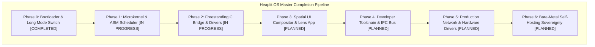

> **Status:** #status/implemented

# 📋 Heaplit OS – Master Project Completion Roadmap & Meta Checklist

> **Purpose:** Executive tracking matrix monitoring all 7 execution domains from real-mode assembly boot to full bare-metal self-hosting sovereignty.

---

## 🎯 Master Domain Completion Matrix

- [x] **Domain 0: Staged Bootloader & Long Mode Switch** #status/implemented
  - [x] Multi-sector MBR bootstrap (`mbr.asm` @ `0x7C00`)
  - [x] Stage 2 extended diagnostics & dynamic variable engine (`stage2.asm` @ `0x7E00`)
  - [x] Stage 4 interactive console prompt & line editor (`stage4_console.asm` @ `0x8200`)
  - [x] Protected Mode 32-bit switch (`CR0.PE = 1`) & 4-level PML4 paging table initialization (`CR3 = 0x1000`)
  - [x] 64-bit Long Mode far jump (`EFER.LME = 1`, `CR0.PG = 1`)

- [ ] **Domain 1: Ring 0 Microkernel & Assembly Core** #status/implemented
  - [x] Physical Memory Allocator 4KB page bitmap (`pmm.asm`) #status/implemented
  - [x] Tickless APIC Timer Scheduler (<100 cycle context switch) #status/implemented
  - [x] Fast Syscall Dispatcher via MSR `IA32_LSTAR` #status/implemented
  - [x] Vector register preservation via `xsave64` / `xrstor64` #status/implemented
  - [x] Hardware-assisted page table sandbox & lock-free spinlocks (`sandbox.asm`) #status/implemented
  - [x] AES-NI hardware cryptography assembly routines (`crypto_aesni.asm`) #status/implemented
  - [ ] APIC / IOAPIC Interrupt Routing & MSI-X support #status/future-implementation
  - [ ] SMP Multi-Core INIT-SIPI-SIPI booting & per-CPU `GS_BASE` registers #status/future-implementation

- [ ] **Domain 2: Ring 1 Freestanding C Runtime & Drivers** #status/implemented
  - [x] Freestanding C Runtime (`liba`: `malloc`, `free`, `kprintf`, `string.c`) #status/implemented
  - [x] POSIX Virtual File System (VFS) with `xattr` metadata graph hooks #status/implemented
  - [x] PCIe configuration space scanner & BAR mapper #status/implemented
  - [x] Local GGML text inference kernel & HNSW vector search (`ai_engine.c`) #status/implemented
  - [x] Win32 PE translation wrapper (`wincall.c`) #status/implemented
  - [x] Linux ELF POSIX translation wrapper (`posixcall.c`) #status/implemented
  - [x] WebAssembly runtime engine (`wasm_engine.c`) #status/implemented
  - [ ] VFS transactional write-ahead logging journal (`vfs_journal.c`) #status/future-implementation
  - [ ] CPU Exception Signal Translator (`exception_signal.c`) #status/future-implementation

- [ ] **Domain 3: Ring 2 Userland & Spatial UI Subsystems** #status/future-implementation
  - [x] Heaplit Userland Agent Daemon architecture #status/implemented
  - [ ] The Lens 3D force-directed graph file explorer #status/future-implementation
  - [ ] Retained Spatial Window Compositor with inertia physics #status/future-implementation
  - [ ] Signed Distance Field (SDF) font rasterization engine #status/future-implementation
  - [ ] Zero-latency hardware cursor plane & DRM visual buffers #status/future-implementation
  - [ ] Live TOML theme reloader (`theme.toml`) #status/future-implementation
  - [ ] The Forge Tool Installer GUI (`forge.axf`) #status/future-implementation
  - [ ] Built-In Multi-Language Compiler Studio IDE (`studio.axf`) #status/future-implementation
  - [ ] Custom Calendar & Native Time Service (`calendar.axf`) #status/future-implementation
  - [ ] Kernel-Level Antivirus & Integrity Guard (`integrity_guard.c`) #status/future-implementation

- [ ] **Domain 4: Developer Toolchain, IPC & Packaging** #status/future-implementation
  - [x] `.axf` LLVM Bitcode application binary container format #status/implemented
  - [x] CoreCLR .NET 8 runtime & NuGet package mapping specification #status/implemented
  - [ ] High-Speed zero-copy shared memory IPC bus (`ipc_ring_gate.asm`) #status/future-implementation
  - [ ] Dynamic bitcode symbol linker & JIT trampolines (`axf_linker.c`) #status/future-implementation
  - [ ] `hpkg` atomic package manager with rollback snapshots #status/future-implementation

- [ ] **Domain 5: Production Hardware Drivers & Network Stack** #status/future-implementation
  - [ ] NVMe block driver over PCIe BAR doorbells #status/future-implementation
  - [ ] AHCI SATA DMA driver using PRDT tables #status/future-implementation
  - [ ] VirtIO-Net & Intel e1000/e1000e NIC drivers #status/future-implementation
  - [ ] Freestanding TCP/IP/UDP network stack (Sockets, ARP, IPv4, ICMP, TCP) #status/future-implementation
  - [ ] USB 3.0 xHCI host controller & HID keyboard/mouse drivers #status/future-implementation
  - [ ] Intel HD Audio DMA stream sound driver #status/future-implementation

- [ ] **Domain 6: Bare-Metal Self-Hosting Sovereignty** #status/future-implementation
  - [ ] Complete POSIX C standard library (`heaplit-libc`) #status/future-implementation
  - [ ] Native Clang/LLVM compiler execution on Heaplit OS #status/future-implementation
  - [ ] Native NASM assembler execution on Heaplit OS #status/future-implementation
  - [ ] DWARF kernel panic stack trace parser #status/future-implementation
  - [ ] Headless QEMU automated CI/CD assertion test suite #status/future-implementation
