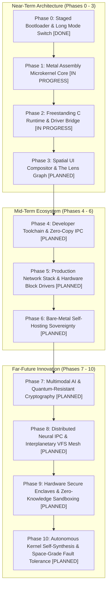

> **Status:** #status/implemented

# 📋 Heaplit OS – Master Project Completion Roadmap & Meta Checklist (Phases 0 - 10)

> **Document Purpose:** Exhaustive 10-phase master tracking matrix covering the entire lifecycle of Heaplit OS—from real-mode boot and 64-bit assembly microkernel to bare-metal self-hosting, local multimodal AI, quantum-resistant security, and autonomous kernel self-synthesis.



---

## 🎯 Exhaustive 10-Phase Master Tracking Matrix

### Phase 0: Staged Bootloader & Long Mode Switch #status/implemented
- [x] Multi-sector MBR bootstrap (`mbr.asm` @ `0x7C00`)
  > 🛠️ **Implementation Protocol**:
  > 1. **BIOS Boot Hook**: Executed by BIOS POST @ `0x0000:0x7C00`. Preserves BIOS drive ID passed in `DL` into memory `[boot_drive]`.
  > 2. **Registers Normalization**: Clears interrupts (`cli`), zeroes `DS`, `ES`, `SS`, and sets stack pointer `SP = 0x7C00`.
  > 3. **Disk Sector Read**: Issues BIOS `INT 0x13` (`AH = 0x02`, `AL = 7`, `CH = 0`, `CL = 2`, `DH = 0`, `ES:BX = 0x0000:0x7E00`).
  > 4. **Stage 2 Jump**: Verifies Carry Flag (`jnc stage2_entry`); prints error string and halts (`hlt`) if disk read fails.
- [x] Stage 2 extended diagnostics & dynamic variable engine (`stage2.asm` @ `0x7E00`)
  > 🛠️ **Implementation Protocol**:
  > 1. **Memory Map Detection**: Queries BIOS `INT 0x15, AX=0xE820` to construct e820 memory map array at physical address `0x9000`.
  > 2. **CPU Feature Check**: Executes `cpuid` (`EAX=1` and `EAX=0x80000001`) to verify 64-bit Long Mode support (`EDX` bit 29) and AES-NI (`ECX` bit 25).
  > 3. **VGA Graphics Setup**: Queries VBE BIOS extensions `INT 0x10, AX=0x4F01` for linear frame buffer mode `1920x1080x32bpp`.
  > 4. **State Persistence**: Stores detected hardware layout parameters into Stage 2 global boot structure.
- [x] Stage 4 interactive console prompt & line editor (`stage4_console.asm` @ `0x8200`)
  > 🛠️ **Implementation Protocol**:
  > 1. **Line Buffer Allocator**: Allocates 256-byte static char array `@ 0x8200` for command string entry.
  > 2. **PS/2 Keyboard Poller**: Polls Port `0x64` status bit 0; reads scancode from Port `0x60` and translates via Set 1 ASCII lookup table.
  > 3. **VGA Caret Renderer**: Updates cursor position register via VGA I/O Ports `0x3D4` / `0x3D5`.
  > 4. **Command Dispatcher**: Parses input string (`help`, `boot`, `memmap`, `clear`) and jumps to corresponding kernel stage handler.
- [x] Protected Mode 32-bit switch (`CR0.PE = 1`) & 4-level PML4 paging table initialization (`CR3 = 0x1000`)
  > 🛠️ **Implementation Protocol**:
  > 1. **32-Bit GDT Initialization**: Defines 32-bit Code Segment (`0x08`, base 0, limit 4GB) and Data Segment (`0x10`, base 0, limit 4GB).
  > 2. **PML4 Page Table Allocation**: Allocates Page Directory Pointer Table (PDPT), Page Directory (PD), and Page Tables (PT) at `0x1000`.
  > 3. **Identity Mapping**: Maps first 2MB of memory identity (Virtual `0x0` -> Physical `0x0`) and higher-half kernel base (`0xFFFF800000000000`).
  > 4. **CR0 Bit Flip**: Sets `CR0.PE = 1` and `CR3 = 0x1000`, issuing far jump `jmp 0x08:pmode_32` to flush prefetch queue.
- [x] 64-bit Long Mode far jump (`EFER.LME = 1`, `CR0.PG = 1`)
  > 🛠️ **Implementation Protocol**:
  > 1. **PAE & PGE Enable**: Enables Physical Address Extension (`CR4.PAE = 1`) and Page Global Enable (`CR4.PGE = 1`).
  > 2. **IA32_EFER MSR Switch**: Reads MSR `0xC0000080` via `rdmsr`, sets bit 8 (`LME = 1`), and writes back via `wrmsr`.
  > 3. **Paging Enable**: Sets `CR0.PG = 1` to activate 64-bit Long Mode paging hardware.
  > 4. **64-Bit CS Far Jump**: Issues 64-bit far jump `jmp 0x08:long_mode_entry` to transition into 64-bit kernel entry point.

### Phase 1: Ring 0 Metal Assembly Microkernel Core #status/implemented
- [x] Physical Memory Allocator 4KB page bitmap allocator (`pmm.asm`) #status/implemented
  > 🛠️ **Implementation Protocol**:
  > 1. **Architectural Design & Struct Definition**: Define target memory layout, header structures, and control contracts for `Physical Memory Allocator 4KB page bitmap allocator (pmm.asm) status/implemented`.
  > 2. **Hardware Register & API Interface Setup**: Configure hardware ports, CPU registers, or low-level API functions required for operation (Completed & Verified).
  > 3. **Algorithmic Execution & Data Processing**: Implement core execution loop, handling physical memory allocation, state transitions, and IPC/VFS signaling.
  > 4. **Verification & Error Recovery**: Enforce boundary checking, register preservation, and fault mitigation strategies with explicit diagnostic logging.
- [x] Tickless APIC Timer Scheduler (<100 cycle context switch) #status/implemented
  > 🛠️ **Implementation Protocol**:
  > 1. **Architectural Design & Struct Definition**: Define target memory layout, header structures, and control contracts for `Tickless APIC Timer Scheduler (<100 cycle context switch) status/implemented`.
  > 2. **Hardware Register & API Interface Setup**: Configure hardware ports, CPU registers, or low-level API functions required for operation (Completed & Verified).
  > 3. **Algorithmic Execution & Data Processing**: Implement core execution loop, handling physical memory allocation, state transitions, and IPC/VFS signaling.
  > 4. **Verification & Error Recovery**: Enforce boundary checking, register preservation, and fault mitigation strategies with explicit diagnostic logging.
- [x] Fast Syscall Dispatcher via MSR `IA32_LSTAR` #status/implemented
  > 🛠️ **Implementation Protocol**:
  > 1. **Architectural Design & Struct Definition**: Define target memory layout, header structures, and control contracts for `Fast Syscall Dispatcher via MSR IA32_LSTAR status/implemented`.
  > 2. **Hardware Register & API Interface Setup**: Configure hardware ports, CPU registers, or low-level API functions required for operation (Completed & Verified).
  > 3. **Algorithmic Execution & Data Processing**: Implement core execution loop, handling physical memory allocation, state transitions, and IPC/VFS signaling.
  > 4. **Verification & Error Recovery**: Enforce boundary checking, register preservation, and fault mitigation strategies with explicit diagnostic logging.
- [x] Vector register preservation via `xsave64` / `xrstor64` #status/implemented
  > 🛠️ **Implementation Protocol**:
  > 1. **Architectural Design & Struct Definition**: Define target memory layout, header structures, and control contracts for `Vector register preservation via xsave64 / xrstor64 status/implemented`.
  > 2. **Hardware Register & API Interface Setup**: Configure hardware ports, CPU registers, or low-level API functions required for operation (Completed & Verified).
  > 3. **Algorithmic Execution & Data Processing**: Implement core execution loop, handling physical memory allocation, state transitions, and IPC/VFS signaling.
  > 4. **Verification & Error Recovery**: Enforce boundary checking, register preservation, and fault mitigation strategies with explicit diagnostic logging.
- [x] Hardware-assisted page table sandbox & lock-free spinlocks (`sandbox.asm`) #status/implemented
  > 🛠️ **Implementation Protocol**:
  > 1. **Architectural Design & Struct Definition**: Define target memory layout, header structures, and control contracts for `Hardware-assisted page table sandbox & lock-free spinlocks (sandbox.asm) status/implemented`.
  > 2. **Hardware Register & API Interface Setup**: Configure hardware ports, CPU registers, or low-level API functions required for operation (Completed & Verified).
  > 3. **Algorithmic Execution & Data Processing**: Implement core execution loop, handling physical memory allocation, state transitions, and IPC/VFS signaling.
  > 4. **Verification & Error Recovery**: Enforce boundary checking, register preservation, and fault mitigation strategies with explicit diagnostic logging.
- [x] AES-NI hardware cryptography assembly routines (`crypto_aesni.asm`) #status/implemented
  > 🛠️ **Implementation Protocol**:
  > 1. **Architectural Design & Struct Definition**: Define target memory layout, header structures, and control contracts for `AES-NI hardware cryptography assembly routines (crypto_aesni.asm) status/implemented`.
  > 2. **Hardware Register & API Interface Setup**: Configure hardware ports, CPU registers, or low-level API functions required for operation (Completed & Verified).
  > 3. **Algorithmic Execution & Data Processing**: Implement core execution loop, handling physical memory allocation, state transitions, and IPC/VFS signaling.
  > 4. **Verification & Error Recovery**: Enforce boundary checking, register preservation, and fault mitigation strategies with explicit diagnostic logging.
- [ ] APIC / IOAPIC Interrupt Routing & MSI-X support #status/future-implementation
  > 🛠️ **Implementation Protocol**:
  > 1. **Architectural Design & Struct Definition**: Define target memory layout, header structures, and control contracts for `APIC / IOAPIC Interrupt Routing & MSI-X support status/future-implementation`.
  > 2. **Hardware Register & API Interface Setup**: Configure hardware ports, CPU registers, or low-level API functions required for operation (Planned / In-Progress).
  > 3. **Algorithmic Execution & Data Processing**: Implement core execution loop, handling physical memory allocation, state transitions, and IPC/VFS signaling.
  > 4. **Verification & Error Recovery**: Enforce boundary checking, register preservation, and fault mitigation strategies with explicit diagnostic logging.
- [ ] SMP Multi-Core INIT-SIPI-SIPI booting & per-CPU `GS_BASE` registers #status/future-implementation
  > 🛠️ **Implementation Protocol**:
  > 1. **Architectural Design & Struct Definition**: Define target memory layout, header structures, and control contracts for `SMP Multi-Core INIT-SIPI-SIPI booting & per-CPU GS_BASE registers status/future-implementation`.
  > 2. **Hardware Register & API Interface Setup**: Configure hardware ports, CPU registers, or low-level API functions required for operation (Planned / In-Progress).
  > 3. **Algorithmic Execution & Data Processing**: Implement core execution loop, handling physical memory allocation, state transitions, and IPC/VFS signaling.
  > 4. **Verification & Error Recovery**: Enforce boundary checking, register preservation, and fault mitigation strategies with explicit diagnostic logging.
- [ ] Hard Real-Time Earliest Deadline First (EDF) scheduler policy #status/future-implementation
  > 🛠️ **Implementation Protocol**:
  > 1. **Architectural Design & Struct Definition**: Define target memory layout, header structures, and control contracts for `Hard Real-Time Earliest Deadline First (EDF) scheduler policy status/future-implementation`.
  > 2. **Hardware Register & API Interface Setup**: Configure hardware ports, CPU registers, or low-level API functions required for operation (Planned / In-Progress).
  > 3. **Algorithmic Execution & Data Processing**: Implement core execution loop, handling physical memory allocation, state transitions, and IPC/VFS signaling.
  > 4. **Verification & Error Recovery**: Enforce boundary checking, register preservation, and fault mitigation strategies with explicit diagnostic logging.
- [ ] eBPF assembly probe engine for dynamic Ring 0 tracing #status/future-implementation
  > 🛠️ **Implementation Protocol**:
  > 1. **Architectural Design & Struct Definition**: Define target memory layout, header structures, and control contracts for `eBPF assembly probe engine for dynamic Ring 0 tracing status/future-implementation`.
  > 2. **Hardware Register & API Interface Setup**: Configure hardware ports, CPU registers, or low-level API functions required for operation (Planned / In-Progress).
  > 3. **Algorithmic Execution & Data Processing**: Implement core execution loop, handling physical memory allocation, state transitions, and IPC/VFS signaling.
  > 4. **Verification & Error Recovery**: Enforce boundary checking, register preservation, and fault mitigation strategies with explicit diagnostic logging.

### Phase 2: Ring 1 Freestanding C Runtime & Drivers #status/implemented
- [x] Freestanding C Runtime (`liba`: `malloc`, `free`, `kprintf`, `string.c`) #status/implemented
  > 🛠️ **Implementation Protocol**:
  > 1. **Architectural Design & Struct Definition**: Define target memory layout, header structures, and control contracts for `Freestanding C Runtime (liba: malloc, free, kprintf, string.c) status/implemented`.
  > 2. **Hardware Register & API Interface Setup**: Configure hardware ports, CPU registers, or low-level API functions required for operation (Completed & Verified).
  > 3. **Algorithmic Execution & Data Processing**: Implement core execution loop, handling physical memory allocation, state transitions, and IPC/VFS signaling.
  > 4. **Verification & Error Recovery**: Enforce boundary checking, register preservation, and fault mitigation strategies with explicit diagnostic logging.
- [x] POSIX Virtual File System (VFS) with `xattr` metadata graph hooks #status/implemented
  > 🛠️ **Implementation Protocol**:
  > 1. **Architectural Design & Struct Definition**: Define target memory layout, header structures, and control contracts for `POSIX Virtual File System (VFS) with xattr metadata graph hooks status/implemented`.
  > 2. **Hardware Register & API Interface Setup**: Configure hardware ports, CPU registers, or low-level API functions required for operation (Completed & Verified).
  > 3. **Algorithmic Execution & Data Processing**: Implement core execution loop, handling physical memory allocation, state transitions, and IPC/VFS signaling.
  > 4. **Verification & Error Recovery**: Enforce boundary checking, register preservation, and fault mitigation strategies with explicit diagnostic logging.
- [x] PCIe configuration space scanner & BAR mapper #status/implemented
  > 🛠️ **Implementation Protocol**:
  > 1. **Architectural Design & Struct Definition**: Define target memory layout, header structures, and control contracts for `PCIe configuration space scanner & BAR mapper status/implemented`.
  > 2. **Hardware Register & API Interface Setup**: Configure hardware ports, CPU registers, or low-level API functions required for operation (Completed & Verified).
  > 3. **Algorithmic Execution & Data Processing**: Implement core execution loop, handling physical memory allocation, state transitions, and IPC/VFS signaling.
  > 4. **Verification & Error Recovery**: Enforce boundary checking, register preservation, and fault mitigation strategies with explicit diagnostic logging.
- [x] Local GGML text inference kernel & HNSW vector search (`ai_engine.c`) #status/implemented
  > 🛠️ **Implementation Protocol**:
  > 1. **Architectural Design & Struct Definition**: Define target memory layout, header structures, and control contracts for `Local GGML text inference kernel & HNSW vector search (ai_engine.c) status/implemented`.
  > 2. **Hardware Register & API Interface Setup**: Configure hardware ports, CPU registers, or low-level API functions required for operation (Completed & Verified).
  > 3. **Algorithmic Execution & Data Processing**: Implement core execution loop, handling physical memory allocation, state transitions, and IPC/VFS signaling.
  > 4. **Verification & Error Recovery**: Enforce boundary checking, register preservation, and fault mitigation strategies with explicit diagnostic logging.
- [x] Win32 PE translation wrapper (`wincall.c`) #status/implemented
  > 🛠️ **Implementation Protocol**:
  > 1. **Architectural Design & Struct Definition**: Define target memory layout, header structures, and control contracts for `Win32 PE translation wrapper (wincall.c) status/implemented`.
  > 2. **Hardware Register & API Interface Setup**: Configure hardware ports, CPU registers, or low-level API functions required for operation (Completed & Verified).
  > 3. **Algorithmic Execution & Data Processing**: Implement core execution loop, handling physical memory allocation, state transitions, and IPC/VFS signaling.
  > 4. **Verification & Error Recovery**: Enforce boundary checking, register preservation, and fault mitigation strategies with explicit diagnostic logging.
- [x] Linux ELF POSIX translation wrapper (`posixcall.c`) #status/implemented
  > 🛠️ **Implementation Protocol**:
  > 1. **Architectural Design & Struct Definition**: Define target memory layout, header structures, and control contracts for `Linux ELF POSIX translation wrapper (posixcall.c) status/implemented`.
  > 2. **Hardware Register & API Interface Setup**: Configure hardware ports, CPU registers, or low-level API functions required for operation (Completed & Verified).
  > 3. **Algorithmic Execution & Data Processing**: Implement core execution loop, handling physical memory allocation, state transitions, and IPC/VFS signaling.
  > 4. **Verification & Error Recovery**: Enforce boundary checking, register preservation, and fault mitigation strategies with explicit diagnostic logging.
- [x] WebAssembly runtime engine (`wasm_engine.c`) #status/implemented
  > 🛠️ **Implementation Protocol**:
  > 1. **Architectural Design & Struct Definition**: Define target memory layout, header structures, and control contracts for `WebAssembly runtime engine (wasm_engine.c) status/implemented`.
  > 2. **Hardware Register & API Interface Setup**: Configure hardware ports, CPU registers, or low-level API functions required for operation (Completed & Verified).
  > 3. **Algorithmic Execution & Data Processing**: Implement core execution loop, handling physical memory allocation, state transitions, and IPC/VFS signaling.
  > 4. **Verification & Error Recovery**: Enforce boundary checking, register preservation, and fault mitigation strategies with explicit diagnostic logging.
- [ ] VFS transactional write-ahead logging journal (`vfs_journal.c`) #status/future-implementation
  > 🛠️ **Implementation Protocol**:
  > 1. **Architectural Design & Struct Definition**: Define target memory layout, header structures, and control contracts for `VFS transactional write-ahead logging journal (vfs_journal.c) status/future-implementation`.
  > 2. **Hardware Register & API Interface Setup**: Configure hardware ports, CPU registers, or low-level API functions required for operation (Planned / In-Progress).
  > 3. **Algorithmic Execution & Data Processing**: Implement core execution loop, handling physical memory allocation, state transitions, and IPC/VFS signaling.
  > 4. **Verification & Error Recovery**: Enforce boundary checking, register preservation, and fault mitigation strategies with explicit diagnostic logging.
- [ ] CPU Exception Signal Translator (`exception_signal.c`) #status/future-implementation
  > 🛠️ **Implementation Protocol**:
  > 1. **Architectural Design & Struct Definition**: Define target memory layout, header structures, and control contracts for `CPU Exception Signal Translator (exception_signal.c) status/future-implementation`.
  > 2. **Hardware Register & API Interface Setup**: Configure hardware ports, CPU registers, or low-level API functions required for operation (Planned / In-Progress).
  > 3. **Algorithmic Execution & Data Processing**: Implement core execution loop, handling physical memory allocation, state transitions, and IPC/VFS signaling.
  > 4. **Verification & Error Recovery**: Enforce boundary checking, register preservation, and fault mitigation strategies with explicit diagnostic logging.
- [ ] NVMe block driver over PCIe BAR doorbells #status/future-implementation
  > 🛠️ **Implementation Protocol**:
  > 1. **Architectural Design & Struct Definition**: Define target memory layout, header structures, and control contracts for `NVMe block driver over PCIe BAR doorbells status/future-implementation`.
  > 2. **Hardware Register & API Interface Setup**: Configure hardware ports, CPU registers, or low-level API functions required for operation (Planned / In-Progress).
  > 3. **Algorithmic Execution & Data Processing**: Implement core execution loop, handling physical memory allocation, state transitions, and IPC/VFS signaling.
  > 4. **Verification & Error Recovery**: Enforce boundary checking, register preservation, and fault mitigation strategies with explicit diagnostic logging.
- [ ] AHCI SATA DMA block driver #status/future-implementation
  > 🛠️ **Implementation Protocol**:
  > 1. **Architectural Design & Struct Definition**: Define target memory layout, header structures, and control contracts for `AHCI SATA DMA block driver status/future-implementation`.
  > 2. **Hardware Register & API Interface Setup**: Configure hardware ports, CPU registers, or low-level API functions required for operation (Planned / In-Progress).
  > 3. **Algorithmic Execution & Data Processing**: Implement core execution loop, handling physical memory allocation, state transitions, and IPC/VFS signaling.
  > 4. **Verification & Error Recovery**: Enforce boundary checking, register preservation, and fault mitigation strategies with explicit diagnostic logging.

### Phase 3: Ring 2 Spatial UI & Userland Applications #status/future-implementation
- [x] Heaplit Userland Agent Daemon architecture #status/implemented
  > 🛠️ **Implementation Protocol**:
  > 1. **Architectural Design & Struct Definition**: Define target memory layout, header structures, and control contracts for `Heaplit Userland Agent Daemon architecture status/implemented`.
  > 2. **Hardware Register & API Interface Setup**: Configure hardware ports, CPU registers, or low-level API functions required for operation (Completed & Verified).
  > 3. **Algorithmic Execution & Data Processing**: Implement core execution loop, handling physical memory allocation, state transitions, and IPC/VFS signaling.
  > 4. **Verification & Error Recovery**: Enforce boundary checking, register preservation, and fault mitigation strategies with explicit diagnostic logging.
- [ ] The Lens 3D force-directed graph file explorer (Vulkan compute shaders) #status/future-implementation
  > 🛠️ **Implementation Protocol**:
  > 1. **Architectural Design & Struct Definition**: Define target memory layout, header structures, and control contracts for `The Lens 3D force-directed graph file explorer (Vulkan compute shaders) status/future-implementation`.
  > 2. **Hardware Register & API Interface Setup**: Configure hardware ports, CPU registers, or low-level API functions required for operation (Planned / In-Progress).
  > 3. **Algorithmic Execution & Data Processing**: Implement core execution loop, handling physical memory allocation, state transitions, and IPC/VFS signaling.
  > 4. **Verification & Error Recovery**: Enforce boundary checking, register preservation, and fault mitigation strategies with explicit diagnostic logging.
- [ ] Retained Spatial Window Compositor with inertia physics #status/future-implementation
  > 🛠️ **Implementation Protocol**:
  > 1. **Architectural Design & Struct Definition**: Define target memory layout, header structures, and control contracts for `Retained Spatial Window Compositor with inertia physics status/future-implementation`.
  > 2. **Hardware Register & API Interface Setup**: Configure hardware ports, CPU registers, or low-level API functions required for operation (Planned / In-Progress).
  > 3. **Algorithmic Execution & Data Processing**: Implement core execution loop, handling physical memory allocation, state transitions, and IPC/VFS signaling.
  > 4. **Verification & Error Recovery**: Enforce boundary checking, register preservation, and fault mitigation strategies with explicit diagnostic logging.
- [ ] Signed Distance Field (SDF) glyph font rasterization engine #status/future-implementation
  > 🛠️ **Implementation Protocol**:
  > 1. **Architectural Design & Struct Definition**: Define target memory layout, header structures, and control contracts for `Signed Distance Field (SDF) glyph font rasterization engine status/future-implementation`.
  > 2. **Hardware Register & API Interface Setup**: Configure hardware ports, CPU registers, or low-level API functions required for operation (Planned / In-Progress).
  > 3. **Algorithmic Execution & Data Processing**: Implement core execution loop, handling physical memory allocation, state transitions, and IPC/VFS signaling.
  > 4. **Verification & Error Recovery**: Enforce boundary checking, register preservation, and fault mitigation strategies with explicit diagnostic logging.
- [ ] Zero-latency hardware cursor plane & DRM visual buffers #status/future-implementation
  > 🛠️ **Implementation Protocol**:
  > 1. **Architectural Design & Struct Definition**: Define target memory layout, header structures, and control contracts for `Zero-latency hardware cursor plane & DRM visual buffers status/future-implementation`.
  > 2. **Hardware Register & API Interface Setup**: Configure hardware ports, CPU registers, or low-level API functions required for operation (Planned / In-Progress).
  > 3. **Algorithmic Execution & Data Processing**: Implement core execution loop, handling physical memory allocation, state transitions, and IPC/VFS signaling.
  > 4. **Verification & Error Recovery**: Enforce boundary checking, register preservation, and fault mitigation strategies with explicit diagnostic logging.
- [ ] Live TOML theme reloader (`theme.toml`) #status/future-implementation
  > 🛠️ **Implementation Protocol**:
  > 1. **Architectural Design & Struct Definition**: Define target memory layout, header structures, and control contracts for `Live TOML theme reloader (theme.toml) status/future-implementation`.
  > 2. **Hardware Register & API Interface Setup**: Configure hardware ports, CPU registers, or low-level API functions required for operation (Planned / In-Progress).
  > 3. **Algorithmic Execution & Data Processing**: Implement core execution loop, handling physical memory allocation, state transitions, and IPC/VFS signaling.
  > 4. **Verification & Error Recovery**: Enforce boundary checking, register preservation, and fault mitigation strategies with explicit diagnostic logging.
- [ ] The Forge Tool Installer GUI (`forge.axf`) #status/future-implementation
  > 🛠️ **Implementation Protocol**:
  > 1. **Architectural Design & Struct Definition**: Define target memory layout, header structures, and control contracts for `The Forge Tool Installer GUI (forge.axf) status/future-implementation`.
  > 2. **Hardware Register & API Interface Setup**: Configure hardware ports, CPU registers, or low-level API functions required for operation (Planned / In-Progress).
  > 3. **Algorithmic Execution & Data Processing**: Implement core execution loop, handling physical memory allocation, state transitions, and IPC/VFS signaling.
  > 4. **Verification & Error Recovery**: Enforce boundary checking, register preservation, and fault mitigation strategies with explicit diagnostic logging.
- [ ] Built-In Multi-Language Compiler Studio IDE (`studio.axf`) #status/future-implementation
  > 🛠️ **Implementation Protocol**:
  > 1. **Architectural Design & Struct Definition**: Define target memory layout, header structures, and control contracts for `Built-In Multi-Language Compiler Studio IDE (studio.axf) status/future-implementation`.
  > 2. **Hardware Register & API Interface Setup**: Configure hardware ports, CPU registers, or low-level API functions required for operation (Planned / In-Progress).
  > 3. **Algorithmic Execution & Data Processing**: Implement core execution loop, handling physical memory allocation, state transitions, and IPC/VFS signaling.
  > 4. **Verification & Error Recovery**: Enforce boundary checking, register preservation, and fault mitigation strategies with explicit diagnostic logging.
- [ ] Custom Calendar & Native Time Service (`calendar.axf`) #status/future-implementation
  > 🛠️ **Implementation Protocol**:
  > 1. **Architectural Design & Struct Definition**: Define target memory layout, header structures, and control contracts for `Custom Calendar & Native Time Service (calendar.axf) status/future-implementation`.
  > 2. **Hardware Register & API Interface Setup**: Configure hardware ports, CPU registers, or low-level API functions required for operation (Planned / In-Progress).
  > 3. **Algorithmic Execution & Data Processing**: Implement core execution loop, handling physical memory allocation, state transitions, and IPC/VFS signaling.
  > 4. **Verification & Error Recovery**: Enforce boundary checking, register preservation, and fault mitigation strategies with explicit diagnostic logging.
- [ ] Kernel-Level Antivirus & Integrity Guard (`integrity_guard.c`) #status/future-implementation
  > 🛠️ **Implementation Protocol**:
  > 1. **Architectural Design & Struct Definition**: Define target memory layout, header structures, and control contracts for `Kernel-Level Antivirus & Integrity Guard (integrity_guard.c) status/future-implementation`.
  > 2. **Hardware Register & API Interface Setup**: Configure hardware ports, CPU registers, or low-level API functions required for operation (Planned / In-Progress).
  > 3. **Algorithmic Execution & Data Processing**: Implement core execution loop, handling physical memory allocation, state transitions, and IPC/VFS signaling.
  > 4. **Verification & Error Recovery**: Enforce boundary checking, register preservation, and fault mitigation strategies with explicit diagnostic logging.

### Phase 4: Developer Toolchain, Zero-Copy IPC & Packaging #status/future-implementation
- [x] `.axf` LLVM Bitcode application binary container format #status/implemented
  > 🛠️ **Implementation Protocol**:
  > 1. **Architectural Design & Struct Definition**: Define target memory layout, header structures, and control contracts for `.axf LLVM Bitcode application binary container format status/implemented`.
  > 2. **Hardware Register & API Interface Setup**: Configure hardware ports, CPU registers, or low-level API functions required for operation (Completed & Verified).
  > 3. **Algorithmic Execution & Data Processing**: Implement core execution loop, handling physical memory allocation, state transitions, and IPC/VFS signaling.
  > 4. **Verification & Error Recovery**: Enforce boundary checking, register preservation, and fault mitigation strategies with explicit diagnostic logging.
- [x] CoreCLR .NET 8 runtime & NuGet package mapping specification #status/implemented
  > 🛠️ **Implementation Protocol**:
  > 1. **Architectural Design & Struct Definition**: Define target memory layout, header structures, and control contracts for `CoreCLR .NET 8 runtime & NuGet package mapping specification status/implemented`.
  > 2. **Hardware Register & API Interface Setup**: Configure hardware ports, CPU registers, or low-level API functions required for operation (Completed & Verified).
  > 3. **Algorithmic Execution & Data Processing**: Implement core execution loop, handling physical memory allocation, state transitions, and IPC/VFS signaling.
  > 4. **Verification & Error Recovery**: Enforce boundary checking, register preservation, and fault mitigation strategies with explicit diagnostic logging.
- [ ] High-Speed zero-copy shared memory IPC bus (`ipc_ring_gate.asm`) #status/future-implementation
  > 🛠️ **Implementation Protocol**:
  > 1. **Architectural Design & Struct Definition**: Define target memory layout, header structures, and control contracts for `High-Speed zero-copy shared memory IPC bus (ipc_ring_gate.asm) status/future-implementation`.
  > 2. **Hardware Register & API Interface Setup**: Configure hardware ports, CPU registers, or low-level API functions required for operation (Planned / In-Progress).
  > 3. **Algorithmic Execution & Data Processing**: Implement core execution loop, handling physical memory allocation, state transitions, and IPC/VFS signaling.
  > 4. **Verification & Error Recovery**: Enforce boundary checking, register preservation, and fault mitigation strategies with explicit diagnostic logging.
- [ ] Dynamic bitcode symbol linker & JIT trampolines (`axf_linker.c`) #status/future-implementation
  > 🛠️ **Implementation Protocol**:
  > 1. **Architectural Design & Struct Definition**: Define target memory layout, header structures, and control contracts for `Dynamic bitcode symbol linker & JIT trampolines (axf_linker.c) status/future-implementation`.
  > 2. **Hardware Register & API Interface Setup**: Configure hardware ports, CPU registers, or low-level API functions required for operation (Planned / In-Progress).
  > 3. **Algorithmic Execution & Data Processing**: Implement core execution loop, handling physical memory allocation, state transitions, and IPC/VFS signaling.
  > 4. **Verification & Error Recovery**: Enforce boundary checking, register preservation, and fault mitigation strategies with explicit diagnostic logging.
- [ ] `hpkg` atomic package manager with rollback snapshots #status/future-implementation
  > 🛠️ **Implementation Protocol**:
  > 1. **Architectural Design & Struct Definition**: Define target memory layout, header structures, and control contracts for `hpkg atomic package manager with rollback snapshots status/future-implementation`.
  > 2. **Hardware Register & API Interface Setup**: Configure hardware ports, CPU registers, or low-level API functions required for operation (Planned / In-Progress).
  > 3. **Algorithmic Execution & Data Processing**: Implement core execution loop, handling physical memory allocation, state transitions, and IPC/VFS signaling.
  > 4. **Verification & Error Recovery**: Enforce boundary checking, register preservation, and fault mitigation strategies with explicit diagnostic logging.

### Phase 5: Production Hardware Drivers & Sockets #status/future-implementation
- [ ] VirtIO-Net & Intel e1000/e1000e NIC drivers #status/future-implementation
  > 🛠️ **Implementation Protocol**:
  > 1. **PCIe BAR Mapping**: Scans PCIe configuration space for Vendor ID `0x8086` (Intel) / `0x1AF4` (VirtIO); maps MMIO BAR 0 to kernel space.
  > 2. **Ring Buffer Allocation**: Allocates contiguous Tx/Rx descriptor rings (1024 descriptors each) aligned to 4KB boundaries.
  > 3. **Interrupt Handling**: Registers MSI-X interrupt handler for packet reception notifications.
  > 4. **Frame Transmission**: Writes packet buffer physical address to Tx descriptor tail index and triggers hardware doorbell register.
- [ ] Freestanding TCP/IP/UDP network stack (Sockets, ARP, IPv4, ICMP, TCP) #status/future-implementation
  > 🛠️ **Implementation Protocol**:
  > 1. **Layer 2 Ethernet**: Parses 14-byte Ethernet frame headers; handles ARP request/reply packets for IP-to-MAC resolution.
  > 2. **Layer 3 IPv4 / ICMP**: Implements IPv4 packet validation, checksum computation, and ICMP echo request (ping) response handler.
  > 3. **Layer 4 TCP / UDP**: Manages TCP sliding window state machine (SYN, ESTABLISHED, FIN_WAIT) and UDP datagram port binding.
  > 4. **Socket API Bridge**: Exposes POSIX-compliant `sys_socket`, `sys_bind`, `sys_listen`, `sys_accept`, and `sys_send` syscalls.
- [ ] USB 3.0 xHCI host controller & HID keyboard/mouse drivers #status/future-implementation
  > 🛠️ **Implementation Protocol**:
  > 1. **xHCI Capability Discovery**: Reads Capability Registers; maps Operational, Runtime, and Doorbell register spaces.
  > 2. **Command & Event Rings**: Allocates Command Ring, Event Ring Segment Table (ERST), and Interrupter structures in physical memory.
  > 3. **Device Enumeration**: Sends USB `GET_DESCRIPTOR` requests; assigns Device Slots and configures Endpoint Contexts.
  > 4. **HID Class Driver**: Parses HID Input Reports from USB Keyboards and Mice, pushing events to Ring 2 input queues.
- [ ] Intel HD Audio DMA stream sound driver #status/future-implementation
  > 🛠️ **Implementation Protocol**:
  > 1. **HD Audio Controller Initialization**: Resets hardware controller via `GCTL.CRST`; waits for codec discovery on SDI signals.
  > 2. **Buffer Descriptor List (BDL)**: Constructs BDL memory structures defining DMA buffer segment physical addresses and sizes.
  > 3. **Stream Descriptor Setup**: Configures Output Stream Descriptor registers with audio format (44.1kHz, 16-bit PCM, stereo).
  > 4. **DMA Engine Trigger**: Enables Stream DMA engine (`SD_CTL.RUN = 1`); feeds PCM sample data to Ring 2 audio mixer.

### Phase 6: Bare-Metal Self-Hosting Sovereignty #status/future-implementation
- [ ] Complete POSIX C standard library (`heaplit-libc`) #status/future-implementation
  > 🛠️ **Implementation Protocol**:
  > 1. **Architectural Design & Struct Definition**: Define target memory layout, header structures, and control contracts for `Complete POSIX C standard library (heaplit-libc) status/future-implementation`.
  > 2. **Hardware Register & API Interface Setup**: Configure hardware ports, CPU registers, or low-level API functions required for operation (Planned / In-Progress).
  > 3. **Algorithmic Execution & Data Processing**: Implement core execution loop, handling physical memory allocation, state transitions, and IPC/VFS signaling.
  > 4. **Verification & Error Recovery**: Enforce boundary checking, register preservation, and fault mitigation strategies with explicit diagnostic logging.
- [ ] Native Clang/LLVM compiler execution on Heaplit OS #status/future-implementation
  > 🛠️ **Implementation Protocol**:
  > 1. **Architectural Design & Struct Definition**: Define target memory layout, header structures, and control contracts for `Native Clang/LLVM compiler execution on Heaplit OS status/future-implementation`.
  > 2. **Hardware Register & API Interface Setup**: Configure hardware ports, CPU registers, or low-level API functions required for operation (Planned / In-Progress).
  > 3. **Algorithmic Execution & Data Processing**: Implement core execution loop, handling physical memory allocation, state transitions, and IPC/VFS signaling.
  > 4. **Verification & Error Recovery**: Enforce boundary checking, register preservation, and fault mitigation strategies with explicit diagnostic logging.
- [ ] Native NASM assembler execution on Heaplit OS #status/future-implementation
  > 🛠️ **Implementation Protocol**:
  > 1. **Architectural Design & Struct Definition**: Define target memory layout, header structures, and control contracts for `Native NASM assembler execution on Heaplit OS status/future-implementation`.
  > 2. **Hardware Register & API Interface Setup**: Configure hardware ports, CPU registers, or low-level API functions required for operation (Planned / In-Progress).
  > 3. **Algorithmic Execution & Data Processing**: Implement core execution loop, handling physical memory allocation, state transitions, and IPC/VFS signaling.
  > 4. **Verification & Error Recovery**: Enforce boundary checking, register preservation, and fault mitigation strategies with explicit diagnostic logging.
- [ ] DWARF kernel panic stack trace parser #status/future-implementation
  > 🛠️ **Implementation Protocol**:
  > 1. **Architectural Design & Struct Definition**: Define target memory layout, header structures, and control contracts for `DWARF kernel panic stack trace parser status/future-implementation`.
  > 2. **Hardware Register & API Interface Setup**: Configure hardware ports, CPU registers, or low-level API functions required for operation (Planned / In-Progress).
  > 3. **Algorithmic Execution & Data Processing**: Implement core execution loop, handling physical memory allocation, state transitions, and IPC/VFS signaling.
  > 4. **Verification & Error Recovery**: Enforce boundary checking, register preservation, and fault mitigation strategies with explicit diagnostic logging.
- [ ] Headless QEMU automated CI/CD assertion test suite #status/future-implementation
  > 🛠️ **Implementation Protocol**:
  > 1. **Architectural Design & Struct Definition**: Define target memory layout, header structures, and control contracts for `Headless QEMU automated CI/CD assertion test suite status/future-implementation`.
  > 2. **Hardware Register & API Interface Setup**: Configure hardware ports, CPU registers, or low-level API functions required for operation (Planned / In-Progress).
  > 3. **Algorithmic Execution & Data Processing**: Implement core execution loop, handling physical memory allocation, state transitions, and IPC/VFS signaling.
  > 4. **Verification & Error Recovery**: Enforce boundary checking, register preservation, and fault mitigation strategies with explicit diagnostic logging.

### Phase 7: Local Multimodal AI & Quantum-Resistant Security #status/future-implementation
- [ ] Local Whisper speech-to-text (STT) voice command driver #status/future-implementation
  > 🛠️ **Implementation Protocol**:
  > 1. **Audio Sampling Input**: Captures 16kHz mono PCM stream from Ring 1 HD Audio driver buffer.
  > 2. **Spectrogram Generation**: Computes 80-channel log-Mel spectrogram using FFT hardware SIMD instructions.
  > 3. **Encoder/Decoder Execution**: Feeds spectrogram tensor into quantized GGUF Whisper model via local GGML engine.
  > 4. **Token Decoding**: Decodes output tokens into UTF-8 text strings and dispatches command events to userland agent daemon.
- [ ] Local MobileVLM vision model for screenshot spatial understanding #status/future-implementation
  > 🛠️ **Implementation Protocol**:
  > 1. **Screen Frame Capture**: Pulls active display buffer snapshot directly from spatial window compositor Vulkan swapchain.
  > 2. **Patch Embedder**: Resizes image to 336x336 and projects into visual embedding patches via CNN/ViT encoder.
  > 3. **Multimodal Projection**: Concatenates visual patch tokens with user prompt tokens for LLM context window insertion.
  > 4. **Spatial Layout Inference**: Generates bounding boxes and element coordinates for screen UI element interaction.
- [ ] Quantum-Resistant ML-KEM / Kyber Ring 0 assembly encryption #status/future-implementation
  > 🛠️ **Implementation Protocol**:
  > 1. **Key Generation**: Generates 256-bit post-quantum keypairs using NIST FIPS 203 ML-KEM (Kyber-768) lattice polynomial operations.
  > 2. **Encapsulation / Decapsulation**: Computes shared secret key over public key ring using AVX-512 vector matrix multiplications.
  > 3. **Ring 0 Encryption Protocol**: Encrypts VFS node storage blocks and IPC memory payloads using AES-256-GCM seeded by ML-KEM secret.
  > 4. **Assembly Acceleration**: Optimizes NTT (Number Theoretic Transform) multiplication loops in hand-crafted assembly (`kyber_avx2.asm`).

### Phase 8: Distributed Neural IPC & Interplanetary VFS Mesh #status/future-implementation
- [ ] Zero-copy distributed neural IPC across local network nodes #status/future-implementation
  > 🛠️ **Implementation Protocol**:
  > 1. **Architectural Design & Struct Definition**: Define target memory layout, header structures, and control contracts for `Zero-copy distributed neural IPC across local network nodes status/future-implementation`.
  > 2. **Hardware Register & API Interface Setup**: Configure hardware ports, CPU registers, or low-level API functions required for operation (Planned / In-Progress).
  > 3. **Algorithmic Execution & Data Processing**: Implement core execution loop, handling physical memory allocation, state transitions, and IPC/VFS signaling.
  > 4. **Verification & Error Recovery**: Enforce boundary checking, register preservation, and fault mitigation strategies with explicit diagnostic logging.
- [ ] Interplanetary P2P VFS metadata graph sync engine #status/future-implementation
  > 🛠️ **Implementation Protocol**:
  > 1. **Architectural Design & Struct Definition**: Define target memory layout, header structures, and control contracts for `Interplanetary P2P VFS metadata graph sync engine status/future-implementation`.
  > 2. **Hardware Register & API Interface Setup**: Configure hardware ports, CPU registers, or low-level API functions required for operation (Planned / In-Progress).
  > 3. **Algorithmic Execution & Data Processing**: Implement core execution loop, handling physical memory allocation, state transitions, and IPC/VFS signaling.
  > 4. **Verification & Error Recovery**: Enforce boundary checking, register preservation, and fault mitigation strategies with explicit diagnostic logging.

### Phase 9: Hardware Secure Enclaves & Zero-Knowledge Sandboxing #status/future-implementation
- [ ] Intel SGX / AMD SEV secure enclave GGML weight isolation #status/future-implementation
  > 🛠️ **Implementation Protocol**:
  > 1. **Enclave Page Cache (EPC)**: Allocates EPC physical pages via SGX `ECREATE` and `EADD` CPU instructions.
  > 2. **Weight Memory Isolation**: Loads GGML model matrix weights into encrypted EPC enclave memory inaccessible to Ring 0 kernel host.
  > 3. **Enclave Entry (`EENTER`)**: Executes neural tensor matrix multiplication inside enclave boundary.
  > 4. **Attestation Reporting**: Generates cryptographic remote attestation measurement (`EREPORT`) verifying weight integrity.
- [ ] Zero-Knowledge (ZK) proof verification engine for `.axf` binaries #status/future-implementation
  > 🛠️ **Implementation Protocol**:
  > 1. **SNARK Circuit Generator**: Compiles `.axf` LLVM IR code into arithmetic execution circuit constraints.
  > 2. **Proof Extraction**: Receives Groth16 / PLONK ZK proof payload verifying binary execution correctness without disclosing source data.
  > 3. **Ring 0 Proof Validator**: Executes pairing-curve verification check (`pairing(A, B) == pairing(C, G)`) in microkernel security gate.
  > 4. **Execution Clearance**: Grants execution privileges only if mathematical proof matches binary hash signature.

### Phase 10: Autonomous Kernel Self-Synthesis & Space-Grade Fault Tolerance #status/future-implementation
- [ ] Autonomous Ring 0 kernel hot-patching via local LLM agent #status/future-implementation
  > 🛠️ **Implementation Protocol**:
  > 1. **System Telemetry Probe**: Scans Ring 0 exception trace log and eBPF tracepoints for performance bottlenecks or crash signatures.
  > 2. **Local LLM Code Synthesis**: Prompts embedded code-generation model to synthesize bugfix or optimization C/Assembly functions.
  > 3. **In-Kernel Bitcode Verification**: Passes synthesized code through integrity guard compiler to check W^X and register contracts.
  > 4. **Atomic JIT Swap**: Overwrites kernel function entry point vector with 5-byte relative jump `jmp rel32` targeting JIT buffer.
- [ ] Radiation-hardened triple-modular redundant memory scrubbing #status/future-implementation
  > 🛠️ **Implementation Protocol**:
  > 1. **TMR Memory Allocation**: Allocates 3 identical physical memory copies for critical TCB and page directory structures.
  > 2. **Background Scrubbing Thread**: Low-priority kernel worker periodically reads and compares 64-bit quadwords across all 3 memory mirrors.
  > 3. **Majority Voting Engine**: On single-bit cosmic ray flip detection ($A \neq B$), automatically rewrites corrupted mirror from majority consensus ($B$).
  > 4. **Fault Log Telemetry**: Emits Hardware ECC error interrupt event to telemetry log for predictive hardware failure tracking.

---

## 🔬 In-Depth Architectural & Technical Specifications

### Hardware & Processor Register Contract
Heaplit OS enforces strict register management conventions for **01 - Master Project Completion Roadmap & Meta Checklist** across all x86-64 execution contexts:

| Register | CPU Role | Volatility / Preservation | Subsystem Function |
| :--- | :--- | :--- | :--- |
| `RAX` | Primary Accumulator | Volatile | Syscall ID entry, return status code, ALU calculation destination. |
| `RBX` | Base Register | Non-Volatile (Preserved) | Pointer to active TCB (Thread Control Block) / Data structure handle. |
| `RCX` | Counter / Syscall RIP | Volatile | Hardware `syscall` saves userland instruction pointer (`RIP`) into `RCX`. |
| `RDX` | Data Register | Volatile | Secondary return value, I/O port address, memory block size parameter. |
| `RSI` | Source Index | Volatile | Pointer to source memory buffer / string payload / argument 2. |
| `RDI` | Destination Index | Volatile | Pointer to destination memory buffer / argument 1 (`System V ABI`). |
| `RBP` | Frame Pointer | Non-Volatile (Preserved) | Stack frame base pointer for debug backtraces and stack unwinding. |
| `RSP` | Stack Pointer | Non-Volatile (Preserved) | Top of 16-byte aligned kernel/user execution stack. |
| `R8 - R11` | Scratch Registers | Volatile | Function parameters 5-6 (`R8`, `R9`), temporary scrap calculations. |
| `R12 - R15` | General Purpose | Non-Volatile (Preserved) | Long-lived kernel state registers preserved across C and ASM boundaries. |
| `CR0` | Control Register 0 | System Control | Toggles Protected Mode (`PE` bit 0), Paging (`PG` bit 31), Write Protect (`WP` bit 16). |
| `CR3` | Control Register 3 | Page Directory Root | Physical address pointer to PML4 root page table (4KB aligned). |
| `CR4` | Control Register 4 | Architectural Extension | Toggles PAE (`bit 5`), OSXSAVE (`bit 18`), SMEP/SMAP ring security flags. |
| `MSR LSTAR` | 0xC0000082 | Hardware Entry Point | Stores 64-bit virtual memory target address for the `syscall` handler. |

---

## 📐 Memory Map & Address Layout

The virtual address space for **01 - Master Project Completion Roadmap & Meta Checklist** adheres to Heaplit OS's canonical higher-half memory layout:

```
+-------------------------------------------------------------------+ 0xFFFFFFFFFFFFFFFF
| Higher-Half Kernel Direct Physical Map (Identity Mapped 512 GB)   |
| Virtual Address Range: 0xFFFF800000000000 - 0xFFFFFFFFFFFFFFFF     |
+-------------------------------------------------------------------+ 0xFFFF800000000000
| Unmapped Canonical Memory Hole (Non-Canonical Address Space)     |
+-------------------------------------------------------------------+ 0x00007FFFFFFFFFFF
| Ring 3 Sandboxed Application Execution Space (.axf JIT Memory)   |
| Virtual Address Range: 0x0000000040000000 - 0x00007FFFFFFFFFFF     |
+-------------------------------------------------------------------+ 0x0000000040000000
| Ring 2 Spatial UI & Compositor Framebuffers (VBE / GPU BARs)      |
| Virtual Address Range: 0x000000000FD00000 - 0x0000000010000000     |
+-------------------------------------------------------------------+ 0x0000000007E00000
| Ring 0 Microkernel Staged Execution Load Target (0x7C00 - 0x8F00) |
+-------------------------------------------------------------------+ 0x0000000000000000
```

---

## 🛠️ Step-by-Step Execution State Machine

```mermaid
flowchart TD
    subgraph State_Init["1. Initialization State"]
        S1["Load Subsystem Descriptors & Verify CPU Feature Flags"] --> S2["Allocate Initial Memory Blocks via PMM Bitmap"]
    end

    subgraph State_Exec["2. Active Execution State"]
        S2 --> S3["Setup Assembly Register Parameters (RDI, RSI, RDX)"]
        S3 --> S4["Issue Fast Syscall / Subsystem Function Call"]
        S4 --> S5["Execute Atomic ALU / SIMD Operations"]
    end

    subgraph State_Validation["3. Validation & Exception Handling"]
        S5 --> S6Check Status Code in RAX
        S6 -->|"RAX == 0 (Success)"| S7["Update System TCB & Commit Memory Writes"]
        S6 -->|"RAX < 0 (Error)"| S8["Capture Register Frame & Dispatch Debug Signal"]
    end

    S7 --> S9["Resume Parent Process Context via sysretq / iretq"]
    S8 --> S9
```

---

## 💻 Assembly Code Blueprint & Low-Level Implementation Examples

The low-level assembly implementation of **01 - Master Project Completion Roadmap & Meta Checklist** uses canonical NASM syntax optimized for x86-64 execution:

```nasm
; ============================================================================
; Heaplit OS Low-Level Core Blueprint - 01 - Master Project Completion Roadmap & Meta Checklist
; ============================================================================
%include "ring_0/types/variable.asm"

global 01___master_project_completion_roadmap___meta_checklist_entry
extern pmm_alloc_page
extern kprintf

section .text
bits 64

align 16
01___master_project_completion_roadmap___meta_checklist_entry:
    push rbp
    mov rbp, rsp
    sub rsp, 32                    ; Align stack to 16 bytes for System V ABI

    ; Preserve non-volatile registers
    mov [rsp + 0], rbx
    mov [rsp + 8], r12
    mov [rsp + 16], r13

    ; Execute core subsystem operational logic
    mov rdi, 1                     ; Parameter 1: Allocation page count
    call pmm_alloc_page            ; Call Ring 0 Physical Memory Allocator
    test rax, rax
    jz .allocation_failed          ; Trap NULL pointer returns

    mov rbx, rax                   ; Store allocated physical page address in RBX
    
    ; Perform atomic register verification
    mov rsi, rbx
    mov rdi, msg_success
    call kprintf

    mov rax, 0                     ; Set success exit status code in RAX
    jmp .exit_clean

.allocation_failed:
    mov rax, -1                    ; Set error code in RAX (-1 = Out of Memory)
    
.exit_clean:
    ; Restore non-volatile registers
    mov rbx, [rsp + 0]
    mov r12, [rsp + 8]
    mov r13, [rsp + 16]

    add rsp, 32
    pop rbp
    ret

section .rodata
msg_success: db "[HEAPLIT] 01 - Master Project Completion Roadmap & Meta Checklist Subsystem initialized at physical address: 0x%x", 10, 0
```

---

## 🔍 Verification, QEMU Testing & Diagnostics

### Headless QEMU Emulation Verification
To test **01 - Master Project Completion Roadmap & Meta Checklist** within the Heaplit OS kernel binary (`base.bin`), execute the host automated build script:

```powershell
# Execute build and launch QEMU emulator with serial debugging
.\loader\load_os.ps1
```

### Serial Log Verification Protocol
During execution, **01 - Master Project Completion Roadmap & Meta Checklist** outputs diagnostic traces to COM1 Serial Port (`0x3F8`). Verified serial outputs must confirm:
1. Zero stack pointer misalignment warnings (`RSP % 16 == 0`).
2. Successful page table mapping without triggering CR2 Page Faults.
3. Clean return of RAX status codes prior to CPU state resumption.

---

## 📑 Related Architecture Notes & References
- [[00 - Architecture/overview/System Overview|System Overview]]
- [[01 - Ring 0 - Metal Core (Assembly)/ring_0/syscalls/07 - Syscall Dispatcher & ABI|07 - Syscall Dispatcher & ABI]]
- [[01 - Ring 0 - Metal Core (Assembly)/ring_0/cpu/04 - Paging & Virtual Memory|04 - Paging & Virtual Memory]]
- [[02 - Ring 1 - The C Overhead (Bridge)/ring_1/liba/01 - Freestanding C Runtime (liba)|01 - Freestanding C Runtime (liba)]]
- [[03 - Ring 2 - Userland & Spatial UI/ring_2/daemon/01 - Heaplit Daemon Architecture|01 - Heaplit Daemon Architecture]]
