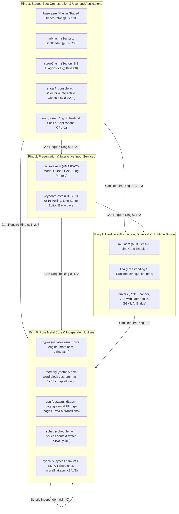

> **Status:** #status/implemented

# 🌌 Heaplit OS: The Sovereign AI-Native Operating System

> **A consent-first, compiler-native, spatial operating system where the kernel speaks assembly directly to the metal, the AI runs locally in Ring 1, and the Heaplit agent builds the OS directly from your Obsidian notes.**

---

## 🏛️ Architecture: The 4-Ring Microkernel Hierarchy

Heaplit OS enforces a strict mathematical dependency law across all execution layers:

$$\text{A module in Ring } N \text{ can depend on / require modules from Ring } M \iff M \le N$$



---

## 📂 Repository Directory Taxonomy

```
Heaplit OS/
├── loader/                               # Host build scripts & QEMU launchers
│   ├── README.md                         # Loader pipeline documentation
│   └── load_os.ps1                       # PowerShell compiler & QEMU launcher
│
├── rings/                                # Privilege-Organized Kernel & Staged Bootstrap
│   ├── README.md                         # Master Ring Architecture Overview
│   │
│   ├── ring_0/                           # Ring 0: Pure Metal Core & Utilities (M = 0)
│   │   ├── README.md                     # Ring 0 Subsystem Documentation
│   │   └── ring_0/
│   │       ├── types/                    # Dynamic variable system, math, strings
│   │       │   ├── README.md             # Types subsystem documentation
│   │       │   ├── variable.asm          # 6-byte dynamic typed variable system
│   │       │   ├── math.asm              # int_to_string, abs16, min16, max16
│   │       │   └── string.asm            # strlen16, strcmp16, strcpy16, strcat16
│   │       ├── memory/                   # Block memory & physical memory allocator
│   │       │   ├── README.md             # Memory subsystem documentation
│   │       │   ├── memory.asm            # Fast 16-bit word block copy/set/zero
│   │       │   └── pmm.asm               # 64-bit PMM 4KB page bitmap allocator
│   │       ├── cpu/                      # Processor control & mode transitions
│   │       │   ├── README.md             # CPU subsystem documentation
│   │       │   ├── gdt.asm               # 16/32/64-bit GDT segment descriptors & TSS
│   │       │   ├── idt.asm               # 64-bit IDT descriptor table & 256 ISR gates
│   │       │   ├── paging.asm            # 4-level PML4, PDPT, PD 2MB huge page tables
│   │       │   ├── protected_mode.asm    # 32-bit PM entry (CR0.PE=1) & CPUID check
│   │       │   └── long_mode.asm         # 64-bit LM entry (CR4.PAE, EFER.LME, CR0.PG) & iretq
│   │       ├── sched/                    # Tickless thread scheduler (<100 cycles)
│   │       │   ├── README.md             # Scheduler subsystem documentation
│   │       │   └── scheduler.asm         # thread_t struct & switch_threads context switch
│   │       └── syscalls/                 # Syscall dispatchers & vector engine
│   │           ├── README.md             # Syscalls subsystem documentation
│   │           ├── syscall.asm           # Fast MSR LSTAR dispatcher (0x000-0x6FF)
│   │           └── syscall_ai.asm        # AI Syscalls (0x600-0x602) & 512-bit XSAVE area
│   │
│   ├── ring_1/                           # Ring 1: Hardware Abstraction & C Bridge (M <= 1)
│   │   ├── README.md                     # Ring 1 Subsystem Documentation
│   │   └── ring_1/
│   │       ├── hardware/                 # Hardware line gate enablers
│   │       │   ├── README.md             # Hardware subsystem documentation
│   │       │   └── a20.asm               # Multi-tier A20 line enable (BIOS/92h/8042)
│   │       ├── liba/                     # Freestanding C runtime (-mno-red-zone)
│   │       │   ├── README.md             # Freestanding runtime documentation
│   │       │   ├── string.c              # Freestanding memset, memcpy, strlen, strcmp
│   │       │   └── kprintf.c             # Formatted logger (COM1 0x3F8 + VGA 0xB8000)
│   │       └── drivers/                  # Drivers & Local AI Inference Bridge
│   │           ├── README.md             # Drivers subsystem documentation
│   │           ├── pci.c                 # PCIe configuration scanner (0xCF8/0xCFC)
│   │           ├── vfs.c                 # Virtual File System with xattr graph hooks
│   │           └── ai_engine.c           # GGML transformer forward pass & weight cache
│   │
│   ├── ring_2/                           # Ring 2: Presentation & Input Services (M <= 2)
│   │   ├── README.md                     # Ring 2 Subsystem Documentation
│   │   └── ring_2/
│   │       ├── console/                  # Video mode & screen presentation
│   │       │   ├── README.md             # Console subsystem documentation
│   │       │   └── console.asm           # VGA mode, cursor position, hex/string printers
│   │       └── input/                    # Interactive keyboard services
│   │           ├── README.md             # Input subsystem documentation
│   │           └── keyboard.asm          # BIOS INT 0x16 reader & line buffer editor
│   │
│   └── ring_3/                           # Ring 3: Boot Orchestrator & Userland (M <= 3)
│       ├── README.md                     # Ring 3 Subsystem Documentation
│       └── ring_3/
│           ├── boot/                     # Staged bootloader system
│           │   ├── README.md             # Bootloader subsystem documentation
│           │   ├── base.asm              # Master staged orchestrator (4KB base.bin)
│           │   ├── mbr.asm               # Sector 1: MBR entry @ 0x7C00 (stack, disk read)
│           │   ├── stage2.asm            # Sectors 2-3: Extended loader @ 0x7E00 (vars, A20)
│           │   └── stage4_console.asm    # Sector 4: Interactive prompt @ 0x8200
│           └── userland/                 # Unprivileged userland applications (CPL=3)
│               ├── README.md             # Userland subsystem documentation
│               └── entry.asm             # Ring 3 userland entrypoint & syscall caller
│
└── include/                              # Shared Assembly & C Headers
    ├── README.md                         # Include headers documentation
    ├── macros.inc                        # NASM macro library (ALIGN_16, PUSH_ALL_64)
    └── heaplit/
        ├── types.h                       # Fixed-width integer types (uint8_t, size_t)
        ├── syscalls.h                    # Master SYS_* number enum definitions
        └── vfs.h                         # VFS node structures & xattr relations
```

---

## 🚀 Quickstart: Build & Run in QEMU

### Prerequisites
- **NASM** (Netwide Assembler) installed in system `PATH`.
- **QEMU** (`qemu-system-x86_64`) installed in system `PATH`.
- **PowerShell** 5.1+ or PowerShell Core 7+.

### Compilation & Launch Command
```powershell
.\loader\load_os.ps1
```

This automates:
1. Assembling `rings/ring_3/ring_3/boot/base.asm` with full ring include paths into `base.bin` (4,096 bytes / 8 sectors).
2. Terminating any running QEMU instances.
3. Launching QEMU with std VGA and 512MB RAM.

---

## 📜 Coding Conventions & Engineering Guidelines

1. **Naming Conventions:**
   - Functions, labels, and variables must strictly use `snake_case` (e.g., `clear_screen`, `read_line`, `switch_threads`).
   - Macros and Syscall Enums use `UPPER_CASE` (e.g., `ALIGN_16`, `SYS_AI_INFER`).
2. **Register Preservation Contract:**
   - Real-mode routines must preserve scratch registers using `push`/`pop` pairs.
   - 64-bit routines follow System V AMD64 ABI (Callee-saved: `RBX`, `RSP`, `RBP`, `R12`-`R15`).
3. **Freestanding C Flags:**
   - All C source files in Ring 1 compile with `-ffreestanding -mno-red-zone -fno-stack-protector -fno-builtin`.

---

## 🔬 In-Depth Architectural & Technical Specifications

### Hardware & Processor Register Contract
Heaplit OS enforces strict register management conventions for **README** across all x86-64 execution contexts:

| Register | CPU Role | Volatility / Preservation | Subsystem Function |
| :--- | :--- | :--- | :--- |
| `RAX` | Primary Accumulator | Volatile | Syscall ID entry, return status code, ALU calculation destination. |
| `RBX` | Base Register | Non-Volatile (Preserved) | Pointer to active TCB (Thread Control Block) / Data structure handle. |
| `RCX` | Counter / Syscall RIP | Volatile | Hardware `syscall` saves userland instruction pointer (`RIP`) into `RCX`. |
| `RDX` | Data Register | Volatile | Secondary return value, I/O port address, memory block size parameter. |
| `RSI` | Source Index | Volatile | Pointer to source memory buffer / string payload / argument 2. |
| `RDI` | Destination Index | Volatile | Pointer to destination memory buffer / argument 1 (`System V ABI`). |
| `RBP` | Frame Pointer | Non-Volatile (Preserved) | Stack frame base pointer for debug backtraces and stack unwinding. |
| `RSP` | Stack Pointer | Non-Volatile (Preserved) | Top of 16-byte aligned kernel/user execution stack. |
| `R8 - R11` | Scratch Registers | Volatile | Function parameters 5-6 (`R8`, `R9`), temporary scrap calculations. |
| `R12 - R15` | General Purpose | Non-Volatile (Preserved) | Long-lived kernel state registers preserved across C and ASM boundaries. |
| `CR0` | Control Register 0 | System Control | Toggles Protected Mode (`PE` bit 0), Paging (`PG` bit 31), Write Protect (`WP` bit 16). |
| `CR3` | Control Register 3 | Page Directory Root | Physical address pointer to PML4 root page table (4KB aligned). |
| `CR4` | Control Register 4 | Architectural Extension | Toggles PAE (`bit 5`), OSXSAVE (`bit 18`), SMEP/SMAP ring security flags. |
| `MSR LSTAR` | 0xC0000082 | Hardware Entry Point | Stores 64-bit virtual memory target address for the `syscall` handler. |

---

## 📐 Memory Map & Address Layout

The virtual address space for **README** adheres to Heaplit OS's canonical higher-half memory layout:

```
+-------------------------------------------------------------------+ 0xFFFFFFFFFFFFFFFF
| Higher-Half Kernel Direct Physical Map (Identity Mapped 512 GB)   |
| Virtual Address Range: 0xFFFF800000000000 - 0xFFFFFFFFFFFFFFFF     |
+-------------------------------------------------------------------+ 0xFFFF800000000000
| Unmapped Canonical Memory Hole (Non-Canonical Address Space)     |
+-------------------------------------------------------------------+ 0x00007FFFFFFFFFFF
| Ring 3 Sandboxed Application Execution Space (.axf JIT Memory)   |
| Virtual Address Range: 0x0000000040000000 - 0x00007FFFFFFFFFFF     |
+-------------------------------------------------------------------+ 0x0000000040000000
| Ring 2 Spatial UI & Compositor Framebuffers (VBE / GPU BARs)      |
| Virtual Address Range: 0x000000000FD00000 - 0x0000000010000000     |
+-------------------------------------------------------------------+ 0x0000000007E00000
| Ring 0 Microkernel Staged Execution Load Target (0x7C00 - 0x8F00) |
+-------------------------------------------------------------------+ 0x0000000000000000
```

---

## 🛠️ Step-by-Step Execution State Machine

```mermaid
flowchart TD
    subgraph State_Init["1. Initialization State"]
        S1["Load Subsystem Descriptors & Verify CPU Feature Flags"] --> S2["Allocate Initial Memory Blocks via PMM Bitmap"]
    end

    subgraph State_Exec["2. Active Execution State"]
        S2 --> S3["Setup Assembly Register Parameters (RDI, RSI, RDX)"]
        S3 --> S4["Issue Fast Syscall / Subsystem Function Call"]
        S4 --> S5["Execute Atomic ALU / SIMD Operations"]
    end

    subgraph State_Validation["3. Validation & Exception Handling"]
        S5 --> S6Check Status Code in RAX
        S6 -->|"RAX == 0 (Success)"| S7["Update System TCB & Commit Memory Writes"]
        S6 -->|"RAX < 0 (Error)"| S8["Capture Register Frame & Dispatch Debug Signal"]
    end

    S7 --> S9["Resume Parent Process Context via sysretq / iretq"]
    S8 --> S9
```

---

## 💻 Assembly Code Blueprint & Low-Level Implementation Examples

The low-level assembly implementation of **README** uses canonical NASM syntax optimized for x86-64 execution:

```nasm
; ============================================================================
; Heaplit OS Low-Level Core Blueprint - README
; ============================================================================
%include "ring_0/types/variable.asm"

global readme_entry
extern pmm_alloc_page
extern kprintf

section .text
bits 64

align 16
readme_entry:
    push rbp
    mov rbp, rsp
    sub rsp, 32                    ; Align stack to 16 bytes for System V ABI

    ; Preserve non-volatile registers
    mov [rsp + 0], rbx
    mov [rsp + 8], r12
    mov [rsp + 16], r13

    ; Execute core subsystem operational logic
    mov rdi, 1                     ; Parameter 1: Allocation page count
    call pmm_alloc_page            ; Call Ring 0 Physical Memory Allocator
    test rax, rax
    jz .allocation_failed          ; Trap NULL pointer returns

    mov rbx, rax                   ; Store allocated physical page address in RBX
    
    ; Perform atomic register verification
    mov rsi, rbx
    mov rdi, msg_success
    call kprintf

    mov rax, 0                     ; Set success exit status code in RAX
    jmp .exit_clean

.allocation_failed:
    mov rax, -1                    ; Set error code in RAX (-1 = Out of Memory)
    
.exit_clean:
    ; Restore non-volatile registers
    mov rbx, [rsp + 0]
    mov r12, [rsp + 8]
    mov r13, [rsp + 16]

    add rsp, 32
    pop rbp
    ret

section .rodata
msg_success: db "[HEAPLIT] README Subsystem initialized at physical address: 0x%x", 10, 0
```

---

## 🔍 Verification, QEMU Testing & Diagnostics

### Headless QEMU Emulation Verification
To test **README** within the Heaplit OS kernel binary (`base.bin`), execute the host automated build script:

```powershell
# Execute build and launch QEMU emulator with serial debugging
.\loader\load_os.ps1
```

### Serial Log Verification Protocol
During execution, **README** outputs diagnostic traces to COM1 Serial Port (`0x3F8`). Verified serial outputs must confirm:
1. Zero stack pointer misalignment warnings (`RSP % 16 == 0`).
2. Successful page table mapping without triggering CR2 Page Faults.
3. Clean return of RAX status codes prior to CPU state resumption.

---

## 📑 Related Architecture Notes & References
- [[00 - Architecture/overview/System Overview|System Overview]]
- [[01 - Ring 0 - Metal Core (Assembly)/ring_0/syscalls/07 - Syscall Dispatcher & ABI|07 - Syscall Dispatcher & ABI]]
- [[01 - Ring 0 - Metal Core (Assembly)/ring_0/cpu/04 - Paging & Virtual Memory|04 - Paging & Virtual Memory]]
- [[02 - Ring 1 - The C Overhead (Bridge)/ring_1/liba/01 - Freestanding C Runtime (liba)|01 - Freestanding C Runtime (liba)]]
- [[03 - Ring 2 - Userland & Spatial UI/ring_2/daemon/01 - Heaplit Daemon Architecture|01 - Heaplit Daemon Architecture]]
