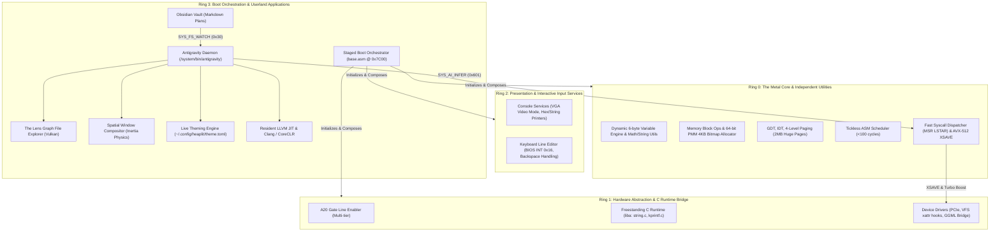

> **Status:** #status/implemented

# 🌌 Heaplit OS: The Sovereign AI-Native Operating System
### *Autonomous Planning, Architecture & Knowledge Graph*

> **"Heaplit is the escape hatch."**  
> A consent-first, compiler-native, spatial operating system where the kernel speaks assembly directly to the metal, the AI runs locally in Ring 1, and the Antigravity agent builds the OS directly from your Obsidian notes.

---

## 🧭 Master Vault Index & Knowledge Map

---

## 📂 Vault Structure & Direct Links

### 1. [[00 - Foundations & Vision/The Vision & Manifest|00 - Foundations & Vision]]
- [[00 - Foundations & Vision/The Vision & Manifest|The Vision & Manifest]] — The 5 Core Philosophies (Sovereignty, Performance, Architecture-Neutrality, Spatial Logic, Autonomy)
- [[00 - Foundations & Vision/System Architecture Blueprint|System Architecture Blueprint]] — The 4-Ring execution hierarchy & dataflow
- [[00 - Foundations & Vision/Sovereignty & Security Model|Sovereignty & Security Model]] — Local AI sandbox, zero telemetry, visual data-flow graphs

### 2. [[00 - Architecture/System Overview|00 - Architecture & Code Walkthroughs]]
- [[00 - Architecture/System Overview|System Overview]] — The 4-Ring dependency hierarchy ($M \le N$) and execution flow
- [[00 - Architecture/Exhaustive Code Architecture & Implementation Walkthrough|Exhaustive Code Architecture & Implementation Walkthrough]] — Directory taxonomy, memory maps, ABI conventions, code snippets
- [[00 - Architecture/Code Quality & Engineering Guidelines|Code Quality & Engineering Guidelines]] — Naming rules, scaffolding rules, register preservation contracts
- [[00 - Architecture/Ring 0 - Metal & Scheduler|Ring 0 - Metal & Scheduler]] — Assembly kernel core & scheduler design
- [[00 - Architecture/Ring 1 - The C Inference Engine|Ring 1 - The C Inference Engine]] — GGML bridge & C overhead layer
- [[00 - Architecture/Ring 2 - Antigravity Userland Daemon|Ring 2 - Antigravity Userland Daemon]] — Userland watcher and daemon architecture

### 3. [[01 - Ring 0 - Metal Core (Assembly)/01 - Boot Sequence & Staged Loading|01 - Ring 0: The Metal Core (Assembly)]]
- [[01 - Ring 0 - Metal Core (Assembly)/01 - Boot Sequence & Staged Loading|01 - Boot Sequence & Staged Loading]] — Multi-sector MBR (`0x7C00` $
ightarrow$ `0x7E00` $
ightarrow$ `0x8200`)
- [[01 - Ring 0 - Metal Core (Assembly)/02 - A20 Gate & Hardware Line|02 - A20 Gate & Hardware Line]] — BIOS fast A20, 8042 keyboard controller, port 0x92
- [[01 - Ring 0 - Metal Core (Assembly)/03 - GDT, IDT & Descriptor Tables|03 - GDT, IDT & Descriptor Tables]] — Segment descriptors, 64-bit IDT interrupt gates, TSS
- [[01 - Ring 0 - Metal Core (Assembly)/04 - Paging & Virtual Memory|04 - Paging & Virtual Memory]] — 4-level PML4, 2MB huge pages, higher-half mapping (`0xFFFFFFFF80000000`)
- [[01 - Ring 0 - Metal Core (Assembly)/05 - Physical Memory Allocator (PMM)|05 - Physical Memory Allocator (PMM)]] — BIOS E820 map parser, 4KB bitmap allocator
- [[01 - Ring 0 - Metal Core (Assembly)/06 - Tickless ASM Scheduler|06 - Tickless ASM Scheduler]] — Event-driven, sub-100-cycle context switch macro
- [[01 - Ring 0 - Metal Core (Assembly)/07 - Syscall Dispatcher & ABI|07 - Syscall Dispatcher & ABI]] — MSR LSTAR/STAR/SFMASK, Fast Syscall table (`0x000`–`0x6FF`)
- [[01 - Ring 0 - Metal Core (Assembly)/08 - AVX-512 & XSAVE Engine|08 - AVX-512 & XSAVE Engine]] — Vector register state preservation (`ZMM0`–`ZMM31`), turbo boost
- [[01 - Ring 0 - Metal Core (Assembly)/09 - Assembly Coding Standards & Macros|09 - Assembly Coding Standards & Macros]] — `snake_case` rules, calling conventions, macro library

### 4. [[02 - Ring 1 - The C Overhead (Bridge)/01 - Freestanding C Runtime (liba)|02 - Ring 1: The C Overhead (Bridge)]]
- [[02 - Ring 1 - The C Overhead (Bridge)/01 - Freestanding C Runtime (liba)|01 - Freestanding C Runtime (liba)]] — Freestanding C library (`memset`, `memcpy`, `kprintf`)
- [[02 - Ring 1 - The C Overhead (Bridge)/02 - GGML & Llama.cpp Kernel Port|02 - GGML & Llama.cpp Kernel Port]] — AVX-512 vectorized matrix multiplication & tokenizer
- [[02 - Ring 1 - The C Overhead (Bridge)/03 - Virtual File System (VFS)|03 - Virtual File System (VFS)]] — Unified POSIX inode interface with `xattr` graph hooks
- [[02 - Ring 1 - The C Overhead (Bridge)/04 - FAT32 & EXT4 Drivers|04 - FAT32 & EXT4 Drivers]] — Boot partition and block storage drivers
- [[02 - Ring 1 - The C Overhead (Bridge)/05 - Device Drivers (PCIe, NVMe, USB)|05 - Device Drivers (PCIe, NVMe, USB)]] — PCIe enumeration, NVMe DMA queues, xHCI

### 5. [[03 - Ring 2 - Userland & Spatial UI/01 - Antigravity Daemon Architecture|03 - Ring 2: Userland & Spatial UI]]
- [[03 - Ring 2 - Userland & Spatial UI/01 - Antigravity Daemon Architecture|01 - Antigravity Daemon Architecture]] — `/system/bin/antigravity` daemon, `/tmp/antigravity.sock`
- [[03 - Ring 2 - Userland & Spatial UI/02 - The Lens Graph File Explorer|02 - The Lens Graph File Explorer]] — Force-directed graph UI (Vulkan compute shader)
- [[03 - Ring 2 - Userland & Spatial UI/03 - Spatial Window Compositor|03 - Spatial Window Compositor]] — Window physics engine (inertia, mass, friction, velocity)
- [[03 - Ring 2 - Userland & Spatial UI/04 - GPU Rendering & SDF Fonts|04 - GPU Rendering & SDF Fonts]] — Multi-channel signed distance field font rasterization
- [[03 - Ring 2 - Userland & Spatial UI/05 - Hardware Cursor & Visual Buffers|05 - Hardware Cursor & Visual Buffers]] — Zero-latency DRM cursor plane & Vulkan swapchains
- [[03 - Ring 2 - Userland & Spatial UI/06 - Live Theming & TOML Engine|06 - Live Theming & TOML Engine]] — `~/.config/heaplit/theme.toml` hot-reload engine

### 6. [[04 - Developer Toolchain & Packaging/01 - LLVM Bitcode (.axf) Application Format|04 - Developer Toolchain & Packaging]]
- [[04 - Developer Toolchain & Packaging/01 - LLVM Bitcode (.axf) Application Format|01 - LLVM Bitcode (.axf) Application Format]] — Architecture-neutral binary containers
- [[04 - Developer Toolchain & Packaging/02 - Clang & Native Toolchain|02 - Clang & Native Toolchain]] — Built-in Clang C/C++ compiler and LLD linker
- [[04 - Developer Toolchain & Packaging/03 - CoreCLR (.NET & C#) Runtime|03 - CoreCLR (.NET & C#) Runtime]] — RyuJIT port with AVX-512 integration
- [[04 - Developer Toolchain & Packaging/04 - The hpkg Package Manager|04 - The hpkg Package Manager]] — Atomic package management with ZFS rollback snapshots

### 7. [[05 - ASM Utility Library Blueprints/01 - Variable System Specification|05 - ASM Utility Library Blueprints]]
- [[05 - ASM Utility Library Blueprints/01 - Variable System Specification|01 - Variable System Specification]] — 6-byte typed dynamic variable engine (`variable.asm`)
- [[05 - ASM Utility Library Blueprints/02 - Math & Arithmetic Utilities|02 - Math & Arithmetic Utilities]] — `int_to_string`, `abs16`, 16-bit / 64-bit arithmetic
- [[05 - ASM Utility Library Blueprints/03 - String & Buffer Utilities|03 - String & Buffer Utilities]] — `strlen16`, `strcmp16`, memory manipulation
- [[05 - ASM Utility Library Blueprints/04 - Console & Video Utilities|04 - Console & Video Utilities]] — Cursor positioning, hex dump printer, screen clearing
- [[05 - ASM Utility Library Blueprints/05 - Keyboard & Input Service|05 - Keyboard & Input Service]] — Line buffer editor with backspace handling, BIOS INT 0x16
- [[05 - ASM Utility Library Blueprints/06 - Disk & Storage Utilities|06 - Disk & Storage Utilities]] — 64-bit LBA addressing & INT 0x13 AH=0x42 disk packet

### 8. [[06 - Master Planning & Roadmaps/01 - 5-Year Vision & Phased Timeline|06 - Master Planning & Roadmaps]]
- [[06 - Master Planning & Roadmaps/01 - 5-Year Vision & Phased Timeline|01 - 5-Year Vision & Phased Timeline]] — Master roadmap (Phases 0 through 5)
- [[06 - Master Planning & Roadmaps/02 - HeaplitPlan - Bootloader & Long Mode Switch|02 - HeaplitPlan: Bootloader & Long Mode Switch]] — Phase 0 Action Checklist
- [[06 - Master Planning & Roadmaps/03 - HeaplitPlan - Microkernel & ASM Scheduler|03 - HeaplitPlan: Microkernel & ASM Scheduler]] — Phase 0 Action Checklist
- [[06 - Master Planning & Roadmaps/04 - HeaplitPlan - AI Subsystem & Ring 1 Bridge|04 - HeaplitPlan: AI Subsystem & Ring 1 Bridge]] — Phase 1 Action Checklist
- [[06 - Master Planning & Roadmaps/05 - HeaplitPlan - Lens Graph Filesystem|05 - HeaplitPlan: Lens Graph Filesystem]] — Phase 2 Action Checklist
- [[06 - Master Planning & Roadmaps/06 - HeaplitPlan - Spatial Compositor & UI Shell|06 - HeaplitPlan: Spatial Compositor & UI Shell]] — Phase 3 Action Checklist
- [[06 - Master Planning & Roadmaps/07 - HeaplitPlan - Developer Toolchain|07 - HeaplitPlan: Developer Toolchain]] — Phase 4 Action Checklist

### 9. [[07 - Antigravity AI Agent Playbooks/01 - Autonomous Build & Test Loop|07 - Antigravity AI Agent Playbooks]]
- [[07 - Antigravity AI Agent Playbooks/01 - Autonomous Build & Test Loop|01 - Autonomous Build & Test Loop]] — Obsidian note $
ightarrow$ Prompt $
ightarrow$ NASM $
ightarrow$ QEMU loop
- [[07 - Antigravity AI Agent Playbooks/02 - Obsidian Markdown Syntax & Directives|02 - Obsidian Markdown Syntax & Directives]] — Directives (`#HeaplitPlan`, `@Antigravity:`)
- [[07 - Antigravity AI Agent Playbooks/03 - Crash Diagnostics & Rollback Playbook|03 - Crash Diagnostics & Rollback Playbook]] — Watchdog, register dumps, ZFS rollback

---
*Created and maintained autonomously by Antigravity AI Agent for Heaplit OS.*
