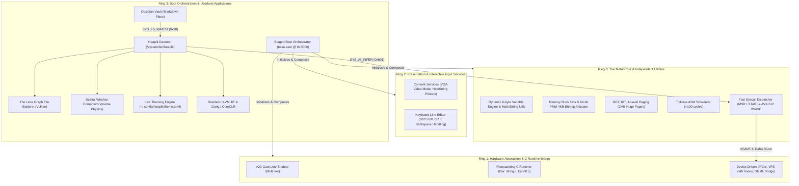

> **Status:** #status/implemented

# 🌌 Heaplit OS: The Sovereign AI-Native Operating System
### *Autonomous Planning, Architecture & Knowledge Graph*

> **"Heaplit is the escape hatch."**  
> A consent-first, compiler-native, spatial operating system where the kernel speaks assembly directly to the metal, the AI runs locally in Ring 1, and the Heaplit agent builds the OS directly from your Obsidian notes.

---

## 🧭 Master Vault Index & Knowledge Map

---

## 📂 Vault Structure & Direct Links

### 1. 🏛️ Master Architecture & Handover Specs
- [[00 - Architecture/overview/00 - Comprehensive Project Handover & Architecture Specification|00 - Comprehensive Project Handover & Architecture Specification]] — Master executive handover specs
- [[00 - Architecture/overview/System Overview|System Overview]] — The 4-Ring dependency hierarchy ($M \le N$) and execution flow
- [[00 - Architecture/overview/Exhaustive Code Architecture & Implementation Walkthrough|Exhaustive Code Architecture & Implementation Walkthrough]] — Directory taxonomy, memory maps, ABI conventions, code snippets
- [[00 - Architecture/overview/Code Quality & Engineering Guidelines|Code Quality & Engineering Guidelines]] — Naming rules, scaffolding rules, register preservation contracts
- [[00 - Architecture/rings/Ring 0 - Metal & Scheduler|Ring 0 - Metal & Scheduler]] — Assembly kernel core & scheduler design
- [[00 - Architecture/rings/Ring 1 - The C Inference Engine|Ring 1 - The C Inference Engine]] — GGML bridge & C overhead layer
- [[00 - Architecture/rings/Ring 2 - Heaplit Userland Daemon|Ring 2 - Heaplit Userland Daemon]] — Userland watcher and daemon architecture
- [[00 - Architecture/tooling/Obsidian Integration & 2-Way Sync|Obsidian Integration & 2-Way Sync]] — Real-time vault indexing engine

### 2. 👁️ Foundations & Vision
- [[00 - Foundations & Vision/manifest/The Vision & Manifest|The Vision & Manifest]] — The 5 Core Philosophies (Sovereignty, Performance, Architecture-Neutrality, Spatial Logic, Autonomy)
- [[00 - Foundations & Vision/manifest/System Architecture Blueprint|System Architecture Blueprint]] — The 4-Ring execution hierarchy & dataflow
- [[00 - Foundations & Vision/manifest/Sovereignty & Security Model|Sovereignty & Security Model]] — Local AI sandbox, zero telemetry, visual data-flow graphs

### 3. ⚡ Ring 0: Metal Core (Assembly)
- [[01 - Ring 0 - Metal Core (Assembly)/ring_0/standards/01 - Boot Sequence & Staged Loading|01 - Boot Sequence & Staged Loading]] — Multi-sector MBR (`0x7C00` -> `0x7E00` -> `0x8200`)
- [[01 - Ring 0 - Metal Core (Assembly)/ring_0/cpu/02 - A20 Gate & Hardware Line|02 - A20 Gate & Hardware Line]] — BIOS fast A20, 8042 keyboard controller, port 0x92
- [[01 - Ring 0 - Metal Core (Assembly)/ring_0/cpu/03 - GDT, IDT & Descriptor Tables|03 - GDT, IDT & Descriptor Tables]] — Segment descriptors, 64-bit IDT interrupt gates, TSS
- [[01 - Ring 0 - Metal Core (Assembly)/ring_0/cpu/04 - Paging & Virtual Memory|04 - Paging & Virtual Memory]] — 4-level PML4, 2MB huge pages, higher-half mapping (`0xFFFFFFFF80000000`)
- [[01 - Ring 0 - Metal Core (Assembly)/ring_0/memory/05 - Physical Memory Allocator (PMM)|05 - Physical Memory Allocator (PMM)]] — BIOS E820 map parser, 4KB bitmap allocator
- [[01 - Ring 0 - Metal Core (Assembly)/ring_0/sched/06 - Tickless ASM Scheduler|06 - Tickless ASM Scheduler]] — Event-driven, sub-100-cycle context switch macro
- [[01 - Ring 0 - Metal Core (Assembly)/ring_0/syscalls/07 - Syscall Dispatcher & ABI|07 - Syscall Dispatcher & ABI]] — MSR LSTAR/STAR/SFMASK, Fast Syscall table (`0x000`–`0x6FF`)
- [[01 - Ring 0 - Metal Core (Assembly)/ring_0/cpu/08 - AVX-512 & XSAVE Engine|08 - AVX-512 & XSAVE Engine]] — Vector register state preservation (`ZMM0`–`ZMM31`), turbo boost
- [[01 - Ring 0 - Metal Core (Assembly)/ring_0/standards/09 - Assembly Coding Standards & Macros|09 - Assembly Coding Standards & Macros]] — `snake_case` rules, calling conventions, macro library
- [[01 - Ring 0 - Metal Core (Assembly)/ring_0/types/10 - Dynamic Variable Engine & Types|10 - Dynamic Variable Engine & Types]] — 6-byte packed header layout, typed arithmetic
- [[01 - Ring 0 - Metal Core (Assembly)/ring_0/memory/11 - Real-Mode Memory & Block Utilities|11 - Real-Mode Memory & Block Utilities]] — Real mode segment arithmetic & word block copies
- [[01 - Ring 0 - Metal Core (Assembly)/ring_0/cpu/12 - Hardware-Assisted Sandbox Isolation & Concurrency Primitives|12 - Hardware-Assisted Sandbox Isolation & Concurrency Primitives]] — CR3 page table guards & lock-free spinlocks
- [[01 - Ring 0 - Metal Core (Assembly)/ring_0/cpu/13 - Hardware-Accelerated AES-NI & SHA Cryptography|13 - Hardware-Accelerated AES-NI & SHA Cryptography]] — Direct AES-NI hardware instruction encryption

### 4. 🌁 Ring 1: The C Overhead (Bridge)
- [[02 - Ring 1 - The C Overhead (Bridge)/ring_1/liba/01 - Freestanding C Runtime (liba)|01 - Freestanding C Runtime (liba)]] — Freestanding C library (`memset`, `memcpy`, `kprintf`)
- [[02 - Ring 1 - The C Overhead (Bridge)/ring_1/drivers/02 - GGML & Llama.cpp Kernel Port|02 - GGML & Llama.cpp Kernel Port]] — AVX-512 vectorized matrix multiplication & tokenizer
- [[02 - Ring 1 - The C Overhead (Bridge)/ring_1/drivers/03 - Virtual File System (VFS)|03 - Virtual File System (VFS)]] — Unified POSIX inode interface with `xattr` graph hooks
- [[02 - Ring 1 - The C Overhead (Bridge)/ring_1/drivers/04 - FAT32 & EXT4 Drivers|04 - FAT32 & EXT4 Drivers]] — Boot partition and block storage drivers
- [[02 - Ring 1 - The C Overhead (Bridge)/ring_1/drivers/05 - Device Drivers (PCIe, NVMe, USB)|05 - Device Drivers (PCIe, NVMe, USB)]] — PCIe enumeration, NVMe DMA queues, xHCI
- [[02 - Ring 1 - The C Overhead (Bridge)/ring_1/drivers/06 - VFS Journaling & Exception Translation Pipeline|06 - VFS Journaling & Exception Translation Pipeline]] — RAM write intent journaling & CPU exception translation
- [[02 - Ring 1 - The C Overhead (Bridge)/ring_1/drivers/07 - Win32 PE Compatibility Translation (wincall)|07 - Win32 PE Compatibility Translation (wincall)]] — Win32 PE header validation & syscall translation
- [[02 - Ring 1 - The C Overhead (Bridge)/ring_1/drivers/08 - Linux ELF POSIX Compatibility Translation (posixcall)|08 - Linux ELF POSIX Compatibility Translation (posixcall)]] — Linux ELF64 header validation & POSIX translation
- [[02 - Ring 1 - The C Overhead (Bridge)/ring_1/drivers/09 - WebAssembly Runtime Engine (wasm_engine)|09 - WebAssembly Runtime Engine (wasm_engine)]] — Freestanding Wasm binary validation & JIT harness

### 5. 🖥️ Ring 2: Userland & Spatial UI
- [[03 - Ring 2 - Userland & Spatial UI/ring_2/daemon/01 - Heaplit Daemon Architecture|01 - Heaplit Daemon Architecture]] — `/system/bin/heaplit` daemon & watcher engine
- [[03 - Ring 2 - Userland & Spatial UI/ring_2/spatial_ui/02 - The Lens Graph File Explorer|02 - The Lens Graph File Explorer]] — Force-directed graph UI (Vulkan compute shader)
- [[03 - Ring 2 - Userland & Spatial UI/ring_2/spatial_ui/03 - Spatial Window Compositor|03 - Spatial Window Compositor]] — Window physics engine (inertia, mass, friction, velocity)
- [[03 - Ring 2 - Userland & Spatial UI/ring_2/spatial_ui/04 - GPU Rendering & SDF Fonts|04 - GPU Rendering & SDF Fonts]] — Multi-channel signed distance field font rasterization
- [[03 - Ring 2 - Userland & Spatial UI/ring_2/spatial_ui/05 - Hardware Cursor & Visual Buffers|05 - Hardware Cursor & Visual Buffers]] — Zero-latency DRM cursor plane & Vulkan swapchains
- [[03 - Ring 2 - Userland & Spatial UI/ring_2/spatial_ui/06 - Live Theming & TOML Engine|06 - Live Theming & TOML Engine]] — `~/.config/heaplit/theme.toml` hot-reload engine
- [[03 - Ring 2 - Userland & Spatial UI/ring_2/console/07 - Console & Display Subsystem|07 - Console & Display Subsystem]] — VGA text mode & ANSI escape code parser
- [[03 - Ring 2 - Userland & Spatial UI/ring_2/input/08 - Keyboard & Interactive Editor Subsystem|08 - Keyboard & Interactive Editor Subsystem]] — Line buffer editor with backspace handling & scancode mapping
- [[03 - Ring 2 - Userland & Spatial UI/ring_2/applications/09 - The Forge Tool Installer GUI|09 - The Forge Tool Installer GUI]] — One-click developer toolchain fetcher & provisioner
- [[03 - Ring 2 - Userland & Spatial UI/ring_2/applications/10 - Built-In Multi-Language Compiler Studio|10 - Built-In Multi-Language Compiler Studio]] — Native IDE with in-kernel LLVM JIT service
- [[03 - Ring 2 - Userland & Spatial UI/ring_2/applications/11 - Custom Calendar & Native Time Service|11 - Custom Calendar & Native Time Service]] — RTC hardware timekeeper & event-to-file cross-referencer
- [[03 - Ring 2 - Userland & Spatial UI/ring_2/applications/12 - Kernel-Level Antivirus & Integrity Guard|12 - Kernel-Level Antivirus & Integrity Guard]] — `.axf` LLVM IR bitcode validator & W^X page protection

### 6. 🛠️ Developer Toolchain & Packaging
- [[04 - Developer Toolchain & Packaging/format/01 - LLVM Bitcode (.axf) Application Format|01 - LLVM Bitcode (.axf) Application Format]] — Architecture-neutral binary containers
- [[04 - Developer Toolchain & Packaging/format/02 - Clang & Native Toolchain|02 - Clang & Native Toolchain]] — Built-in Clang C/C++ compiler and LLD linker
- [[04 - Developer Toolchain & Packaging/runtime/03 - CoreCLR (.NET & C#) Runtime|03 - CoreCLR (.NET & C#) Runtime]] — RyuJIT port with AVX-512 integration
- [[04 - Developer Toolchain & Packaging/packaging/04 - The hpkg Package Manager|04 - The hpkg Package Manager]] — Atomic package management with rollback snapshots
- [[04 - Developer Toolchain & Packaging/infrastructure/05 - High-Speed IPC & Shared Memory Message Bus|05 - High-Speed IPC & Shared Memory Message Bus]] — Zero-copy shared PMM pages & lock-free ASM ring gates
- [[04 - Developer Toolchain & Packaging/infrastructure/06 - Dynamic Bitcode Linking & Runtime Resolution|06 - Dynamic Bitcode Linking & Runtime Resolution]] — Runtime symbol resolver & JIT trampolines

### 7. 📖 System API References
- [[02 - Reference/api/AI Syscall Specification|AI Syscall Specification]] — `sys_ai_infer` API documentation & parameters
- [[02 - Reference/api/Console & Display API|Console & Display API]] — VGA buffer writing & ANSI color standards
- [[02 - Reference/api/Keyboard & Input Service|Keyboard & Input Service]] — Scancode decoding & line editor API
- [[02 - Reference/api/Memory Management API|Memory Management API]] — Kernel page allocation (`kalloc`) & page mapping
- [[02 - Reference/api/Variable System API|Variable System API]] — Dynamic variable creation & typed ALU operations

### 8. 🛠️ ASM Utility Library Blueprints
- [[05 - ASM Utility Library Blueprints/blueprints/01 - Variable System Specification|01 - Variable System Specification]] — 6-byte typed dynamic variable engine (`variable.asm`)
- [[05 - ASM Utility Library Blueprints/blueprints/02 - Math & Arithmetic Utilities|02 - Math & Arithmetic Utilities]] — `int_to_string`, `abs16`, 16-bit / 64-bit arithmetic
- [[05 - ASM Utility Library Blueprints/blueprints/03 - String & Buffer Utilities|03 - String & Buffer Utilities]] — `strlen16`, `strcmp16`, memory manipulation
- [[05 - ASM Utility Library Blueprints/blueprints/04 - Console & Video Utilities|04 - Console & Video Utilities]] — Cursor positioning, hex dump printer, screen clearing
- [[05 - ASM Utility Library Blueprints/blueprints/05 - Keyboard & Input Service|05 - Keyboard & Input Service]] — Line buffer editor with backspace handling, BIOS INT 0x16
- [[05 - ASM Utility Library Blueprints/blueprints/06 - Disk & Storage Utilities|06 - Disk & Storage Utilities]] — 64-bit LBA addressing & INT 0x13 AH=0x42 disk packet

### 9. 🗺️ Master Planning & Roadmaps
- [[06 - Master Planning & Roadmaps/roadmap/01 - 5-Year Vision & Phased Timeline|01 - 5-Year Vision & Phased Timeline]] — Master roadmap (Phases 0 through 5)
- [[06 - Master Planning & Roadmaps/roadmap/01 - Grand Roadmap & Timeline|01 - Grand Roadmap & Timeline]] — Comprehensive master timeline
- [[06 - Master Planning & Roadmaps/roadmap/08 - The Complete Production OS Implementation Blueprint & Gap Analysis|08 - The Complete Production OS Implementation Blueprint & Gap Analysis]] — Bare-metal production gap analysis & 7-domain blueprint
- [[06 - Master Planning & Roadmaps/roadmap/09 - Next-Gen Operating System Innovations & Architectural Blueprint|09 - Next-Gen Operating System Innovations & Architectural Blueprint]] — Hardware cryptography, local multimodal AI & Wasm/POSIX translation
- [[06 - Master Planning & Roadmaps/plans/HeaplitPlan - AI Syscall Subsystem|HeaplitPlan - AI Syscall Subsystem]] — AI Syscall specification plan
- [[06 - Master Planning & Roadmaps/plans/HeaplitPlan - Bootloader & Real Mode|HeaplitPlan - Bootloader & Real Mode]] — Real mode bootloader plan
- [[06 - Master Planning & Roadmaps/plans/HeaplitPlan - Variable System & Memory|HeaplitPlan - Variable System & Memory]] — Memory and variable engine plan
- [[06 - Master Planning & Roadmaps/plans/02 - HeaplitPlan - Bootloader & Long Mode Switch|02 - HeaplitPlan - Bootloader & Long Mode Switch]] — Bootloader action checklist
- [[06 - Master Planning & Roadmaps/plans/03 - HeaplitPlan - Microkernel & ASM Scheduler|03 - HeaplitPlan - Microkernel & ASM Scheduler]] — Scheduler action checklist
- [[06 - Master Planning & Roadmaps/plans/04 - HeaplitPlan - AI Subsystem & Ring 1 Bridge|04 - HeaplitPlan - AI Subsystem & Ring 1 Bridge]] — AI subsystem action checklist
- [[06 - Master Planning & Roadmaps/plans/05 - HeaplitPlan - Lens Graph Filesystem|05 - HeaplitPlan - Lens Graph Filesystem]] — Lens graph action checklist
- [[06 - Master Planning & Roadmaps/plans/06 - HeaplitPlan - Spatial Compositor & UI Shell|06 - HeaplitPlan - Spatial Compositor & UI Shell]] — Spatial UI action checklist
- [[06 - Master Planning & Roadmaps/plans/07 - HeaplitPlan - Developer Toolchain|07 - HeaplitPlan - Developer Toolchain]] — Developer toolchain action checklist

### 10. 🤖 Heaplit AI Agent Playbooks
- [[07 - Heaplit AI Agent Playbooks/playbooks/01 - Autonomous Build & Test Loop|01 - Autonomous Build & Test Loop]] — Autonomous build & QEMU test execution loop
- [[07 - Heaplit AI Agent Playbooks/playbooks/02 - Obsidian Markdown Syntax & Directives|02 - Obsidian Markdown Syntax & Directives]] — Directive parsing & tag conventions
- [[07 - Heaplit AI Agent Playbooks/playbooks/03 - Crash Diagnostics & Rollback Playbook|03 - Crash Diagnostics & Rollback Playbook]] — Watchdog, register dumps & auto-rollback

### 11. 📋 Master Todo & Execution Checklists
- [[08 - Master Todo & Execution Checklists/01 - Master Project Completion Roadmap & Meta Checklist|01 - Master Project Completion Roadmap & Meta Checklist]] — Master project tracking matrix across all 7 execution domains
- [[08 - Master Todo & Execution Checklists/02 - Ring 0 Metal Core & Microkernel Checklist|02 - Ring 0 Metal Core & Microkernel Checklist]] — Bootloader, PMM, scheduler, syscalls, AES-NI, APIC/SMP checklist
- [[08 - Master Todo & Execution Checklists/03 - Ring 1 Freestanding C Runtime & Driver Bridge Checklist|03 - Ring 1 Freestanding C Runtime & Driver Bridge Checklist]] — `liba`, VFS, PCIe, WinCall, PosixCall, Wasm, NVMe/AHCI driver checklist
- [[08 - Master Todo & Execution Checklists/04 - Ring 2 Userland & Spatial UI Checklist|04 - Ring 2 Userland & Spatial UI Checklist]] — Lens explorer, window compositor, SDF fonts, Forge GUI, IDE checklist
- [[08 - Master Todo & Execution Checklists/05 - Developer Toolchain, IPC & Packaging Checklist|05 - Developer Toolchain, IPC & Packaging Checklist]] — `.axf` format, CoreCLR, zero-copy IPC bus, dynamic linker, `hpkg` checklist
- [[08 - Master Todo & Execution Checklists/06 - Production Hardware Drivers & Network Stack Checklist|06 - Production Hardware Drivers & Network Stack Checklist]] — VirtIO-Net, e1000, TCP/IP stack, USB 3.0 xHCI, Intel HD Audio checklist
- [[08 - Master Todo & Execution Checklists/07 - Self-Hosting, Testing & CI-CD Pipeline Checklist|07 - Self-Hosting, Testing & CI-CD Pipeline Checklist]] — `heaplit-libc`, native Clang/NASM port, DWARF panic traces, QEMU harness checklist

---
*Created and maintained autonomously by Heaplit AI Agent for Heaplit OS.*
