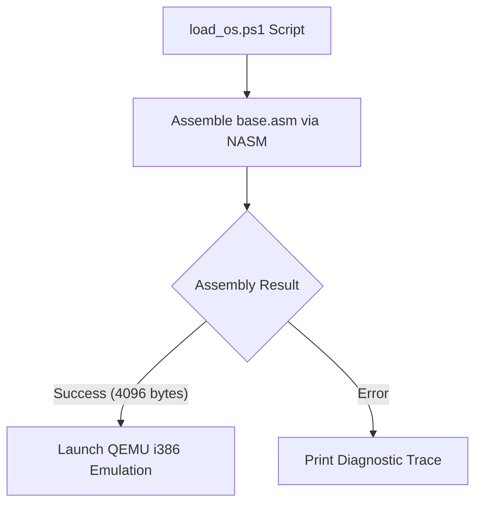

> **Status:** #status/implemented

# 🛠️ Host Loader & Build Pipeline (`loader/`)

This directory contains host-side PowerShell build automation and QEMU emulator launchers.

---

## 📂 File Breakdown & Responsibilities

### 1. `load_os.ps1` — PowerShell Compiler & QEMU Launcher
- **Purpose**: Assembles `rings/ring_3/ring_3/boot/base.asm` with NASM, includes all ring directories, checks output binary size, terminates any running QEMU instances, and boots Heaplit OS in QEMU.
- **Usage**:
  ```powershell
  .\loader\load_os.ps1
  ```

## 🔄 Loader Build & Test Loop


