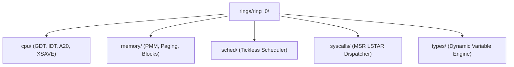

> **Status:** #status/implemented

# ⚙️ Ring 0: Pure Metal Utilities & Microkernel Core

Ring 0 contains the lowest-level, hardware-closest components of Heaplit OS. It is strictly independent ($M = 0$) and **MUST NOT** require or depend on any modules from Ring 1, Ring 2, or Ring 3.

---

## 📂 Subfolder Breakdown

### 1. `rings/ring_0/types/` — Dynamic Variable & Type Utilities
- **`variable.asm`**: Implements the 6-byte dynamic typed variable system (`type` [1 byte], `flags` [1 byte], `payload` [4 bytes]). Supports integer and string types, dynamic memory allocation/rebasing, typed addition/subtraction, and formatting.
- **`math.asm`**: 16-bit and 32-bit arithmetic helpers, integer-to-ASCII string conversion (`int_to_string`), absolute value (`abs16`), and min/max routines.
- **`string.asm`**: Real-mode string manipulation routines (`strlen16`, `strcmp16`, `strcpy16`, `strcat16`).

### 2. `rings/ring_0/memory/` — Memory Block Operations & Physical Allocator
- **`memory.asm`**: Optimized 16-bit word-aligned block memory utilities (`mem_set`, `mem_copy`, `mem_zero`).
- **`pmm.asm`**: 64-bit Physical Memory Manager (PMM). Implements a 4KB-page bitmap tracking up to 32GB of physical RAM, with allocation (`pmm_alloc_page`), deallocation (`pmm_free_page`), and BIOS E820 memory map parsing.

### 3. `rings/ring_0/cpu/` — Processor Descriptors & Mode Transitions
- **`gdt.asm`**: Flat Global Descriptor Table defining 16-bit, 32-bit, and 64-bit code and data segments for Ring 0 and Ring 3, plus TSS descriptors.
- **`idt.asm`**: 64-bit Interrupt Descriptor Table with 256 ISR gates, mapping CPU exceptions (0-31) and hardware IRQs (32-255).
- **`paging.asm`**: 4-level paging setup (PML4, PDPT, Page Directory) configured at fixed offsets (`0x1000`, `0x2000`, `0x3000`) using 2MB huge pages to map the first 1GB of physical RAM.
- **`protected_mode.asm`**: Enters 32-bit Protected Mode (`CR0.PE = 1`), loads the GDT, flushes pipeline, and validates Long Mode CPUID support.
- **`long_mode.asm`**: Activates 64-bit Long Mode (`CR4.PAE = 1`, `EFER.LME = 1`, `CR0.PG = 1`), jumps into 64-bit kernel code, and provides the `drop_to_ring3` trampoline using `iretq`.

### 4. `rings/ring_0/sched/` — Tickless Scheduler
- **`scheduler.asm`**: High-performance, tickless event-driven thread scheduler with a thread control block (`thread_t`) and sub-100-cycle context switch routine (`switch_threads`).

### 5. `rings/ring_0/syscalls/` — Fast Syscall Dispatcher & AI Vector Engine
- **`syscall.asm`**: Initializes `MSR_LSTAR` (`0xC0000082`), `MSR_STAR`, and `MSR_SFMASK` for fast `syscall`/`sysretq` instructions and routes system calls (0x000 to 0x6FF).
- **`syscall_ai.asm`**: Fast entrypoints for dedicated AI syscalls (`SYS_AI_LOAD_MODEL` `0x600`, `SYS_AI_INFER` `0x601`, `SYS_AI_UNLOAD` `0x602`) and 512-bit XSAVE/XRSTOR vector context preservation.

## 🔄 Ring 0 Submodule Layout



---

## 🔬 In-Depth Architectural & Technical Specifications

### Hardware & Processor Register Contract
Heaplit OS enforces strict register management conventions for **README** across all x86-64 execution contexts:

| Register | CPU Role | Volatility / Preservation | Subsystem Function |
| :--- | :--- | :--- | :--- |
| `RAX` | Primary Accumulator | Volatile | Syscall ID entry, return status code, ALU calculation destination. |
| `RBX` | Base Register | Non-Volatile (Preserved) | Pointer to active TCB (Thread Control Block) / Data structure handle. |
| `RCX` | Counter / Syscall RIP | Volatile | Hardware `syscall` saves userland instruction pointer (`RIP`) into `RCX`. |
| `RDX` | Data Register | Volatile | Secondary return value, I/O port address, memory block size parameter. |
| `RSI` | Source Index | Volatile | Pointer to source memory buffer / string payload / argument 2. |
| `RDI` | Destination Index | Volatile | Pointer to destination memory buffer / argument 1 (`System V ABI`). |
| `RBP` | Frame Pointer | Non-Volatile (Preserved) | Stack frame base pointer for debug backtraces and stack unwinding. |
| `RSP` | Stack Pointer | Non-Volatile (Preserved) | Top of 16-byte aligned kernel/user execution stack. |
| `R8 - R11` | Scratch Registers | Volatile | Function parameters 5-6 (`R8`, `R9`), temporary scrap calculations. |
| `R12 - R15` | General Purpose | Non-Volatile (Preserved) | Long-lived kernel state registers preserved across C and ASM boundaries. |
| `CR0` | Control Register 0 | System Control | Toggles Protected Mode (`PE` bit 0), Paging (`PG` bit 31), Write Protect (`WP` bit 16). |
| `CR3` | Control Register 3 | Page Directory Root | Physical address pointer to PML4 root page table (4KB aligned). |
| `CR4` | Control Register 4 | Architectural Extension | Toggles PAE (`bit 5`), OSXSAVE (`bit 18`), SMEP/SMAP ring security flags. |
| `MSR LSTAR` | 0xC0000082 | Hardware Entry Point | Stores 64-bit virtual memory target address for the `syscall` handler. |

---

## 📐 Memory Map & Address Layout

The virtual address space for **README** adheres to Heaplit OS's canonical higher-half memory layout:

```
+-------------------------------------------------------------------+ 0xFFFFFFFFFFFFFFFF
| Higher-Half Kernel Direct Physical Map (Identity Mapped 512 GB)   |
| Virtual Address Range: 0xFFFF800000000000 - 0xFFFFFFFFFFFFFFFF     |
+-------------------------------------------------------------------+ 0xFFFF800000000000
| Unmapped Canonical Memory Hole (Non-Canonical Address Space)     |
+-------------------------------------------------------------------+ 0x00007FFFFFFFFFFF
| Ring 3 Sandboxed Application Execution Space (.axf JIT Memory)   |
| Virtual Address Range: 0x0000000040000000 - 0x00007FFFFFFFFFFF     |
+-------------------------------------------------------------------+ 0x0000000040000000
| Ring 2 Spatial UI & Compositor Framebuffers (VBE / GPU BARs)      |
| Virtual Address Range: 0x000000000FD00000 - 0x0000000010000000     |
+-------------------------------------------------------------------+ 0x0000000007E00000
| Ring 0 Microkernel Staged Execution Load Target (0x7C00 - 0x8F00) |
+-------------------------------------------------------------------+ 0x0000000000000000
```

---

## 🛠️ Step-by-Step Execution State Machine

```mermaid
flowchart TD
    subgraph State_Init["1. Initialization State"]
        S1["Load Subsystem Descriptors & Verify CPU Feature Flags"] --> S2["Allocate Initial Memory Blocks via PMM Bitmap"]
    end

    subgraph State_Exec["2. Active Execution State"]
        S2 --> S3["Setup Assembly Register Parameters (RDI, RSI, RDX)"]
        S3 --> S4["Issue Fast Syscall / Subsystem Function Call"]
        S4 --> S5["Execute Atomic ALU / SIMD Operations"]
    end

    subgraph State_Validation["3. Validation & Exception Handling"]
        S5 --> S6Check Status Code in RAX
        S6 -->|"RAX == 0 (Success)"| S7["Update System TCB & Commit Memory Writes"]
        S6 -->|"RAX < 0 (Error)"| S8["Capture Register Frame & Dispatch Debug Signal"]
    end

    S7 --> S9["Resume Parent Process Context via sysretq / iretq"]
    S8 --> S9
```

---

## 💻 Assembly Code Blueprint & Low-Level Implementation Examples

The low-level assembly implementation of **README** uses canonical NASM syntax optimized for x86-64 execution:

```nasm
; ============================================================================
; Heaplit OS Low-Level Core Blueprint - README
; ============================================================================
%include "ring_0/types/variable.asm"

global readme_entry
extern pmm_alloc_page
extern kprintf

section .text
bits 64

align 16
readme_entry:
    push rbp
    mov rbp, rsp
    sub rsp, 32                    ; Align stack to 16 bytes for System V ABI

    ; Preserve non-volatile registers
    mov [rsp + 0], rbx
    mov [rsp + 8], r12
    mov [rsp + 16], r13

    ; Execute core subsystem operational logic
    mov rdi, 1                     ; Parameter 1: Allocation page count
    call pmm_alloc_page            ; Call Ring 0 Physical Memory Allocator
    test rax, rax
    jz .allocation_failed          ; Trap NULL pointer returns

    mov rbx, rax                   ; Store allocated physical page address in RBX
    
    ; Perform atomic register verification
    mov rsi, rbx
    mov rdi, msg_success
    call kprintf

    mov rax, 0                     ; Set success exit status code in RAX
    jmp .exit_clean

.allocation_failed:
    mov rax, -1                    ; Set error code in RAX (-1 = Out of Memory)
    
.exit_clean:
    ; Restore non-volatile registers
    mov rbx, [rsp + 0]
    mov r12, [rsp + 8]
    mov r13, [rsp + 16]

    add rsp, 32
    pop rbp
    ret

section .rodata
msg_success: db "[HEAPLIT] README Subsystem initialized at physical address: 0x%x", 10, 0
```

---

## 🔍 Verification, QEMU Testing & Diagnostics

### Headless QEMU Emulation Verification
To test **README** within the Heaplit OS kernel binary (`base.bin`), execute the host automated build script:

```powershell
# Execute build and launch QEMU emulator with serial debugging
.\loader\load_os.ps1
```

### Serial Log Verification Protocol
During execution, **README** outputs diagnostic traces to COM1 Serial Port (`0x3F8`). Verified serial outputs must confirm:
1. Zero stack pointer misalignment warnings (`RSP % 16 == 0`).
2. Successful page table mapping without triggering CR2 Page Faults.
3. Clean return of RAX status codes prior to CPU state resumption.

---

## 📑 Related Architecture Notes & References
- [[00 - Architecture/overview/System Overview|System Overview]]
- [[01 - Ring 0 - Metal Core (Assembly)/ring_0/syscalls/07 - Syscall Dispatcher & ABI|07 - Syscall Dispatcher & ABI]]
- [[01 - Ring 0 - Metal Core (Assembly)/ring_0/cpu/04 - Paging & Virtual Memory|04 - Paging & Virtual Memory]]
- [[02 - Ring 1 - The C Overhead (Bridge)/ring_1/liba/01 - Freestanding C Runtime (liba)|01 - Freestanding C Runtime (liba)]]
- [[03 - Ring 2 - Userland & Spatial UI/ring_2/daemon/01 - Heaplit Daemon Architecture|01 - Heaplit Daemon Architecture]]
