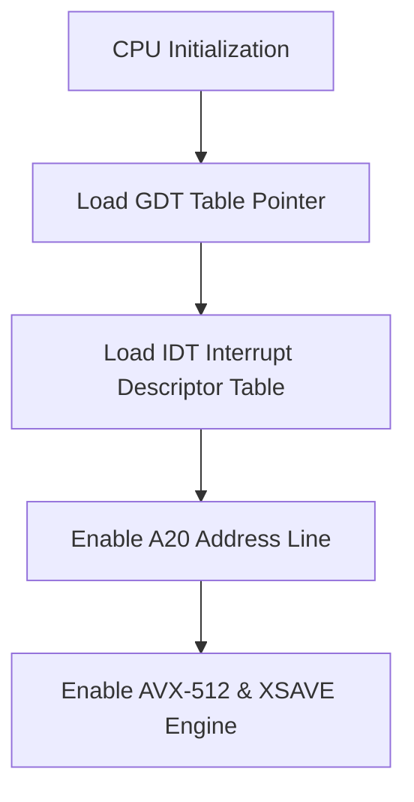

> **Status:** #status/implemented

# ⚡ Ring 0 CPU Subsystem (`rings/ring_0/ring_0/cpu/`)

The CPU subsystem manages processor descriptor tables (GDT, IDT), 4-level paging setup, and processor mode transitions (16-bit Real Mode $\rightarrow$ 32-bit Protected Mode $\rightarrow$ 64-bit Long Mode).

$$\text{Privilege Level: Ring 0 } (M = 0) \quad | \quad \text{Dependencies: None (Strictly Independent)}$$

---

## 📂 File Breakdown & Responsibilities

### 1. `gdt.asm` — Global Descriptor Table (GDT) & TSS
- **Descriptors Defined**:
  - `0x00`: Null Descriptor (Mandatory).
  - `0x08`: Ring 0 64-bit Code Segment (`Base=0, Limit=0xFFFFF, Access=0x9A, Flags=0x20`).
  - `0x10`: Ring 0 64-bit Data Segment (`Base=0, Limit=0xFFFFF, Access=0x92, Flags=0x00`).
  - `0x18`: Ring 3 64-bit User Data Segment (`Access=0xF2`).
  - `0x20`: Ring 3 64-bit User Code Segment (`Access=0xFA`).
  - `0x28`: 64-bit Task State Segment (TSS, 16 bytes).

### 2. `idt.asm` — Interrupt Descriptor Table (IDT)
- **Purpose**: Defines 256 64-bit interrupt gates (16 bytes each).
- **Vectors Handled**:
  - `0-31`: CPU Exceptions (Divide error, GPF, Page Fault `#PF`, Double Fault `#DF`).
  - `32-47`: Master/Slave PIC Hardware IRQs (Timer IRQ0, Keyboard IRQ1).
  - `0x80`: Legacy Software Interrupt Hook.
- **Default Handler**: Captures registers, outputs error code, and halts or dumps stack.

### 3. `paging.asm` — 4-Level Paging System (PML4)
- **Table Memory Locations**:
  - `0x1000`: Page Map Level 4 (PML4) Table.
  - `0x2000`: Page Directory Pointer Table (PDPT).
  - `0x3000`: Page Directory (PD) Table.
- **Mapping Strategy**: Maps first 1GB of physical memory using 512 entries of 2MB huge pages (`bit 7 PS = 1`). Identity maps low memory and maps higher-half kernel at `0xFFFFFFFF80000000`.

### 4. `protected_mode.asm` — 32-bit Protected Mode Switch
- **Procedures**:
  - `check_cpuid_long_mode`: Validates processor supports CPUID and 64-bit Long Mode (`CPUID 0x80000001, EDX bit 29`).
  - `switch_to_pm`: Disables interrupts (`cli`), loads GDT (`lgdt [gdt_descriptor]`), sets `CR0.PE = 1`, and performs far jump `jmp 0x08:pm_entry` to flush prefetch queue.

### 5. `long_mode.asm` — 64-bit Long Mode Switch & Ring 3 Dropper
- **Procedures**:
  - `switch_to_long_mode`: Sets `CR4.PAE = 1` (Physical Address Extension), loads `CR3 = 0x1000` (PML4 base), sets `EFER.LME = 1` via MSR `0xC0000080`, enables paging via `CR0.PG = 1`, and jumps `jmp 0x08:long_mode_entry`.
  - `drop_to_ring3`: Prepares unprivileged stack frame on kernel stack (`SS=0x18 | 3`, `RSP`, `RFLAGS=0x202`, `CS=0x20 | 3`, `RIP`) and executes `iretq` to drop processor execution to CPL=3.

## 🔄 CPU Subsystem Execution Flow

