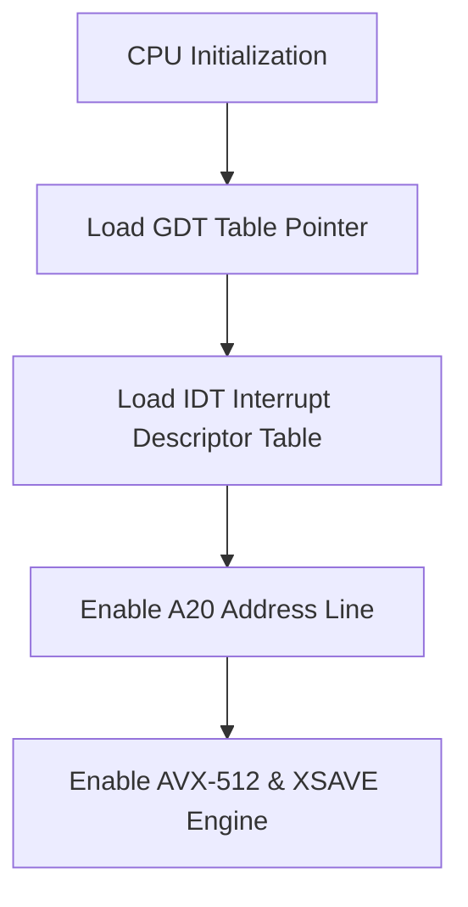

> **Status:** #status/implemented

# ⚡ Ring 0 CPU Subsystem (`rings/ring_0/ring_0/cpu/`)

The CPU subsystem manages processor descriptor tables (GDT, IDT), 4-level paging setup, and processor mode transitions (16-bit Real Mode $\rightarrow$ 32-bit Protected Mode $\rightarrow$ 64-bit Long Mode).

$$\text{Privilege Level: Ring 0 } (M = 0) \quad | \quad \text{Dependencies: None (Strictly Independent)}$$

---

## 📂 File Breakdown & Responsibilities

### 1. `gdt.asm` — Global Descriptor Table (GDT) & TSS
- **Descriptors Defined**:
  - `0x00`: Null Descriptor (Mandatory).
  - `0x08`: Ring 0 64-bit Code Segment (`Base=0, Limit=0xFFFFF, Access=0x9A, Flags=0x20`).
  - `0x10`: Ring 0 64-bit Data Segment (`Base=0, Limit=0xFFFFF, Access=0x92, Flags=0x00`).
  - `0x18`: Ring 3 64-bit User Data Segment (`Access=0xF2`).
  - `0x20`: Ring 3 64-bit User Code Segment (`Access=0xFA`).
  - `0x28`: 64-bit Task State Segment (TSS, 16 bytes).

### 2. `idt.asm` — Interrupt Descriptor Table (IDT)
- **Purpose**: Defines 256 64-bit interrupt gates (16 bytes each).
- **Vectors Handled**:
  - `0-31`: CPU Exceptions (Divide error, GPF, Page Fault `#PF`, Double Fault `#DF`).
  - `32-47`: Master/Slave PIC Hardware IRQs (Timer IRQ0, Keyboard IRQ1).
  - `0x80`: Legacy Software Interrupt Hook.
- **Default Handler**: Captures registers, outputs error code, and halts or dumps stack.

### 3. `paging.asm` — 4-Level Paging System (PML4)
- **Table Memory Locations**:
  - `0x1000`: Page Map Level 4 (PML4) Table.
  - `0x2000`: Page Directory Pointer Table (PDPT).
  - `0x3000`: Page Directory (PD) Table.
- **Mapping Strategy**: Maps first 1GB of physical memory using 512 entries of 2MB huge pages (`bit 7 PS = 1`). Identity maps low memory and maps higher-half kernel at `0xFFFFFFFF80000000`.

### 4. `protected_mode.asm` — 32-bit Protected Mode Switch
- **Procedures**:
  - `check_cpuid_long_mode`: Validates processor supports CPUID and 64-bit Long Mode (`CPUID 0x80000001, EDX bit 29`).
  - `switch_to_pm`: Disables interrupts (`cli`), loads GDT (`lgdt [gdt_descriptor]`), sets `CR0.PE = 1`, and performs far jump `jmp 0x08:pm_entry` to flush prefetch queue.

### 5. `long_mode.asm` — 64-bit Long Mode Switch & Ring 3 Dropper
- **Procedures**:
  - `switch_to_long_mode`: Sets `CR4.PAE = 1` (Physical Address Extension), loads `CR3 = 0x1000` (PML4 base), sets `EFER.LME = 1` via MSR `0xC0000080`, enables paging via `CR0.PG = 1`, and jumps `jmp 0x08:long_mode_entry`.
  - `drop_to_ring3`: Prepares unprivileged stack frame on kernel stack (`SS=0x18 | 3`, `RSP`, `RFLAGS=0x202`, `CS=0x20 | 3`, `RIP`) and executes `iretq` to drop processor execution to CPL=3.

## 🔄 CPU Subsystem Execution Flow



---

## 🔬 In-Depth Architectural & Technical Specifications

### Hardware & Processor Register Contract
Heaplit OS enforces strict register management conventions for **README** across all x86-64 execution contexts:

| Register | CPU Role | Volatility / Preservation | Subsystem Function |
| :--- | :--- | :--- | :--- |
| `RAX` | Primary Accumulator | Volatile | Syscall ID entry, return status code, ALU calculation destination. |
| `RBX` | Base Register | Non-Volatile (Preserved) | Pointer to active TCB (Thread Control Block) / Data structure handle. |
| `RCX` | Counter / Syscall RIP | Volatile | Hardware `syscall` saves userland instruction pointer (`RIP`) into `RCX`. |
| `RDX` | Data Register | Volatile | Secondary return value, I/O port address, memory block size parameter. |
| `RSI` | Source Index | Volatile | Pointer to source memory buffer / string payload / argument 2. |
| `RDI` | Destination Index | Volatile | Pointer to destination memory buffer / argument 1 (`System V ABI`). |
| `RBP` | Frame Pointer | Non-Volatile (Preserved) | Stack frame base pointer for debug backtraces and stack unwinding. |
| `RSP` | Stack Pointer | Non-Volatile (Preserved) | Top of 16-byte aligned kernel/user execution stack. |
| `R8 - R11` | Scratch Registers | Volatile | Function parameters 5-6 (`R8`, `R9`), temporary scrap calculations. |
| `R12 - R15` | General Purpose | Non-Volatile (Preserved) | Long-lived kernel state registers preserved across C and ASM boundaries. |
| `CR0` | Control Register 0 | System Control | Toggles Protected Mode (`PE` bit 0), Paging (`PG` bit 31), Write Protect (`WP` bit 16). |
| `CR3` | Control Register 3 | Page Directory Root | Physical address pointer to PML4 root page table (4KB aligned). |
| `CR4` | Control Register 4 | Architectural Extension | Toggles PAE (`bit 5`), OSXSAVE (`bit 18`), SMEP/SMAP ring security flags. |
| `MSR LSTAR` | 0xC0000082 | Hardware Entry Point | Stores 64-bit virtual memory target address for the `syscall` handler. |

---

## 📐 Memory Map & Address Layout

The virtual address space for **README** adheres to Heaplit OS's canonical higher-half memory layout:

```
+-------------------------------------------------------------------+ 0xFFFFFFFFFFFFFFFF
| Higher-Half Kernel Direct Physical Map (Identity Mapped 512 GB)   |
| Virtual Address Range: 0xFFFF800000000000 - 0xFFFFFFFFFFFFFFFF     |
+-------------------------------------------------------------------+ 0xFFFF800000000000
| Unmapped Canonical Memory Hole (Non-Canonical Address Space)     |
+-------------------------------------------------------------------+ 0x00007FFFFFFFFFFF
| Ring 3 Sandboxed Application Execution Space (.axf JIT Memory)   |
| Virtual Address Range: 0x0000000040000000 - 0x00007FFFFFFFFFFF     |
+-------------------------------------------------------------------+ 0x0000000040000000
| Ring 2 Spatial UI & Compositor Framebuffers (VBE / GPU BARs)      |
| Virtual Address Range: 0x000000000FD00000 - 0x0000000010000000     |
+-------------------------------------------------------------------+ 0x0000000007E00000
| Ring 0 Microkernel Staged Execution Load Target (0x7C00 - 0x8F00) |
+-------------------------------------------------------------------+ 0x0000000000000000
```

---

## 🛠️ Step-by-Step Execution State Machine

```mermaid
flowchart TD
    subgraph State_Init["1. Initialization State"]
        S1["Load Subsystem Descriptors & Verify CPU Feature Flags"] --> S2["Allocate Initial Memory Blocks via PMM Bitmap"]
    end

    subgraph State_Exec["2. Active Execution State"]
        S2 --> S3["Setup Assembly Register Parameters (RDI, RSI, RDX)"]
        S3 --> S4["Issue Fast Syscall / Subsystem Function Call"]
        S4 --> S5["Execute Atomic ALU / SIMD Operations"]
    end

    subgraph State_Validation["3. Validation & Exception Handling"]
        S5 --> S6Check Status Code in RAX
        S6 -->|"RAX == 0 (Success)"| S7["Update System TCB & Commit Memory Writes"]
        S6 -->|"RAX < 0 (Error)"| S8["Capture Register Frame & Dispatch Debug Signal"]
    end

    S7 --> S9["Resume Parent Process Context via sysretq / iretq"]
    S8 --> S9
```

---

## 💻 Assembly Code Blueprint & Low-Level Implementation Examples

The low-level assembly implementation of **README** uses canonical NASM syntax optimized for x86-64 execution:

```nasm
; ============================================================================
; Heaplit OS Low-Level Core Blueprint - README
; ============================================================================
%include "ring_0/types/variable.asm"

global readme_entry
extern pmm_alloc_page
extern kprintf

section .text
bits 64

align 16
readme_entry:
    push rbp
    mov rbp, rsp
    sub rsp, 32                    ; Align stack to 16 bytes for System V ABI

    ; Preserve non-volatile registers
    mov [rsp + 0], rbx
    mov [rsp + 8], r12
    mov [rsp + 16], r13

    ; Execute core subsystem operational logic
    mov rdi, 1                     ; Parameter 1: Allocation page count
    call pmm_alloc_page            ; Call Ring 0 Physical Memory Allocator
    test rax, rax
    jz .allocation_failed          ; Trap NULL pointer returns

    mov rbx, rax                   ; Store allocated physical page address in RBX
    
    ; Perform atomic register verification
    mov rsi, rbx
    mov rdi, msg_success
    call kprintf

    mov rax, 0                     ; Set success exit status code in RAX
    jmp .exit_clean

.allocation_failed:
    mov rax, -1                    ; Set error code in RAX (-1 = Out of Memory)
    
.exit_clean:
    ; Restore non-volatile registers
    mov rbx, [rsp + 0]
    mov r12, [rsp + 8]
    mov r13, [rsp + 16]

    add rsp, 32
    pop rbp
    ret

section .rodata
msg_success: db "[HEAPLIT] README Subsystem initialized at physical address: 0x%x", 10, 0
```

---

## 🔍 Verification, QEMU Testing & Diagnostics

### Headless QEMU Emulation Verification
To test **README** within the Heaplit OS kernel binary (`base.bin`), execute the host automated build script:

```powershell
# Execute build and launch QEMU emulator with serial debugging
.\loader\load_os.ps1
```

### Serial Log Verification Protocol
During execution, **README** outputs diagnostic traces to COM1 Serial Port (`0x3F8`). Verified serial outputs must confirm:
1. Zero stack pointer misalignment warnings (`RSP % 16 == 0`).
2. Successful page table mapping without triggering CR2 Page Faults.
3. Clean return of RAX status codes prior to CPU state resumption.

---

## 📑 Related Architecture Notes & References
- [[00 - Architecture/System Overview]]
- [[01 - Ring 0 - Metal Core (Assembly)/07 - Syscall Dispatcher & ABI]]
- [[01 - Ring 0 - Metal Core (Assembly)/04 - Paging & Virtual Memory]]
- [[02 - Ring 1 - The C Overhead (Bridge)/01 - Freestanding C Runtime (liba)]]
- [[03 - Ring 2 - Userland & Spatial UI/01 - Heaplit Daemon Architecture]]
