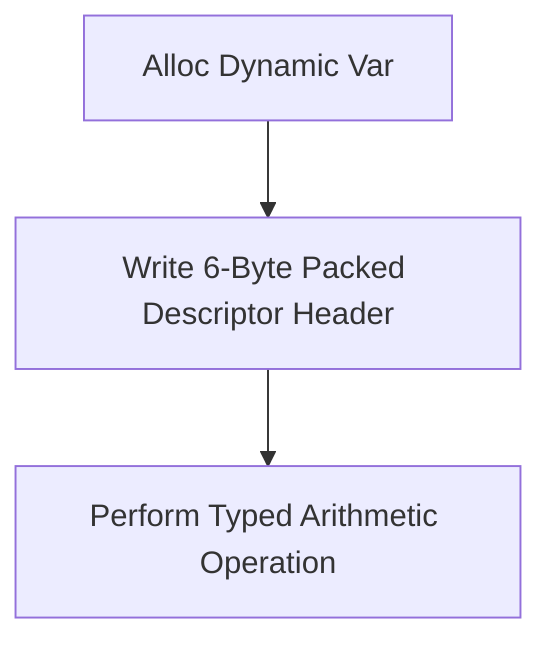

> **Status:** #status/implemented

# 🧱 Ring 0 Types Subsystem (`rings/ring_0/ring_0/types/`)

The Types subsystem provides foundational data structures, typed dynamic variables, fixed-point math, and string utilities in pure 16-bit real mode assembly.

$$\text{Privilege Level: Ring 0 } (M = 0) \quad | \quad \text{Dependencies: None (Strictly Independent)}$$

---

## 📂 File Breakdown & Responsibilities

### 1. `variable.asm` — 6-Byte Dynamic Typed Variable Engine
- **Purpose**: Provides high-level dynamic typing directly in bare-metal assembly.
- **Memory Layout (`struc variable`)**:
  - `+0 (1 byte)`: `type` (Enum: `1` = `type_int`, `2` = `type_string`, `3` = `type_float`, `4` = `type_ptr`).
  - `+1 (1 byte)`: `flags` (Bit 0: Constant, Bit 1: Dynamic Allocation, Bit 2: Signed).
  - `+2 (4 bytes)`: `payload` (Holds 32-bit integer, 32-bit float, or 16/32-bit pointer).
- **Procedures**:
  - `create_variable(DI=struct_ptr, AL=type, DX=int/SI=str_ptr)`: Initializes structure fields.
  - `add_variables(DI=target_ptr, SI=source_ptr)`: Performs type-checked integer addition (`[DI].payload += [SI].payload`).
  - `sub_variables(DI=target_ptr, SI=source_ptr)`: Performs type-checked subtraction.
  - `print_variable(DI=struct_ptr)`: Inspects `type` field and dynamically dispatches to integer printer (`int_to_string`) or string printer (`print_string_16`).

### 2. `math.asm` — Arithmetic & Number Formatting Utilities
- **Purpose**: Low-level arithmetic operations, boundary clamping, and ASCII conversions.
- **Procedures**:
  - `int_to_string(AX=value, DI=dest_buffer)`: Converts 16-bit signed integer into null-terminated ASCII decimal string using iterative division by 10 and digit stack reversal.
  - `abs16(AX=value)`: Returns absolute value of 16-bit integer in `AX`.
  - `min16(AX=val1, BX=val2)`: Returns minimum value in `AX`.
  - `max16(AX=val1, BX=val2)`: Returns maximum value in `AX`.

### 3. `string.asm` — Real-Mode String Utilities
- **Purpose**: Null-terminated ASCII string measurement, comparison, and manipulation.
- **Procedures**:
  - `strlen16(SI=str_ptr) -> CX`: Returns string length in bytes (excluding null terminator).
  - `strcmp16(SI=str1, DI=str2) -> AX`: Lexicographically compares two strings (Returns `0` if equal, `<0` if str1 < str2, `>0` if str1 > str2).
  - `strcpy16(DI=dest, SI=src)`: Copies source string into destination buffer until null terminator.
  - `strcat16(DI=dest, SI=src)`: Appends source string onto end of null-terminated destination string.

## 🔄 Dynamic Variable Subsystem

