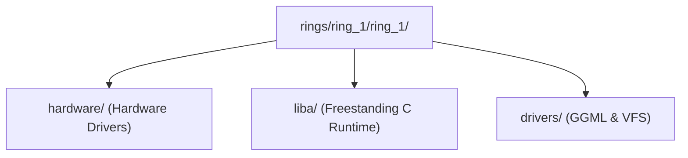

> **Status:** #status/implemented

# 🔌 Ring 1: Hardware Abstraction, Drivers & C Runtime Bridge

Ring 1 sits between the pure metal assembly of Ring 0 and the userland/presentation layers. It handles hardware bus interactions, device drivers, freestanding C libraries, and local AI model inference.

$$\text{Dependency Rule: May require Ring 0 and Ring 1 } (M \le 1). \text{ MUST NOT require Ring 2 or 3.}$$

---

## 📂 Subfolder Breakdown

### 1. `rings/ring_1/ring_1/hardware/` — Hardware Line Activation
- **`a20.asm`**: Multi-method A20 Gate enabler. Tests memory wrap-around at `0x0000:0x7E00` vs `0xFFFF:0x7E10`, attempts BIOS Fast A20 (`INT 0x15, AX=0x2401`), Fast A20 via System Port `0x92`, and fallback to 8042 Keyboard Controller output port `0xD1`.

### 2. `rings/ring_1/ring_1/liba/` — Freestanding C Runtime
- **`string.c`**: Freestanding C string and memory utilities (`memset`, `memcpy`, `strlen`, `strcmp`, `strcat`, `strcpy`) compiled with `-ffreestanding -mno-red-zone`.
- **`kprintf.c`**: Formatted kernel logger outputting directly to COM1 Serial Port (`0x3F8`) and VGA text buffer (`0xB8000`).

### 3. `rings/ring_1/ring_1/drivers/` — Device Drivers & Inference Bridge
- **`pci.c`**: Scans PCIe configuration space via I/O ports `0xCF8` (Address) and `0xCFC` (Data) to enumerate bus/slot/function devices.
- **`vfs.c`**: Virtual File System providing unified POSIX node operations (`open`, `read`, `write`, `close`, `readdir`) and extended attribute (`xattr`) relational graph hooks for the Lens file explorer.
- **`ai_engine.c`**: Freestanding GGML/Llama.cpp transformer inference bridge with AVX-512 matrix multiplication stubs, model cache management, and zero-copy inference buffers.

## 🔄 Ring 1 Submodule Overview

