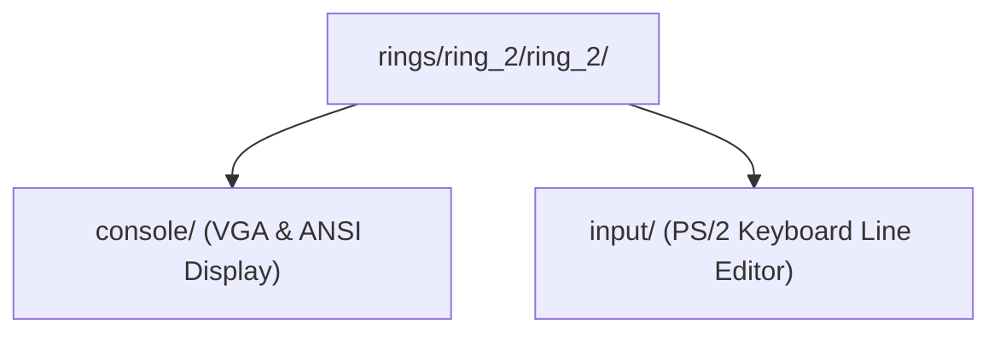

> **Status:** #status/implemented

# 🖥️ Ring 2: Presentation & Interactive Input Services

Ring 2 provides presentation, display control, and user input capture services.

$$\text{Dependency Rule: May require Ring 0, Ring 1, and Ring 2 } (M \le 2). \text{ MUST NOT require Ring 3.}$$

---

## 📂 Subfolder Breakdown

### 1. `rings/ring_2/ring_2/console/` — Video Mode & Text Presentation
- **`console.asm`**: Real-mode console display utilities:
  - `set_video_mode`: Configures 80x25 16-color VGA text mode (BIOS `INT 0x10, AH=0x00`).
  - `clear_screen`: Clears screen buffer and resets cursor to top-left (`0,0`).
  - `set_cursor_position`: Sets cursor row and column (`INT 0x10, AH=0x02`).
  - `print_string_16`: Null-terminated string printer using BIOS teletype (`INT 0x10, AH=0x0E`).
  - `print_hex16`: Prints 16-bit word values in 4-digit hexadecimal notation (`0xXXXX`).
  - `print_newline`: Emits carriage return (`0x0D`) and line feed (`0x0A`).

### 2. `rings/ring_2/ring_2/input/` — Keyboard & Interactive Editor
- **`keyboard.asm`**: Interactive keyboard services:
  - `read_char`: Blocks and reads next keypress from BIOS (`INT 0x16, AH=0x00`).
  - `read_char_noblock`: Non-blocking keystroke check (`INT 0x16, AH=0x01`).
  - `read_line`: Interactive line buffer editor with full backspace handling, screen backspacing, and buffer boundary constraints.

## 🔄 Ring 2 Spatial UI Subsystem Layout

