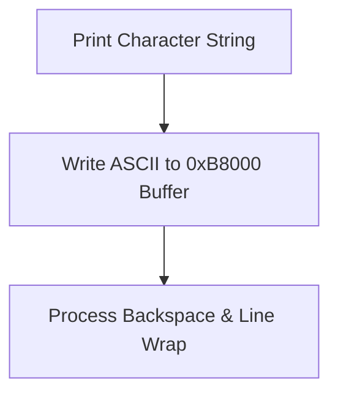

> **Status:** #status/implemented

# 📺 Ring 2 Console Subsystem (`rings/ring_2/ring_2/console/`)

The Console subsystem provides display mode selection, cursor control, formatted hexadecimal/string printing, and screen manipulation in real-mode assembly.

$$\text{Privilege Level: Ring 2 } (M \le 2) \quad | \quad \text{Dependencies: Ring 0, Ring 1, Ring 2}$$

---

## 📂 File Breakdown & Responsibilities

### 1. `console.asm` — Video Mode & Text Output Utilities
- **Procedures**:
  - `set_video_mode`: Calls BIOS `INT 0x10, AH=0x00, AL=0x03` to configure 80x25 16-color VGA text mode.
  - `clear_screen`: Calls BIOS `INT 0x10, AH=0x06, AL=0x00` to scroll/clear active window and repositions cursor at (0,0).
  - `set_cursor_position(DH=row, DL=col)`: Calls BIOS `INT 0x10, AH=0x02, BH=0x00`.
  - `print_string_16(SI=str_ptr)`: Emits null-terminated string to screen using BIOS teletype `INT 0x10, AH=0x0E`.
  - `print_hex16(DX=value)`: Prints 16-bit word in formatted hexadecimal (`0xXXXX`).
  - `print_newline`: Emits carriage return (`0x0D`) and line feed (`0x0A`).

## 🔄 Console Output Subsystem

