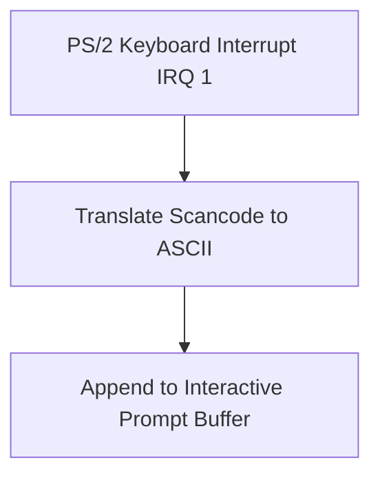

> **Status:** #status/implemented

# ⌨️ Ring 2 Input Subsystem (`rings/ring_2/ring_2/input/`)

The Input subsystem provides non-blocking polling, blocking keystroke capture, and an interactive line buffer editor with full backspace erasing.

$$\text{Privilege Level: Ring 2 } (M \le 2) \quad | \quad \text{Dependencies: Ring 0, Ring 1, Ring 2}$$

---

## 📂 File Breakdown & Responsibilities

### 1. `keyboard.asm` — Keyboard Reader & Line Editor
- **Procedures**:
  - `read_char() -> AL`: Blocks until a key is pressed via BIOS `INT 0x16, AH=0x00`.
  - `read_char_noblock() -> AL (ZF set if empty)`: Polls keyboard buffer via `INT 0x16, AH=0x01`.
  - `read_line(DI=buffer_ptr, CX=max_len)`:
    - Interactive text input loop.
    - Echoes characters to screen as typed.
    - Handles Backspace (`0x08`): decrements buffer pointer, emits backspace character, space, and second backspace to cleanly erase character on screen.
    - Terminates upon Enter (`0x0D`), appends null terminator `0x00`, and emits newline.

## 🔄 Input & Line Editor Subsystem

