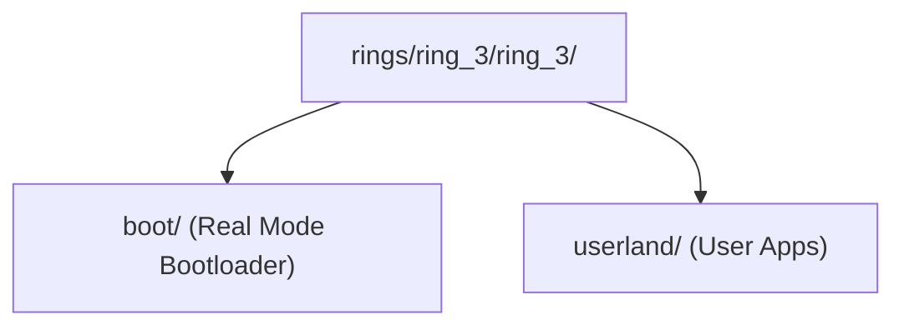

> **Status:** #status/implemented

# 🚀 Ring 3: Staged Boot Orchestrator & Userland Shell

Ring 3 is the top orchestration and userland privilege layer ($M \le 3$). It contains the master staged bootloader that composes the lower rings during bootstrap, as well as the unprivileged userland shell and applications.

---

## 📂 Subfolder Breakdown

### 1. `rings/ring_3/ring_3/boot/` — Staged Bootloader System
- **`base.asm`**: Master multi-sector staged bootstrap orchestrator. Coordinates Sector 1 (MBR), Sectors 2-3 (Stage 2 diagnostics), Sector 4 (Stage 4 interactive console), and Sectors 5+ (32-bit Protected Mode and 64-bit Long Mode staging), producing a 4KB (8-sector) raw disk image (`base.bin`).
- **`mbr.asm`**: Sector 1 Master Boot Record (MBR) loaded by BIOS at `0x7C00`. Initializes segment registers (`DS=ES=SS=0`), sets stack pointer to `0x7C00`, clears the screen, and reads remaining 7 sectors into memory at `0x7E00` via BIOS `INT 0x13, AH=0x02`.
- **`stage2.asm`**: Sectors 2-3 extended diagnostics executing at `0x7E00`. Tests Ring 0 typed variable engine (`add_variables`, `print_variable`) and Ring 1 A20 gate activation.
- **`stage4_console.asm`**: Sector 4 interactive prompt executing at `0x8200`. Uses Ring 2 keyboard line buffer editor to accept user input before transitioning to Protected Mode.

### 2. `rings/ring_3/ring_3/userland/` — Userland Shell & Applications
- **`entry.asm`**: Ring 3 unprivileged (CPL=3) userland entrypoint. Demonstrates hardware isolation, executes user commands, and makes fast syscalls (`SYS_YIELD`, `SYS_EXIT`) via the `syscall` instruction.

## 🔄 Ring 3 Userland Layout

